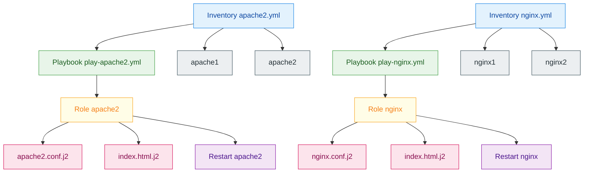

# Group exercise — modules (Apache2 / Nginx)

## Exercise statement

### 🎯 Exercise objective

Set up an Ansible infrastructure composed of 4 servers:

- 2 Apache2 servers
- 2 Nginx servers

Each server type:

- uses its own playbook
- is defined in a dedicated inventory
- has its specific templates
- triggers its specific handlers

---

## Group exercise — modules



---

## If you need help with the exercise structure:

```bash
group_vars/
└── all.yml

inventories/
├── apache2.yml
└── nginx.yml

playbooks/
├── play-apache2.yml
└── play-nginx.yml

roles/
├── apache2/
│   ├── tasks/
│   │   └── main.yml
│   ├── handlers/
│   │   └── main.yml
│   ├── templates/
│   │   ├── apache2.conf.j2
│   │   └── index.html.j2
│   └── vars/
│       └── main.yml
│
└── nginx/
    ├── tasks/
    │   └── main.yml
    ├── handlers/
    │   └── main.yml
    ├── templates/
    │   ├── nginx.conf.j2
    │   └── index.html.j2
    └── vars/
        └── main.yml
```
