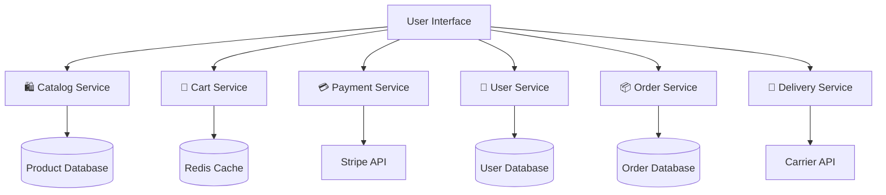

<a name="CI/CD" id="CI/CD"></a>

# Understanding CI/CD & Microservices

---

# Understanding CI/CD 🔄

### Definition and context

**CI/CD** (Continuous Integration / Continuous Deployment) has become the backbone of modern software development. This methodology makes it possible to fully automate an application's lifecycle, from the development phase through to production deployment.

---

# Why CI/CD? 🎯

### Why is CI/CD essential in 2026?

- **Fewer errors**: Early detection of bugs and integration issues
- **More frequent deployments**: Continuous delivery of new features
- **Fast feedback**: Immediate insight into code quality
- **Better collaboration**: Automatic synchronization across teams

---

# CI/CD & AI in 2026 🤖

### The impact of artificial intelligence on CI/CD and containerization

In 2026, **AI** is revolutionizing how we set up CI/CD pipelines and Docker environments. Many AI-assisted tools save valuable time and automate complex tasks.

---

# The automotive metaphor for CI/CD 🚗

### Continuous Integration (CI) 🔧

Imagine you run a modern car factory producing 500 cars per day. **Continuous Integration** means:

- **Checking every part** before installing it on the assembly line
- **Testing each assembly** along the way (engine, brakes, electronics)
- **Validating quality** at every workstation, not only at the end
- **Detecting immediately** if a part is defective or incompatible

---

# Continuous Deployment (CD) 🚀

Once all components are validated and the assembly is perfected, **Continuous Deployment** makes it possible to:

- **Automatically finish** the car without manual intervention
- **Deliver immediately** as soon as all tests pass
- **Maintain consistent quality** for every vehicle produced
- **Repeat the process** reliably across the entire production line

---

# Automatic Dockerfile generation 🐳⚡

- **AI tools**: Platforms such as [Docker AI](https://www.docker.com/products/docker-ai/), [GitHub Copilot](https://github.com/features/copilot), or [ChatGPT](https://openai.com/) generate optimized Dockerfiles from simple project descriptions.
- Non-exhaustive list of AI tools for CI/CD:

To generate code, use them with the caution of understanding 100% what you generate.

  - [Cursor](https://www.cursor.com/)
  - [Claude](https://www.anthropic.com/products/claude)
  - [Gemini](https://gemini.google.com/)
  - [Grok](https://grok.com/)
  - [Perplexity](https://www.perplexity.ai/)

---

To simplify Docker, there are tools that generate optimized Dockerfiles from simple project descriptions.

- [nixpacks](https://nixpacks.com/): Generates a Dockerfile from a project description.
- [coolify](https://coolify.io/): Largely handles continuous integration and deployment on its own.
- [railway](https://railway.app/): Create your own Dockerfile; it offers to host your container for free in a few clicks.

---

### Simplified deployment platforms 🚀

- [render](https://render.com/): Create your own Dockerfile; it offers to host your container for free in a few clicks.
- [netlify](https://netlify.com/): Largely handles continuous integration and deployment on its own.
- [vercel](https://vercel.com/): Largely handles continuous integration and deployment on its own.

- **Benefits**:
  - Instant generation of Dockerfiles adapted to your stack
  - Suggestions for security and optimization best practices
  - Automatic detection of dependencies and ports to expose

---

# Simplified deployment platforms 🚀

- **Coolify**: Open-source platform that lets you deploy Docker, Node.js, PHP, and other applications in a few clicks, with automatic management of SSL certificates, databases, and scaling.
- **Netlify**: Ultra-fast deployment of static sites and serverless APIs, native continuous integration, automatic previews.
- **Vercel**: Instant deployment of front-end and back-end applications, automatic previews for every pull request.
- **Render, Railway, Fly.io**: Modern alternatives for deploying containers or microservices without manual infrastructure management.

---

# AI to automate and secure the pipeline 🛡️

- **Automatic vulnerability detection** in Docker images thanks to tools such as Snyk, Trivy, or scanners built into modern CI/CD platforms.
- **Build optimization**: AI suggests faster build steps, detects redundancies, and recommends improvements.
- **Intelligent monitoring**: Predictive incident analysis, proactive alerts, and automatic scaling recommendations.

---

# In summary

AI and modern platforms are transforming CI/CD and containerization in 2026:
- Dockerfile and pipeline generation in seconds
- Simplified deployment on platforms such as Coolify, Netlify, Vercel, and more
- Automated security and optimization
- More time for innovation, less time for manual configuration!

---
routeAlias: 'utiliser-des-pipelines-cicd'
---

<a name="PIPELINES" id="PIPELINES"></a>

# CI/CD Pipelines in Practice 🛠️

### What is a pipeline?

A **CI/CD pipeline** is an automated chain of steps that turns your source code into a deployed, operational application.

---

# Pipeline diagram 📊


---

# Essential phases 🔄

### Essential phases of a modern pipeline

- **Source**: Fetching code from the repository (Git)
- **Build**: Compiling and building the application
- **Test**: Running unit, integration, and security tests
- **Package**: Creating deployable artifacts (Docker containers)
- **Deploy**: Automated deployment to target environments

---

# Pipeline tools and technologies in 2026 🔧

### Popular CI/CD platforms

- **GitHub Actions**: Native GitHub integration, YAML-based
- **GitLab CI/CD**: Complete solution integrated with GitLab
- **Jenkins**: Mature, extensible open-source solution
- **Azure DevOps**: Complete Microsoft ecosystem
- **CircleCI**: Cloud pipeline optimized for speed

---
layout: new-section
routeAlias: 'comprendre-les-microservices'
---

<a name="MICROSERVICES" id="MICROSERVICES"></a>

# Microservices ⚙️

---

# Microservices Architecture 🏗️

### Definition and philosophy

**Microservices architecture** consists of breaking a monolithic application into independent services, each with a specific responsibility and able to be developed, deployed, and scaled autonomously.

---

# The supermarket metaphor 🛒

### The supermarket metaphor 🛒

Imagine a modern supermarket where each aisle works like a microservice:

- **Produce aisle**: Managing fresh products, stock, and prices
- **Bakery**: Production, baking, and sale of baked goods
- **Checkout**: Payment processing and customer loyalty
- **Stock room**: Supply, inventory, and logistics

---

# Aisle independence 🔄

### Each aisle can:

- **Operate independently** of the other aisles
- **Have its own staff** and processes
- **Be updated** without affecting the others
- **Communicate** with the others through defined interfaces

---

# Benefits of Microservices 💡

### Technical benefits

- **Granular scalability**: Scale service by service according to needs
- **Polyglot technology**: Each service can use the most suitable technology
- **Fault isolation**: A failure does not affect the entire system
- **Independent deployments**: Continuous delivery without impact on other services

---

# Organizational benefits 👥

### Organizational benefits

- **Autonomous teams**: Each team owns and maintains its services
- **Parallel development**: Accelerates overall development
- **Clear responsibility**: Well-defined ownership and accountability
- **Technical innovation**: Freedom to experiment on isolated services

---
routeAlias: 'pourquoi-utiliser-les-microservices'
---

<a name="MICROSERVICES" id="MICROSERVICES"></a>

# Concrete Example: E-commerce 🛍️

### Microservices architecture of an e-commerce platform

---

# E-commerce architecture 📊



---

# Product Catalog Service 🛍️

### **🛍️ Product Catalog Service**
- **Responsibility**: Managing products, categories, prices, and promotions
- **Technology**: Node.js + MongoDB for data flexibility
- **API**: REST for browsing, GraphQL for complex search

---

# Cart Service 🛒

### **🛒 Cart Service**
- **Responsibility**: Managing customer carts and total calculations
- **Technology**: Redis for performance and session management
- **API**: WebSocket for real-time updates

---

# Payment Service 💳

### **💳 Payment Service**
- **Responsibility**: Secure transaction processing
- **Technology**: Java Spring Boot for robustness and security
- **Integrations**: Stripe, PayPal, Apple Pay, Google Pay

---

# Communication between microservices 🔗

### Communication patterns

- **Synchronous**: REST/HTTP APIs for immediate operations
- **Asynchronous**: Message queues (RabbitMQ, Kafka) for background tasks
- **Event-driven**: Publish/subscribe for system notifications

---

# Relationship with Docker 🐳

### Relationship with Docker

**Why does this architecture lead us to Docker?**

- **Isolation**: Each microservice in its own container
- **Portability**: Identical deployment across all environments
- **Scalability**: Scale containers according to load
- **Orchestration**: Kubernetes to manage all services

This microservices approach is the perfect foundation for understanding the value of containerization with Docker! 🐳

---

# 🎯 Live Tutorial: Deploy in 5 Minutes

### Minimal projects to try Vercel and Render.com

Let's get our hands dirty with 2 ultra-simple examples!

---

# 📝 Project 1: Static site for Vercel

```bash
# 1. Create the folder
mkdir my-site-vercel
cd my-site-vercel

# 2. Create the HTML file: index.html
<!DOCTYPE html>
<html>
<head>
    <title>My site deployed with Vercel!</title>
    <style>
        body { font-family: Arial; text-align: center; padding: 50px; background: linear-gradient(135deg, #667eea 0%, #764ba2 100%); color: white; }
        .card { background: rgba(255,255,255,0.1); padding: 30px; border-radius: 15px; backdrop-filter: blur(10px); }
    </style>
</head>
<body>
    <div class="card">
        <h1>🚀 Congratulations!</h1>
        <p>Your site is deployed on Vercel</p>
        <p>⏰ Deployment time: ~1 minute</p>
        <p>💡 Powered by automatic CI/CD</p>
    </div>
</body>
</html>


# 3. Initialize Git
git init
git add .
git commit -m "feat: add simple static site"
```

---

# 🚀 Deploy on Vercel (2 minutes)

### Ultra-simple steps

1. **Push to GitHub**:
```bash
# Create a repo on github.com and get the URL
git remote add origin https://github.com/YOUR-USERNAME/my-site-vercel.git
git push -u origin main
```

2. **Go to vercel.com** → Sign in with GitHub

3. **Click "New Project"** → Select your repo

4. **Click "Deploy"** → That's it! 🎉

**Result**: Live site in 1 minute at `https://my-site-vercel-xxx.vercel.app`

---

# 📝 Project 2: Node.js API for Render.com

```bash
# 1. Create the project
mkdir my-api-render
cd my-api-render

# 2. Initialize Node.js
npm init -y

# 3. Install Express
npm install express

# 4. Create the API
# 2. Create the server.js file
const express = require('express');
const app = express();
const PORT = process.env.PORT || 3000;

app.get('/', (req, res) => {
  res.json({
    message: '🎉 API deployed on Render.com!',
    timestamp: new Date().toISOString(),
    status: 'running',
    platform: 'render'
  });
});

app.get('/health', (req, res) => {
  res.json({ status: 'healthy' });
});

app.listen(PORT, () => {
  console.log(`🚀 Server running on port ${PORT}`);
});

# 5. Add the start script
npm pkg set scripts.start="node server.js"
```

---

# 📦 Dockerfile for Render.com

```dockerfile
FROM node:18-alpine

WORKDIR /app

# Copy and install dependencies
COPY package*.json ./
RUN npm ci --only=production

# Copy the code
COPY . .

# Create a non-root user
RUN addgroup -S appgroup && adduser -S appuser -G appgroup
USER appuser

# Configuration
EXPOSE 3000
HEALTHCHECK --interval=30s CMD curl -f http://localhost:3000/health || exit 1

# Startup
CMD ["npm", "start"]
```

---

# 🚀 Deploy on Render.com (3 minutes)

### Simple steps

1. **Push to GitHub**:
```bash
git init
git add .
git commit -m "feat: add simple API with Docker"
git remote add origin https://github.com/YOUR-USERNAME/my-api-render.git
git push -u origin main
```

---

2. **Go to render.com** → Sign in with GitHub

3. **New Web Service** → Connect your repo

4. **Configuration**:
   - **Environment**: Docker
   - **Region**: Frankfurt (closest)
   - **Instance Type**: Free

5. **Deploy** → Wait 2-3 minutes 🎉

---

# ✅ Testing deployments

### Verify that everything works

**Vercel** - Test the site:
```bash
# Open in the browser
open https://my-site-vercel-xxx.vercel.app
```

**Render.com** - Test the API:
```bash
# Test with curl
curl https://my-api-render-xxx.onrender.com/

# Expected response:
{
  "message": "🎉 API deployed on Render.com!",
  "timestamp": "2026-01-XX...",
  "status": "running",
  "platform": "render"
}
```

---

# 🔄 Automatic CI/CD enabled!

### What happens automatically

**On every push to GitHub**:

✅ **Vercel**:
- Automatic site build
- Deployment in ~30 seconds
- Preview URL for each branch

✅ **Render.com**:
- Docker image build
- Deployment in ~2 minutes
- Automatic health checks

**No more manual deployment!** 🎉

---

# 💡 Going further

### Possible improvements

**Vercel**:
- Add `vercel.json` for configuration
- Environment variables via the dashboard
- Custom domain

**Render.com**:
- PostgreSQL database (free tier)
- Environment variables
- Monitoring and logs

**Both use the same principle: Git push = automatic deployment!**
