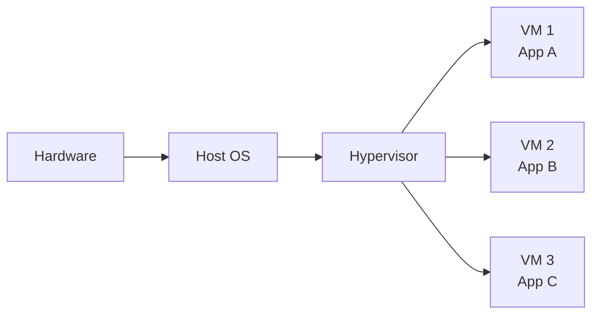
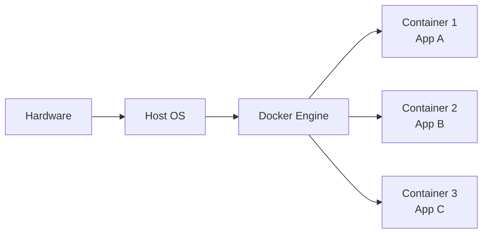

# Virtualization vs containerization

---

# Virtualization vs Containerization 🏗️

### Understanding different isolation approaches

To fully grasp the revolution that Docker represents, it is essential to understand the fundamental differences between traditional virtualization and modern containerization.

---

# Traditional Virtualization 💻

### Architecture with virtual machines

---

# Docker Containerization 🐳

### Architecture with containers

---

# Resource comparison 📊

### Performance and usage

| Criteria | Virtualization | Containerization |
|---------|---------------|------------------|
| **Size** | 1-20 GB per VM | 10-500 MB per container |
| **RAM** | 512MB-8GB minimum | 10-100MB typical |
| **Startup** | 30s-5min | 0.1-2s |
| **CPU Overhead** | 5-15% | <1% |

---

# Advantages/Disadvantages 📊

### Virtualization

**✅ Advantages** : Maximum isolation, different OSes
**❌ Disadvantages** : Heavy, slow, high resource consumption

### Containerization

**✅ Advantages** : Lightweight, fast, efficient
**❌ Disadvantages** : Same OS required, weaker isolation

---

# When to use virtualization? 🎯

### Use cases for VMs

- **Legacy applications** requiring a specific OS
- **Critical security** : Maximum isolation required
- **Multi-OS environments** : Windows + Linux
- **Strict regulatory compliance**

---

# When to use containers? 🐳

### Use cases for Docker

- **Modern** cloud-native applications
- **Microservices** and decoupled architecture
- **Agile development** with frequent deployments
- **CI/CD** and automation

---

# The future: Container-First 🌟

### 2026 trend

- **85%** of new applications use containers
- **40%** reduction in infrastructure costs
- **3x** improvement in deployment velocity
- **Container-First** becomes the default standard
