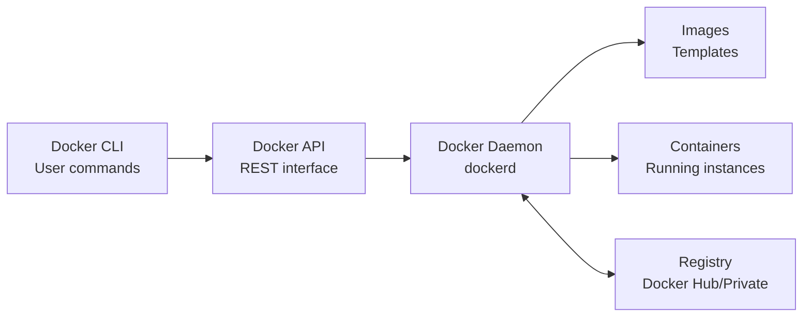
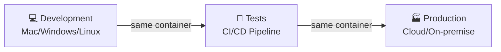

<a name="INTRO-DOCKER" id="INTRO-DOCKER"></a>

# Introduction to Docker 🐳

---

# Simple Definition 📝

### What exactly is Docker?

Docker is a **containerization platform** that lets you package an application and all its dependencies into a portable, lightweight, self-contained container that runs consistently on any environment.

---

# Essential Docker Vocabulary 📚

### Core concepts to master

Before diving into practice, it is crucial to understand Docker vocabulary.

These terms will come up constantly in your day-to-day use.

---

# Fundamental Definitions 📝

### Container vs Image

- **Container**: An isolated, portable runtime environment that contains everything an application needs to run (code, runtime, system tools, libraries)

- **Image**: A read-only template that serves as a blueprint for creating containers. It is a frozen snapshot of a filesystem with all dependencies

---

# Dockerfile & Ecosystem 🐳

### Essential components

- **Dockerfile**: A text file containing a series of instructions to automatically build a custom Docker image

- **Docker Hub**: The official public registry where millions of ready-to-use Docker images are stored and shared

- **Docker Registry**: A service for storing and distributing Docker images, which can be private or public

---

# Complete 2026 Ecosystem 🌟

### Modern platform

- **Active community**: Over 10 million developers worldwide
- **Docker Desktop**: Graphical interface and development tools
- **Over 6 million images** available on Docker Hub
- **85% of new applications** use Docker or Podman, its 100% open-source implementation in 2026

Yes, Docker is not 100% open source — there are proprietary licenses.
It is a company that seeks to monetize its product to some extent.

Podman is an open-source alternative to Docker; it is lighter and faster.

You can run Docker on a Linux server without Docker Desktop, and the same on macOS via OrbStack, etc.

---

# Modern Docker Architecture 🏗️

### Main components

- **Docker Engine**: The core of Docker that manages the container lifecycle (create, run, stop, remove)

- **Docker Daemon (dockerd)**: A system service that runs in the background and manages Docker objects

- **Docker CLI**: The command-line interface for interacting with the Docker Daemon via commands

---

# System Overview 🔧



---

# Why does Docker revolutionize things? 🚀

### The dependency problem

**Before Docker**: "It works on my machine" 😅
- Version conflicts between environments
- Complex manual configuration
- System incompatibilities
- Unpredictable deployments

---

# The Docker solution ✅

**With Docker**: "It works everywhere" ✅
- Guaranteed identical environments
- Encapsulated dependencies
- Reproducible deployment
- Perfect isolation

---

# Docker superpowers 💪

### Absolute portability



---

# Concrete technical advantages 📊

### Performance and efficiency

- **Ultra-fast startup**: 0.1 to 2 seconds vs 30s–5min for a VM
- **High density**: 100–1000 containers vs 5–20 VMs per server
- **Optimized memory usage**: 10–100MB vs 512MB–8GB per instance
- **Native performance**: <1% overhead vs 5–15% for virtualization

---

# Fundamental principles 💡

### Isolation and security

- **Isolation**: Each container runs in its own isolated environment, separate from other containers and the host system

- **Namespaces**: Linux mechanism that isolates system resources (PID, network, filesystem)

- **Cgroups**: Limit and control system resources (CPU, memory, I/O) allocated to containers

---

# Container-First Philosophy 🎯

### Stateless by default

Docker containers follow the **stateless** principle:

- **Ephemeral data**: The container can be destroyed and recreated without loss of functionality
- **Externalized state**: Persistent data is stored in volumes or external databases
- **Externalized configuration**: Environment variables and configuration files mounted from outside

---

# Portability and reproducibility 🔄

### Docker guarantees

- **Portability**: Containers run identically on all environments that support Docker (development, test, production)

- **Immutability**: Docker images are immutable, guaranteeing reproducible deployments

- **Infrastructure as Code**: Infrastructure configuration is defined in versionable, reproducible code

---

# First contact with Docker 🎯

### Quick 2026 installation

```bash
# Linux (Ubuntu/Debian)
curl -fsSL https://get.docker.com | sh
# Add the current user to the docker group
sudo usermod -aG docker $USER

# macOS/Windows: Docker Desktop from their site or:
wsl --install
```

Then run the first command again to install Docker

---

# Installation verification ✅

### Test your environment

```bash
# Version and system information
docker --version
docker info

# Classic test: create a hello-world container
docker run hello-world
```

---

# Concrete example: Nginx in action 🌐

### Deploy a web server in one command

```bash
# Start an Nginx server
docker run -d -p 8080:80 --name my-nginx nginx:alpine

# Check the container
docker ps

# View logs
docker logs my-nginx
```

---

# What happens behind the scenes 🔍

### Process analysis

1. **Automatic pull**: Download of the nginx:alpine image
2. **Container creation**: Isolated instance with Nginx
3. **Port mapping**: Host port 8080 → container port 80
4. **Startup**: Nginx operational in a few seconds

**Result**: Web server accessible at http://localhost:8080

---

# Images vs Containers in practice 📋

### Fundamental relationship

**Docker Images** 📦
- **Immutable**, **versioned** templates
- **Layered** architecture for optimization
- Stored in **registries** (Docker Hub, private)
- Can be **tagged** for versioning

**Docker Containers** 🏃‍♂️
- **Living instances** created from images
- **Isolated environments** with their own filesystem
- **Mutable state**: can be started, stopped, modified
- **Ephemeral**: data lost on removal (except volumes)

---

# Advanced concepts 🚀

### Networking and storage

- **Docker Network**: Virtual network enabling secure communication between containers

- **Docker Volume**: Data persistence mechanism that survives the container lifecycle

- **Docker Secret**: Secure management of sensitive information (passwords, API keys, certificates)

---

# Modern orchestration 🎭

### Orchestration solutions

- **Docker Swarm**: Native orchestration solution for managing container clusters

- **Kubernetes**: Advanced orchestration platform for large-scale container deployment and management

- **Docker Stack**: Multi-service application deployment in a Swarm cluster

---

# Practical advantages for developers ✅

### Daily benefits

- **Horizontal scalability**: Easy multiplication of instances
- **Zero-downtime updates**: Transparent container replacement
- **Fast recovery**: Instant restart in case of problems
- **Simplified testing**: Test environments identical to production
- **Uniform deployment**: Same artifact from development to production
