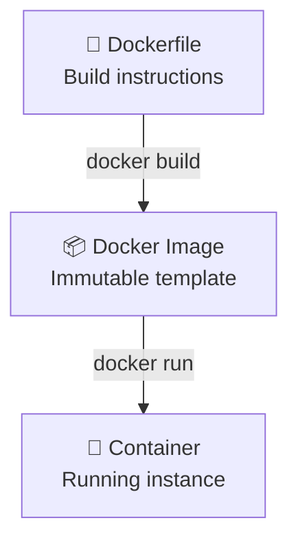

<a name="dockerfile" id="dockerfile"></a>

# Dockerfile & Docker Images

---

# Dockerfile & Docker Images 🏗️

### Create your own custom images

A **Dockerfile** is a recipe file that automates Docker image creation. Let's master building optimized images for production.

---

# What is a Dockerfile? 📄

### The recipe for your application

A **Dockerfile** is a text file containing instructions:

- 📝 **Recipe**: List of steps to build your application
- 🔧 **Instructions**: Automated commands (install, copy, configure...)
- 🏗️ **Reproducible**: Same result on any server
- 📦 **Package**: Turns your code into a ready-to-use Docker image

**Analogy**: It's like a detailed cooking recipe that anyone can follow to get the same dish!

---

# What is a Docker Image? 📦

> To be honest we have already seen this, but a quick reminder:

<br/>

### The ready-to-use template

A **Docker Image** is an immutable template:

- 🎯 **Template**: Frozen model of your application
- 📚 **Layers**: Stack of Dockerfile instructions
- 💾 **Storage**: Saved and reusable
- 🚀 **Base**: Used to create containers

**Analogy**: It's like a cake mold — once created, you can make as many identical cakes as you want!

---

# Image ↔ Container Relationship 🔄



---

# What is a Layer? 🥞

### Smart stacking

Each Dockerfile instruction creates a **layer**:

- 🥞 **Stacking**: Each RUN, COPY, ADD = a new layer
- 💾 **Cache**: Unchanged layers are reused
- ⚡ **Performance**: Faster builds thanks to cache
- 📏 **Size**: Fewer layers = lighter image

**Analogy**: It's like a mille-feuille — each instruction adds a layer, and you can reuse the bottom layers!

---

# Modern Dockerfile - Typical structure 📝

```dockerfile
# 1. Optimized base image
FROM node:20-alpine

# 2. Metadata
LABEL maintainer="dev@myapp.com" version="1.0.0"

# 3. Environment variables
ENV NODE_ENV=production \
    PORT=3000

# 4. Working directory
WORKDIR /app

# 5. Dependencies (optimal order for cache)
COPY package*.json ./
RUN npm ci --only=production && npm cache clean --force

# 6. Source code
COPY . .

# 7. Security: non-root user
RUN addgroup -S appgroup && adduser -S appuser -G appgroup
USER appuser

# 8. Configuration
EXPOSE 3000
HEALTHCHECK --interval=30s CMD curl -f http://localhost:3000/health || exit 1

# 9. Startup
CMD ["npm", "start"]
```

---

# Why FROM? 🏠

### The foundation of your application

**FROM** defines the base image to build on:

- 🏠 **Foundation**: The base operating system
- 🧰 **Tools**: Pre-installed environment and tools
- 🎯 **Specialized**: Choose according to your technology
- ⚡ **Optimized**: Alpine images = lighter and more secure

**Analogy**: It's like choosing land with or without a house on it to build!

---

# Essential instructions 🔧

### FROM - Recommended base images 2026

```dockerfile
FROM node:20-alpine          # Optimized Node.js
FROM python:3.12-slim        # Production-ready Python
FROM openjdk:21-jre-slim     # Modern Java
FROM nginx:1.25-alpine       # High-performance web server
FROM postgres:16-alpine      # Lightweight database
```

**Avoid** `ubuntu:latest` — prefer specialized, tagged images!

---

# Why COPY vs ADD? 📁

### The important difference

**COPY** and **ADD** transfer files, but differently:

- 📋 **COPY**: Simple file transfer (recommended)
- 🎁 **ADD**: Transfer + special features (archives, URLs)
- 🎯 **Clarity**: COPY is more explicit and predictable
- 🔒 **Security**: COPY avoids surprises

**Analogy**: COPY = simple photocopier, ADD = photocopier with built-in scanner and fax!

---

# COPY vs ADD - Best practices 📁

### COPY (recommended in 95% of cases)

```dockerfile
# ✅ Optimal order for Docker cache
COPY package*.json ./        # Dependencies first
RUN npm install
COPY . .                     # Source code after

# ✅ Copy with permissions
COPY --chown=appuser:appgroup . .
```

### ADD (special cases only)

```dockerfile
# To automatically extract archives
ADD release.tar.gz /app/
```

---

# Why optimize RUN? ⚡

### The importance of layers

Each **RUN** creates a new layer:

- 🥞 **Multiplication**: More RUN = more layers = heavier image
- 💾 **Cache**: Grouping commands optimizes cache
- 🧹 **Cleanup**: Remove temporary files in the same layer
- ⚡ **Performance**: Lighter images = faster deployments

**Analogy**: It's like tidying your room — better to do everything at once than leave things lying around!

---

# RUN - Layer optimization ⚡

### Bad example ❌

```dockerfile
RUN apt-get update
RUN apt-get install -y curl
RUN apt-get install -y git
RUN rm -rf /var/lib/apt/lists/*
```

### Good example ✅

```dockerfile
RUN apt-get update && \
    apt-get install -y curl git && \
    rm -rf /var/lib/apt/lists/* && \
    apt-get clean
```

**Single layer = lighter image!**

---

# Why ENV and ARG? 🔧

### Flexible configuration

**ENV** and **ARG** enable customization:

- 🔧 **ARG**: Temporary variables for build only
- 🌍 **ENV**: Persistent variables in the container
- 🎯 **Flexibility**: Same Dockerfile for different environments
- 🔄 **Reusability**: Parameterize without modifying code

**Analogy**: ARG = temporary note for the cook, ENV = permanent oven setting!

---

# ENV and ARG - Configuration 🔧

```dockerfile
# ARG: Build-only variables
ARG BUILD_VERSION=1.0.0
ARG NODE_ENV=production

# ENV: Variables available at runtime
ENV VERSION=$BUILD_VERSION \
    NODE_ENV=$NODE_ENV \
    PORT=3000 \
    DATABASE_URL=""

# Multi-environment configuration
ENV TZ=Europe/Paris \
    LANG=en_US.UTF-8
```

---

# Why non-root USER? 🔒

### Security first

Use **USER** for security:

- 🔒 **Principle**: Least privilege = better security
- 🚫 **Root = Danger**: Full system access in case of vulnerability
- 👤 **Limited user**: Restricted access to resources
- 🛡️ **Production**: Required for production security

**Analogy**: It's like giving a visitor badge instead of the house keys!

---

# Security with USER 🔒

### Always use a non-root user

```dockerfile
# Alpine Linux
RUN addgroup -S appgroup && adduser -S appuser -G appgroup
USER appuser

# Debian/Ubuntu
RUN groupadd -r appuser && useradd -r -g appuser appuser
USER appuser
```

**Never `USER root` in production!**

---

# Why CMD vs ENTRYPOINT? 🚀

### Two ways to start

**CMD** and **ENTRYPOINT** define startup:

- 🔄 **CMD**: Default command, easily overridable
- 🔒 **ENTRYPOINT**: Fixed entry point, harder to modify
- 🎯 **Flexibility**: CMD for versatile containers
- 🛡️ **Security**: ENTRYPOINT to enforce behavior

**Analogy**: CMD = menu suggestion, ENTRYPOINT = fixed dish of the day!

---

# CMD vs ENTRYPOINT 🚀

### CMD - Can be overridden

```dockerfile
CMD ["npm", "start"]              # Default
CMD ["python", "app.py"]          # Overridable with docker run
```

### ENTRYPOINT - Fixed entry point

```dockerfile
ENTRYPOINT ["./docker-entrypoint.sh"]
CMD ["--help"]                    # Default arguments

# Or combination
ENTRYPOINT ["java", "-jar", "app.jar"]
CMD ["--spring.profiles.active=prod"]
```

---

# What is a Multi-stage Build? 🏭

### The art of optimization

**Multi-stage build** separates build and production:

- 🏗️ **Build Stage**: Heavy image with all development tools
- 🚀 **Production Stage**: Lightweight image with only the application
- 📏 **Size**: Drastic reduction (from 1GB to 200MB possible)
- 🔒 **Security**: No build tools in production

**Analogy**: It's like building in a workshop and delivering only the finished product!

---

### Multi-stage builds 🏭 - Drastic optimization: from 1GB to 200MB

```dockerfile
# Stage 1: Build (heavy image with tools)
FROM node:20-alpine AS builder
WORKDIR /app
COPY package*.json ./
RUN npm install
COPY . .
RUN npm run build && npm prune --production

# Stage 2: Production (minimal image)
FROM node:20-alpine AS production
WORKDIR /app

# Selective copy from previous stage
COPY --from=builder /app/dist ./dist
COPY --from=builder /app/node_modules ./node_modules
COPY --from=builder /app/package.json ./

RUN addgroup -S appgroup && adduser -S appuser -G appgroup
USER appuser

EXPOSE 3000
CMD ["node", "dist/server.js"]
```

---

# Why HEALTHCHECK? 🩺

### Automatic monitoring

**HEALTHCHECK** monitors container health:

- 🩺 **Monitoring**: Automatic state verification
- 🔄 **Auto-repair**: Automatic restart if problems
- 📊 **Monitoring**: Integration with orchestrators
- ⚡ **Responsiveness**: Fast failure detection

**Analogy**: It's like a smoke detector that automatically calls the fire department!

---

# HEALTHCHECK - Built-in monitoring 🩺

```dockerfile
# HTTP healthcheck
HEALTHCHECK --interval=30s --timeout=10s --start-period=5s --retries=3 \
    CMD curl -f http://localhost:3000/health || exit 1

# With wget (if curl unavailable)
HEALTHCHECK --interval=30s --timeout=10s --retries=3 \
    CMD wget --no-verbose --tries=1 --spider http://localhost:8080/ping || exit 1
```

**Containers with healthcheck restart automatically!**

---

# Optimal Dockerfile - 2026 Template ✅

```dockerfile
FROM node:20-alpine

LABEL maintainer="dev@example.com" \
      version="1.0.0" \
      description="Production-ready Node.js app"

ENV NODE_ENV=production \
    PORT=3000 \
    LOG_LEVEL=info

WORKDIR /app

# Cache optimization: dependencies first
COPY package*.json ./
RUN npm ci --only=production && \
    npm cache clean --force

COPY . .

# Mandatory security
RUN addgroup -S appgroup && adduser -S appuser -G appgroup
USER appuser

# Built-in monitoring
HEALTHCHECK --interval=30s --timeout=3s \
    CMD curl -f http://localhost:3000/health || exit 1

EXPOSE 3000
CMD ["npm", "start"]
```

---

# Build and analysis 🔧

### Advanced build commands

```bash
# Optimized build with cache
docker build --no-cache -t my-app:latest .

# Build with arguments
docker build --build-arg NODE_ENV=production -t my-app:prod .

# Multi-platform (ARM + x86)
docker buildx build --platform linux/amd64,linux/arm64 -t my-app:multi .

# Layer analysis
docker history my-app:latest

# Full inspection
docker inspect my-app:latest
```

---

# What is a .dockerignore? 🚫

### The smart filter

**.dockerignore** excludes unnecessary files:

- 🚫 **Exclusion**: Avoid copying unnecessary files
- ⚡ **Performance**: Faster builds
- 📏 **Size**: Lighter images
- 🔒 **Security**: Avoid accidentally copying secrets

**Analogy**: It's like a list of what NOT to put in your suitcase!

---

# .dockerignore - Performance ⚡

### Exclude unnecessary files

```bash
# .dockerignore
node_modules
npm-debug.log
.git
.gitignore
README.md
.env
.nyc_output
coverage
.vscode
*.log
```

**An optimal .dockerignore = faster builds!**

---

# Common mistakes to avoid ❌

### Anti-patterns

```dockerfile
# ❌ Image without version
FROM ubuntu:latest

# ❌ Unnecessary installation
RUN apt-get update && apt-get install -y vim nano

# ❌ Inefficient copy
COPY . .
RUN npm install

# ❌ No cleanup
RUN apt-get install -y curl
# (leaves caches)

# ❌ Stays as root
# USER root
```

---

# Best practices summary 📋

### Checklist for a professional Dockerfile

✅ **Base image**: Alpine, slim, or specialized with version

✅ **COPY order**: Dependencies before source code

✅ **Optimized RUN**: Single layer with cleanup

✅ **Non-root USER**: Mandatory security

✅ **HEALTHCHECK**: Automatic monitoring

✅ **.dockerignore**: Optimized exclusions

✅ **Multi-stage**: Minimal production images

---

### Examples by tech stack 💻 - Python Flask - Optimized multi-stage

```dockerfile
# Stage 1: Build dependencies with compilers
FROM python:3.12-slim AS builder
WORKDIR /app

# Install build tools
RUN apt-get update && apt-get install -y \
    build-essential \
    gcc \
    && rm -rf /var/lib/apt/lists/*

# Install dependencies
COPY requirements.txt .
RUN pip install --user --no-cache-dir -r requirements.txt

# Stage 2: Optimized runtime
FROM python:3.12-slim
WORKDIR /app

# Copy only installed packages
COPY --from=builder /root/.local /root/.local

# Copy source code
COPY . .

# Create non-root user
RUN adduser --disabled-password --gecos "" appuser
USER appuser

# Environment variables
ENV PATH=/root/.local/bin:$PATH
ENV FLASK_APP=app.py
ENV FLASK_ENV=production

# Monitoring
HEALTHCHECK --interval=30s --timeout=3s \
    CMD curl -f http://localhost:5000/health || exit 1

EXPOSE 5000
CMD ["python", "-m", "flask", "run", "--host=0.0.0.0"]
```

---

### Simple Flask alternative (for development)

```dockerfile
FROM python:3.12-slim
WORKDIR /app
COPY requirements.txt .
RUN pip install --no-cache-dir -r requirements.txt
COPY . .
RUN adduser --disabled-password appuser
USER appuser
EXPOSE 5000
HEALTHCHECK --interval=30s --timeout=3s \
    CMD curl -f http://localhost:5000/health || exit 1
CMD ["python", "app.py"]
```

---

# Java Spring Boot Example

### Java Spring Boot - Complete multi-stage build

```dockerfile
# Stage 1: Build JAR with Maven
FROM maven:3.9-openjdk-21-slim AS build
WORKDIR /app
COPY pom.xml .
COPY src ./src
RUN mvn clean package -DskipTests

# Stage 2: Optimized runtime
FROM openjdk:21-jre-slim
WORKDIR /app
COPY --from=build /app/target/*.jar app.jar
RUN addgroup --system spring && adduser --system --group spring
USER spring
EXPOSE 8080
HEALTHCHECK --interval=30s --timeout=3s \
    CMD curl -f http://localhost:8080/actuator/health || exit 1
ENTRYPOINT ["java", "-jar", "app.jar"]
```

---

### Gradle alternative

```dockerfile
# Stage 1: Build with Gradle
FROM gradle:8.5-jdk21-alpine AS build
WORKDIR /app
COPY build.gradle settings.gradle ./
COPY src ./src
RUN gradle build -x test --no-daemon

# Stage 2: Runtime
FROM openjdk:21-jre-slim
WORKDIR /app
COPY --from=build /app/build/libs/*.jar app.jar
RUN addgroup --system spring && adduser --system --group spring
USER spring
EXPOSE 8080
HEALTHCHECK --interval=30s --timeout=3s \
    CMD curl -f http://localhost:8080/actuator/health || exit 1
ENTRYPOINT ["java", "-jar", "app.jar"]
```
