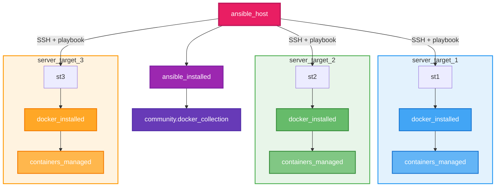
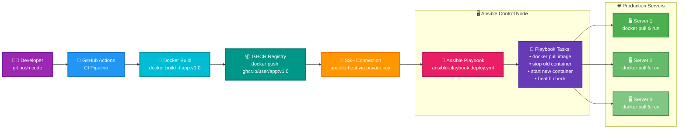
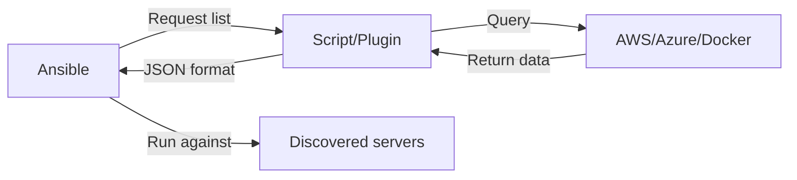
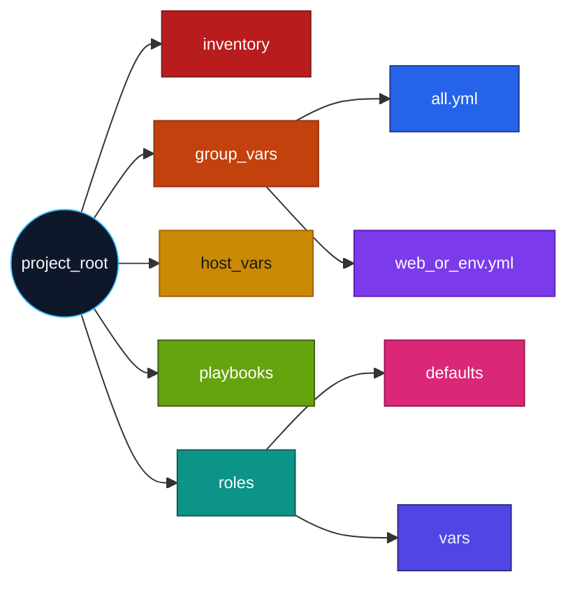
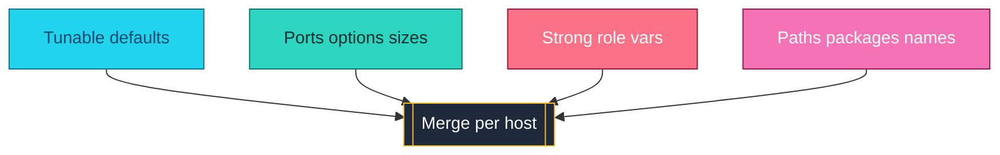

```mermaid
flowchart LR
    dev["👨‍💻 Developer<br/>git push code"]
    ci["🦊 GitLab CI/CD<br/>Pipeline Runner"]
    img["🐳 Docker Build<br/>docker build -t app:latest"]
    reg["📦 GitLab Registry<br/>registry.gitlab.com/project/app"]
    webhook["🔔 Webhook/SSH<br/>Trigger deployment"]
    ans["🎯 Ansible Execution<br/>ansible-playbook site.yml"]
    
    dev --> ci
    ci --> img
    img --> reg
    reg --> webhook
    webhook --> ans

    subgraph "🖥️ Ansible Control Node"
        ans --> inventory["📋 Inventory Check<br/>• production servers<br/>• staging servers"]
        inventory --> tasks["📄 Deployment Tasks:<br/>• login to registry<br/>• pull new image<br/>• rolling update<br/>• rollback if failed"]
    end

    subgraph "🌐 Target Infrastructure"
        prod1["🖥️ Production 1<br/>app:latest running"]
        prod2["🖥️ Production 2<br/>app:latest running"]
        stage1["🔧 Staging<br/>testing environment"]
    end

    tasks --> stage1
    stage1 --> prod1
    stage1 --> prod2
    
    subgraph "📊 Monitoring"
        health["❤️ Health Checks<br/>• container status<br/>• application metrics<br/>• logs monitoring"]
    end
    
    prod1 --> health
    prod2 --> health

    style dev fill:#9c27b0,stroke:#7b1fa2,stroke-width:3px,color:#fff
    style ci fill:#fc6d26,stroke:#e24329,stroke-width:3px,color:#fff
    style img fill:#00bcd4,stroke:#0097a7,stroke-width:3px,color:#fff
    style reg fill:#fc6d26,stroke:#e24329,stroke-width:3px,color:#fff
    style webhook fill:#ff9800,stroke:#f57c00,stroke-width:3px,color:#fff
    style ans fill:#e91e63,stroke:#c2185b,stroke-width:3px,color:#fff
    style inventory fill:#673ab7,stroke:#512da8,stroke-width:2px,color:#fff
    style tasks fill:#3f51b5,stroke:#303f9f,stroke-width:2px,color:#fff
    style prod1 fill:#4caf50,stroke:#388e3c,stroke-width:2px,color:#fff
    style prod2 fill:#66bb6a,stroke:#388e3c,stroke-width:2px,color:#fff
    style stage1 fill:#ffeb3b,stroke:#fbc02d,stroke-width:2px,color:#000
    style health fill:#f44336,stroke:#d32f2f,stroke-width:2px,color:#fff
```

<a name="intro-ansible" id="intro-ansible"></a>

# Module 1: Introduction to Ansible

---

# Ansible - Infrastructure Automation 🎯

### Modern and simple Infrastructure as Code

Ansible is the reference automation tool: **agentless, idempotent, declarative**.

> Idempotence means an operation has the same effect whether you apply it once or multiple times.

---

# Ansible - Perfect for Docker

### Why Ansible + Docker?

Perfect for orchestrating Docker and automating infrastructure.

Concrete example: automate deploying a Dockerized app to several servers with one command, without manually logging into each machine—to install Docker, copy code, build the image, run the container, and handle updates or restarts.

---

# Why Ansible? 💡

### Key advantages

🎯 **Simple**: Readable YAML configuration

🔄 **Idempotent**: Same result on every run

🚀 **Agentless**: SSH/WinRM/API only

---

# Why Ansible? (continued) 💡

### More advantages

📈 **Scalable**: From 1 to 10,000+ servers

🔒 **Secure**: Uses your existing connections

---

# How Ansible connects 🔐

### Agentless architecture over SSH

```
Control node (your laptop)
        │
        │  SSH / WinRM / API
        ▼
Managed nodes (servers, VMs, containers)
```

---

# How Ansible connects (continued) 🔐

### Agentless architecture over SSH

- **No agent** installed on targets
- **Push model**: you trigger runs from the control node
- **Modules** run remotely and report `changed` / `ok` / `failed`

**Analogy**: like calling each server on the phone — no permanent app listening on the other end.

---

# Ansible vs Chef, Puppet, Salt ⚖️

### Configuration management landscape

| Tool | Model | Agent on target | Main language |
|------|-------|-----------------|---------------|
| **Ansible** | Push | ❌ None (SSH) | YAML |
| **Puppet** | Pull | ✅ Puppet agent | Puppet DSL |
| **Chef** | Pull | ✅ Chef client | Ruby |
| **Salt** | Push or pull | Optional minion | YAML + Jinja |

**Takeaway**: Ansible keeps targets lightweight — you only need SSH access and Python.

**Analogy**: Ansible is the visiting chef with a recipe; Puppet and Chef leave a resident cook on every stove.

---
layout: new-section
routeAlias: 'installation-setup'
---

<a name="installation-setup" id="installation-setup"></a>

# Module 2: Installation and 2026 Setup

---

# Installation and 2026 setup ⚙️

### Quick installation

```bash
# Installation via pip (recommended)
python3 -m pip install --user ansible
# Essential collections
# community.general: collection with many modules to manage files, packages, services, network, clouds, etc.
# ansible.posix: POSIX/Linux specific modules like managing users, groups, permissions, cron tasks, system commands.
# ansible.windows: Windows specific modules like managing services, scheduled tasks, file sharing.
ansible-galaxy collection install community.general ansible.posix
# Verification
ansible --version
```

> If the output says **Nothing to do**, all requested collections are already installed. To reinstall anyway, use `--force`.

<br/>

> This means you've already installed the collections or you've already installed ansible which now includes them by default.

---

# Windows Installation

```bash
# If Windows and no python:
# Install python via chocolatey
choco install python
# Install ansible via pip
python3 -m pip install --user ansible
# Verification
ansible --version
```

---

# Virtual environment solution

If you have an installation problem, here's a solution:

> On python 3 you must set up a venv:

```bash
python3 -m venv .venv
source .venv/bin/activate
pip3 install ansible
```

> This creates a virtual environment with ansible installed in it. (default sandbox mode of python 3 to not pollute your global environment)

---

# How Ansible works

To properly understand Ansible's operation schematically, here's a diagram:



---

You can have multiple goals for using ansible:

- You want to automate repetitive tasks (package installation, service configuration, etc.)
- You want to deploy applications on multiple servers
- You want to configure servers uniformly
- You want to manage secrets securely

---
layout: new-section
routeAlias: 'ci-cd-integration'
---

<a name="ci-cd-integration" id="ci-cd-integration"></a>

# Module 3: CI/CD integration

---

# Integrating Ansible into a CI/CD workflow

## Option 1 — Using GitHub Actions

<br/>

> You can integrate Ansible into a GitHub Actions pipeline to automate deployment on every git push.
Two approaches are possible:

- Remote execution: GitHub Actions connects over SSH to a server (private key in secrets) and runs `ansible-playbook` from that server.
- Self-hosted runner: use a GitHub runner on an internal machine with Ansible installed to run deployments locally via playbooks.

>💡 Note: in this model, Ansible does not copy application source directly. The app is packaged as a Docker image (in GitHub Actions), pushed to a registry (e.g. GHCR), then Ansible only pulls and runs that image on targets (`docker pull`, `docker_container`, …).

---



---

## 🧩 Option 2 — GitLab CI/CD integration

GitLab works in a similar way:

- The CI pipeline builds your application’s Docker image.
- That image is pushed automatically to the GitLab Container Registry.
- Then several options are possible:
- Run Ansible from the pipeline if the runner has Ansible installed.
- SSH to a remote host to run a playbook.

- Trigger via webhook from an external tool such as Jenkins, which then runs Ansible.

---



---
layout: new-section
routeAlias: 'inventaires'
---

<a name="inventaires" id="inventaires"></a>

# Module 4: Inventories and servers

---

# What is an inventory? 📋

### Your servers’ address book

An **inventory** is a file that lists all your servers and their details:

- 📍 **IP addresses**: Where your servers are
- 👥 **Groups**: Organize by role (web, database, …)
- ⚙️ **Variables**: Per-server configuration
- 🔑 **Connection**: How to connect (user, SSH keys, …)

**Analogy**: It’s an address book for your servers!

**2 inventory types**:
- **Static**: YAML/INI files written by hand
- **Dynamic**: Scripts that query AWS, Azure, Docker, …

---

# Inventory: define your servers 📋

```yaml
# inventory/hosts.yml - Main inventory file
all:  # Root group containing ALL servers
  vars:  # Global variables for all servers
    ansible_user: ubuntu  # Default SSH user
    ansible_python_interpreter: /usr/bin/python3  # Python path on targets

  children:  # Subgroups by role
    docker_hosts:  # Servers that run Docker
      hosts:  # Hosts in this group
        docker-01: {ansible_host: 10.0.1.10}  # Logical name: real IP
        docker-02: {ansible_host: 10.0.1.11}  # Second Docker server

    databases:  # Database servers
      hosts:  # DB hosts
        db-01: {ansible_host: 10.0.1.20}  # Primary database server

    webservers:  # Web servers (empty declaration here)
databases:  # databases group redefined (can be confusing)
  hosts:  # DB host list
    db-01: {ansible_host: 10.0.1.20}  # Same server as above

webservers:  # webservers group definition
  hosts:  # Web servers with range notation
    web-[01:03]:  # Range: generates web-01, web-02, web-03
      ansible_host: 10.0.1.30  # Base IP (not auto-incremented by default—you manage it)
```

**💡 Note**: The `[01:03]` notation is an Ansible feature to generate several hosts automatically.

---

# 📝 Range notation explained

### Generate several hosts automatically

**Syntax**: `name-[start:end]`

```yaml
# Example 1: numeric range
webservers:
  hosts:
    web-[01:03]:  # Generates: web-01, web-02, web-03
      ansible_host: 10.0.1.10

# Equivalent result:
webservers:
  hosts:
    web-01: {ansible_host: 10.0.1.10}
    web-02: {ansible_host: 10.0.1.10}
    web-03: {ansible_host: 10.0.1.10}
```

---

# 📝 Range notation explained (continued)

### With different IPs

```yaml
# For different IPs, define them explicitly
webservers:
  hosts:
    web-01: {ansible_host: 10.0.1.31}
    web-02: {ansible_host: 10.0.1.32}
    web-03: {ansible_host: 10.0.1.33}

# Or with inventory variables
webservers:
  hosts:
    web-01:
      ansible_host: 10.0.1.31
      server_id: 1
    web-02:
      ansible_host: 10.0.1.32
      server_id: 2
    web-03:
      ansible_host: 10.0.1.33
      server_id: 3
```

---

# 📝 Range notation: use cases

### When to use it?

**✅ Good fit**: Servers with identical configuration
```yaml
docker_nodes:
  hosts:
    node-[01:10]:  # 10 identical Docker nodes
      ansible_host: 10.0.1.100  # Same network, Docker handles routing
      ansible_connection: docker
```

**❌ Poor fit**: Servers with different IPs
```yaml
# ❌ Does not work as you might expect
web-[01:03]: {ansible_host: '10.0.1.{{ 30 + item }}'}
# The {{ item }} variable is not available in inventory
```

**💡 For incrementing IPs**: List them explicitly or use a generation script.

---

# A ready-made local inventory for practice

```yaml
all:
  children:
    local:
      hosts:
        localhost:
          ansible_connection: local
          ansible_python_interpreter: /usr/bin/python3
```

```bash
ansible-inventory --graph
```

You will get a graph similar to this:

```bash
@all:
  |--ungrouped: # logical: nothing is outside a group, so ungrouped is empty
  |--@local:
  |  |--localhost
```

---

# ✅ Inventory: name vs address

### Critical difference

```yaml
all:
  children:
    webservers:
      hosts:
        web-01:  # ⚠️ THIS IS THE NAME (logical alias)
          ansible_host: 10.0.1.10  # ⚠️ THIS IS THE REAL ADDRESS
```

**In your playbooks you use the NAME, not the address!**

---

# Inventory: using the name

```yaml
# ✅ CORRECT: use the name defined in inventory
- name: Deploy to a specific server
  hosts: web-01  # Logical name
  tasks:
    - debug: msg="I am on {{ inventory_hostname }}"
    # Prints: "I am on web-01"
```

```yaml
# ❌ INCORRECT: use the IP directly
- name: Deploy
  hosts: 10.0.1.10  # ❌ Ansible will not find this host
```

---

# 🧠 Rule to remember: inventory

> **Name = what you use in your playbooks**
> 
> **ansible_host = where Ansible actually connects**

Benefit: you can change the IP without editing playbooks!

```yaml
# Before
web-01: {ansible_host: 10.0.1.10}

# After migrating to a new server
web-01: {ansible_host: 192.168.50.10}
# ✅ Your playbooks still work unchanged!
```

---

# 🔧 Ansible global variables

### “Magic” variables Ansible uses

Ansible uses **special variables** to configure connection and behavior on target hosts:

- 🔌 **ansible_connection**: connection type to use
- 👤 **ansible_user**: user to connect as
- 🐍 **ansible_python_interpreter**: path to the Python interpreter
- 🔑 **ansible_ssh_private_key_file**: custom SSH private key
- 🚪 **ansible_port**: connection port (default: 22 for SSH)

These variables can be set:
- Globally (in `all: vars:`)
- Per group (in `group_name: vars:`)
- Per host (on the host itself)

---

# 🔌 ansible_connection: the 3 types

### Type 1: SSH (default)

```yaml
all:
  vars:
    ansible_connection: ssh  # Classic SSH (default)
    ansible_user: ubuntu
  hosts:
    remote-server:
      ansible_host: 192.168.1.100
```

**Use case**: connect to remote servers over SSH  
**Prerequisites**: SSH access configured, SSH keys recommended

---

# 🔌 ansible_connection: type 2 — local

```yaml
all:
  children:
    local:
      hosts:
        localhost:
          ansible_connection: local  # Local execution
          ansible_python_interpreter: /usr/bin/python3
```

**Use case**: run tasks on the Ansible control machine  
**Benefit**: no SSH needed, direct execution  
**Typical use**: local machine setup, tests

---

# 🔌 ansible_connection: type 3 — Docker

```yaml
all:
  children:
    containers:
      vars:
        ansible_connection: docker  # Connect via Docker
      hosts:
        web01:
          # ansible_host not required; uses the container name
        web02:
```

**Use case**: manage Docker containers directly  
**Benefit**: no SSH inside containers  
**Prerequisites**: Docker installed on the control machine

---

# 🐳 Full example: Docker inventory

```yaml
all:
  children:
    docker_containers:
      vars:
        ansible_connection: docker
        ansible_user: root  # User inside the container
      hosts:
        web01:  # Docker container name
        web02:
        db01:
```

```bash
# Containers must be running first
docker ps
# CONTAINER ID   IMAGE     COMMAND   CREATED   STATUS   NAMES
# abc123def456   nginx     ...       ...       Up       web01
# 789ghi012jkl   nginx     ...       ...       Up       web02
# 345mno678pqr   postgres  ...       ...       Up       db01
```

---

# 👤 ansible_user: the connection user

```yaml
all:
  vars:
    ansible_user: ubuntu  # Default user for all hosts
  
  children:
    databases:
      vars:
        ansible_user: postgres  # Override for databases group
      hosts:
        db01:
          ansible_host: 10.0.1.20
    
    webservers:
      hosts:
        web01:
          ansible_host: 10.0.1.10
          ansible_user: nginx  # Override for this host only
```

**Precedence**: host > group > global

---

# 🐍 ansible_python_interpreter

### Why this variable?

Ansible needs Python on target machines to run its modules.

```yaml
all:
  vars:
    # Explicitly set the Python path
    ansible_python_interpreter: /usr/bin/python3
```

**Common cases**:
- `/usr/bin/python3`: system Python 3 (most common)
- `/opt/homebrew/bin/python3`: Homebrew Python (macOS)
- `/usr/local/bin/python3`: manually built Python
- `auto`: let Ansible discover automatically

---

# ⚠️ The Python discovery warning

```bash
[WARNING]: Host 'web01' is using the discovered Python 
interpreter at '/usr/bin/python3.10', but future installation 
of another Python interpreter could cause a different 
interpreter to be discovered.
```

**What does this warning mean?**

Ansible auto-discovered Python but warns that a future install could change which interpreter is used.

---

# ⚠️ How to fix this warning?

### Solution 1: set the path explicitly

```yaml
all:
  vars:
    ansible_python_interpreter: /usr/bin/python3.10
  hosts:
    web01:
      ansible_host: 192.168.1.10
```

### Solution 2: use auto discovery (recommended)

```yaml
all:
  vars:
    ansible_python_interpreter: auto_silent  # Discover without warning
```

---

# 🎯 Practical case: Homebrew on macOS

On macOS with Homebrew, Python is installed elsewhere:

```yaml
all:
  children:
    macos_hosts:
      vars:
        ansible_connection: ssh
        ansible_user: admin
        ansible_python_interpreter: /opt/homebrew/bin/python3
      hosts:
        mac-dev:
          ansible_host: 192.168.1.50
```

**Without this**: Ansible might use the older system Python  
**With this**: Ansible uses the newer Homebrew Python

---

# 📋 Summary: Ansible variables

| Variable | Purpose | Example |
|----------|---------|---------|
| `ansible_connection` | Connection type | `ssh`, `local`, `docker` |
| `ansible_user` | Login user | `ubuntu`, `root`, `admin` |
| `ansible_python_interpreter` | Python path | `/usr/bin/python3` |
| `ansible_host` | Real IP/FQDN | `192.168.1.10` |
| `ansible_port` | Connection port | `22`, `2222` |

---

# 📄 The ansible.cfg file (configuration)

### Configure Ansible for your project

The `ansible.cfg` file sets default parameters:

```ini
[defaults]
# Path to roles
roles_path = ./roles

# Default inventory
inventory = ./inventory.yml

# Disable SSH host key checking (handy for Docker/tests)
host_key_checking = False

# Colored output
force_color = True

# Do not create .retry files
retry_files_enabled = False

# Output format (Ansible 2.13+)
stdout_callback = yaml
```

---

# 📍 Where to put ansible.cfg?

### Ansible looks in this order:

```
1. ANSIBLE_CONFIG environment variable
   ↓
2. ./ansible.cfg (current directory) ← ✅ RECOMMENDED
   ↓
3. ~/.ansible.cfg (user home)
   ↓
4. /etc/ansible/ansible.cfg (system)
```

**Best practice**: add an `ansible.cfg` at your project root!

```
ansible-project/
├── ansible.cfg        # ← Project-local configuration
├── inventory.yml      # ← Referenced from ansible.cfg
├── playbook.yml
└── roles/
```

---

# Inventory connectivity: ping 🏓

### Verify reachability before playbooks

```bash
# Ping all hosts in inventory
ansible all -m ping -i inventory.yml

# Ping one group
ansible webservers -m ping -i inventory.yml

# Ping one host
ansible web-01 -m ping -i inventory.yml
```

---

# Inventory connectivity: ping — expected result 🏓

### Verify reachability before playbooks

**Expected success**:
```
web-01 | SUCCESS => { "ping": "pong" }
```

**Analogy**: like ringing the doorbell before delivering furniture — you check someone is home first.

---

# Inventory connectivity: debug 🔍

### Ad-hoc checks without a playbook

```bash
# Print a variable from inventory
ansible web-01 -m debug -a "var=ansible_user" -i inventory.yml

# Custom message
ansible all -m debug -a "msg='Host {{ inventory_hostname }} is reachable'" -i inventory.yml
```

---

# Inventory connectivity: debug — use case 🔍

### Ad-hoc checks without a playbook

**Use case**: confirm variables and connectivity before running long playbooks.

**Analogy**: like reading the label on a package before opening it — quick sanity check, no full setup.

---

# Inventory connectivity: gather_facts 📊

### Collect system information automatically

```yaml
- name: Show OS facts
  hosts: all
  gather_facts: yes   # default
  tasks:
    - debug:
        msg: "{{ ansible_distribution }} {{ ansible_distribution_version }}"
```

---

# Inventory connectivity: gather_facts (ad-hoc) 📊

### Collect system information automatically

```bash
# Ad-hoc facts for one host
ansible web-01 -m setup -i inventory.yml
ansible web-01 -m setup -a "filter=ansible_distribution*" -i inventory.yml
```

---

# Inventory connectivity: gather_facts — tip 📊

### When to skip fact collection

**Tip**: use `gather_facts: no` for faster runs when facts are not needed.

**Analogy**: like a census form filled automatically before you start work — skip it when you already know the answers.

---

# 🔄 Dynamic inventories

### The problem with static inventories

**Situation**: your infrastructure keeps changing

- Servers created/destroyed automatically (cloud)
- Auto-scaling adds/removes instances
- Docker containers change IP

**Static inventory** = manually maintained list forever 😰

**Dynamic inventory** = script/plugin queries live infrastructure! 🎉

---

# Dynamic inventory: the idea

### How does it work?



**Benefit**: the list stays up to date automatically!

---

# Types of dynamic inventory

### 3 approaches in 2026

**1. Inventory plugins** (recommended in 2026) ✅

- Built into Ansible
- Configuration YAML
- Examples: `aws_ec2`, `azure_rm`, `docker`, `gcp_compute`

**2. Custom scripts** (legacy)

- Python/Bash script returning JSON
- More flexible but more complex

**3. Collections** (modern)

- Plugins shipped with collections
- Example: `community.docker.docker_containers`

---

# Inventory plugin: AWS EC2

### Full configuration

```yaml
# inventory_aws.yml
plugin: amazon.aws.aws_ec2

regions:
  - eu-west-1
  - eu-west-3

filters:
  instance-state-name: running
  tag:Environment:
    - production
    - staging

keyed_groups:
  - key: tags.Environment
    prefix: env
  - key: tags.Role
    prefix: role

hostnames:
  - dns-name
  - private-ip-address
```

---

# AWS EC2 plugin: extracted variables

### What the plugin gathers automatically

```yaml
# Variables available for each instance:
ansible_host: ec2-54-123-45-67.eu-west-1.compute.amazonaws.com
ec2_instance_id: i-0abc123def456789
ec2_instance_type: t3.medium
ec2_region: eu-west-1
ec2_availability_zone: eu-west-1a
ec2_security_groups: ['web-sg', 'ssh-sg']
ec2_tags:
  Environment: production
  Role: webserver
  Name: web-prod-01
```

**Automatically created groups**:

- `env_production`
- `role_webserver`
- `instance_type_t3_medium`

---

# Using the AWS inventory

### Commands

```bash
# Install the AWS collection
ansible-galaxy collection install amazon.aws

# Configure AWS credentials
export AWS_ACCESS_KEY_ID="xxx"
export AWS_SECRET_ACCESS_KEY="yyy"
export AWS_REGION="eu-west-1"

# List discovered servers
ansible-inventory -i inventory_aws.yml --graph

# Sample output:
@all:
  |--@aws_ec2:
  |  |--@env_production:
  |  |  |--web-prod-01
  |  |  |--web-prod-02
  |  |--@role_webserver:
  |  |  |--web-prod-01
  |  |  |--web-prod-02
```

---

# Inventory plugin: Docker

### Configuration for containers

```yaml
# Filename must end with docker.yml or docker.yaml (e.g. inventory_docker.yml)
plugin: community.docker.docker_containers  # hosts = containers (Docker API)

docker_host: unix:///var/run/docker.sock  # local socket; TCP/TLS if remote daemon

# filters: include/exclude list (≥ 3.5); not the old status:/label: dict block
# docker_state.Running | default(false): from docker inspect → State.Running (true if running); default(false) if key missing.
# (docker_config.Labels | default({})).get("managed_by") == "ansible": from docker inspect → Config.Labels (--label dict); require managed_by == ansible as in docker run examples below.
filters:
  - include: >-
      docker_state.Running | default(false)
      and (docker_config.Labels | default({})).get("managed_by") == "ansible"
  - exclude: true  # reject everything else

# keyed_groups: labels under docker_config.Labels → service_* and env_* groups
keyed_groups:
  - key: '(docker_config.Labels | default({})).get("service", "")'  # service label
    prefix: service
  - key: '(docker_config.Labels | default({})).get("environment", "")'  # environment label
    prefix: env

compose:
  ansible_connection: docker
  ansible_user: root
```

---

# Docker plugin: prerequisites

### Docker inventory that fails to load

- **Filename**: must end with **`docker.yml`** or **`docker.yaml`** (plugin requirement).
- **Collection**: `community.docker` (often already present if Galaxy says *Nothing to do*).
- **Python**: `pip install docker` for **the same interpreter as Ansible** (`ansible --version`).

```bash
ansible-galaxy collection install community.docker
python3 -m pip install docker
docker ps
ansible-inventory -i inventory_docker.yml --graph
```

---

# Docker plugin: concrete example

### Create containers with labels

```bash
# Run containers with labels
docker run -d --name web-prod-01 \
  --label managed_by=ansible \
  --label service=web \
  --label environment=production \
  nginx:latest

docker run -d --name web-prod-02 \
  --label managed_by=ansible \
  --label service=web \
  --label environment=production \
  nginx:latest

# PostgreSQL (official image): without a superuser password the container exits immediately
# (message: "Database is uninitialized and superuser password is not specified").
docker run -d --name db-prod-01 \
  -e POSTGRES_PASSWORD=lab_only_change_me \
  --label managed_by=ansible \
  --label service=database \
  --label environment=production \
  postgres:15
```

---

# Docker plugin: result

### Automatically generated inventory

```bash
ansible-inventory -i inventory_docker.yml --graph

# Sample output:
@all:
  |--@docker_containers:
  |  |--@service_web:
  |  |  |--web-prod-01
  |  |  |--web-prod-02
  |  |--@service_database:
  |  |  |--db-prod-01
  |  |--@env_production:
  |  |  |--web-prod-01
  |  |  |--web-prod-02
  |  |  |--db-prod-01
```

**Available variables**: `docker_name`, `docker_image`, `docker_ports`, `docker_labels`

---

# Inventory plugin: Azure

### Azure RM configuration

```yaml
# inventory_azure.yml
plugin: azure.azcollection.azure_rm

auth_source: auto

include_vm_resource_groups:
  - production-rg
  - staging-rg

conditional_groups:
  production: "tags.environment == 'production'"
  staging: "tags.environment == 'staging'"
  webservers: "tags.role == 'web'"

hostnames:
  - default

compose:
  ansible_host: public_ipv4_addresses[0]
  ansible_user: azureuser
```

---

# Inventory plugin: GCP

### Google Cloud configuration

```yaml
# inventory_gcp.yml
plugin: google.cloud.gcp_compute

projects:
  - my-project-id

regions:
  - europe-west1
  - europe-west4

filters:
  - status = RUNNING
  - labels.environment = production

keyed_groups:
  - key: labels.environment
    prefix: env
  - key: labels.role
    prefix: role

hostnames:
  - public_ip
  - name

compose:
  ansible_host: networkInterfaces[0].accessConfigs[0].natIP
```

---

# Combining static + dynamic inventory

### Hybrid setup

```ini
# ansible.cfg
[defaults]
inventory = ./inventory/

# Layout:
inventory/
├── static.yml          # Static inventory (localhost, etc.)
├── aws_ec2.yml        # AWS plugin
└── docker.yml         # Docker plugin
```

**Ansible automatically merges all inventory sources!**

```bash
ansible-inventory -i ./inventory/ --graph
# Shows ALL servers from every source
```

---

# Full example: hybrid infrastructure

### Combined inventory

```yaml
# inventory/static.yml - On-prem servers
all:
  children:
    onpremise:
      hosts:
        control-node:
          ansible_host: 192.168.1.10
          ansible_connection: local
```

---

# Full example: hybrid infrastructure (part 2)

```yaml
# inventory/aws.yml - Cloud servers
plugin: amazon.aws.aws_ec2
regions:
  - eu-west-1
filters:
  instance-state-name: running
keyed_groups:
  - key: tags.Environment
    prefix: env
```

---

# Full example: hybrid infrastructure (part 3)

```yaml
# inventory/docker.yml - Local containers
plugin: community.docker.docker_containers
filters:
  status: running
keyed_groups:
  - key: docker_labels.service
    prefix: service
compose:
  ansible_connection: docker
```

---

# Hybrid inventory result

### All servers reachable

```bash
ansible-inventory -i ./inventory/ --graph

@all:
  |--@onpremise:
  |  |--control-node
  |--@aws_ec2:
  |  |--@env_production:
  |  |  |--web-prod-01.aws
  |  |  |--db-prod-01.aws
  |--@docker_containers:
  |  |--@service_web:
  |  |  |--nginx-dev-01
  |  |  |--nginx-dev-02
```

**Playbook**: can target any group!

---

# Use case: auto-scaling

### Infrastructure that keeps changing

**Problem**: auto-scaling adds/removes instances

```yaml
# Dynamic AWS inventory
plugin: amazon.aws.aws_ec2
regions:
  - eu-west-1
filters:
  tag:AutoScaling: "true"
  instance-state-name: running
```

**Outcome**:
- Ansible queries AWS on every run
- List always current (even with auto-scaling)
- No manual inventory edits needed

---

# Use case: ephemeral containers

### Docker Swarm or Kubernetes

```yaml
# inventory_docker_swarm.yml
plugin: community.docker.docker_swarm

docker_host: tcp://manager-node:2376

include_host_uri: true

filters:
  - node_role == "worker"
  - node_state == "ready"

compose:
  ansible_connection: ssh
  ansible_host: node_addr
```

**Benefit**: automatically discovers swarm workers

---

# Dynamic inventory: best practices

### What to do

**✅ DO**:
- Prefer official inventory plugins (better maintained)
- Add filters to limit hosts
- Use `keyed_groups` for automatic grouping
- Combine with static inventory for fixed servers
- Enable caching with `cache: yes` for large fleets

```yaml
# Add cache (avoids repeated API calls)
plugin: amazon.aws.aws_ec2
cache: yes
cache_plugin: jsonfile
cache_timeout: 3600  # 1 hour
cache_connection: /tmp/ansible_inventory_cache
```

---

# Dynamic inventory: best practices (continued)

### What to avoid

- Inventorying thousands of hosts **without filters** or **cache** (API load + slowness).
- Leaving **secrets** in plain text in inventory files → prefer **Ansible Vault** or injected variables (CI, controller).
- One giant catch-all file: **split** static / dynamic (e.g. `inventory/` directory with several sources).

### Verify before running playbooks

- `ansible-inventory -i … --graph` or `--list` to validate groups and hosts.
- `ansible-inventory -i … --host <name>` to inspect a host’s variables.

---

# 🎯 Mini exercise: Module 4 (10 min)

### Create a dynamic Docker inventory

**Goal**: use the Docker plugin

```bash
# 1. Install the collection
ansible-galaxy collection install community.docker

# 2. Run containers
docker run -d --name web01 --label env=prod nginx
docker run -d --name web02 --label env=prod nginx
docker run -d --name web03 --label env=dev nginx
```

---

# 🎯 Mini exercise: Module 4 (continued)

```yaml
# 3. Create inventory_docker.yml (docker.yml suffix required for this plugin)
plugin: community.docker.docker_containers
docker_host: unix:///var/run/docker.sock
filters:
  - include: docker_state.Running | default(false)
  - exclude: true
keyed_groups:
  - key: '(docker_config.Labels | default({})).get("env", "")'
    prefix: env
compose:
  ansible_connection: docker
```

```bash
# 4. Test
ansible-inventory -i inventory_docker.yml --graph

# 5. Ping only prod containers
ansible -i inventory_docker.yml env_prod -m ping
```

---

# ✅ Mini quiz: Module 4 — inventories

**Question 1**: What is the difference between the hostname and `ansible_host`?
- A) There is no difference
- B) The name is an alias; `ansible_host` is the real address
- C) `ansible_host` is obsolete

**Question 2**: How do you group servers in an inventory?
- A) With `children:` in YAML
- B) With `[group_name]` in INI
- C) Both are possible

**Question 3**: Which variable sets the SSH user?
- A) `ansible_ssh_user`
- B) `ansible_user`
- C) `ssh_username`

**Question 4**: Which plugin for AWS inventory?
- A) `aws_inventory`
- B) `amazon.aws.aws_ec2`
- C) `cloud.aws.ec2`

**Question 5**: Main benefit of dynamic inventory?
- A) Faster
- B) Always up to date automatically
- C) Simpler

---

# 📝 Mini quiz answers — Module 4

**Question 1**: **B** ✅  
The name (e.g. web-01) is a logical alias. `ansible_host` holds the real IP/FQDN.

**Question 2**: **C** ✅  
Both formats are valid: `children:` in YAML or `[group]` in INI.

**Question 3**: **B** ✅  
`ansible_user` is the standard variable (formerly `ansible_ssh_user`).

**Question 4**: **B** ✅  
The official plugin is `amazon.aws.aws_ec2` (from the `amazon.aws` collection).

**Question 5**: **B** ✅  
Dynamic inventory queries live infrastructure = always up to date automatically!

---

# 📝 Module 4 recap: inventories

### What you should remember

<div class="text-xs">

**1. Static inventory**:
- YAML/INI files written by hand
- Good for fixed infrastructure
- Simple and fast

**2. Dynamic inventory**:
- Plugins or scripts that query an API
- Good for cloud and containers
- Always up to date automatically

**3. Recommended plugins (2026)**:
- `amazon.aws.aws_ec2` for AWS
- `azure.azcollection.azure_rm` for Azure
- `google.cloud.gcp_compute` for GCP
- `community.docker.docker_containers` for Docker

**4. Best practices**:
- Combine static + dynamic
- Use cache for performance
- Filter to limit retrieved hosts

</div>

---
layout: new-section
routeAlias: 'playbooks'
---

<a name="playbooks" id="playbooks"></a>

# Module 5: Playbooks

---

# What is a playbook? 🎭

### The recipe for your servers

A **playbook** is a file that describes actions to perform:

- 📝 **Recipe**: ordered sequence of steps

- 🎯 **Targets**: which servers to act on

- 🔧 **Tasks**: what to install, configure, start

- 🎭 **Roles**: who does what (admin or normal user)

**Analogy**: like a cooking recipe, but for configuring your servers!

---

#### First playbook 🎭

<small>

```yaml
- name: Configure Docker servers
  hosts: local
  become: true
  vars:
    docker_compose_version: '2.24.0'
    ansible_ssh_public_key: "{{ lookup('file', '~/.ssh/id_rsa.pub') }}"

  tasks:
    - name: Install Docker
      apt:
        name:
          - docker.io
        state: present
        update_cache: true

    - name: Create ansible user
      user:
        name: ansible
        groups: sudo,docker
        append: true
        shell: /bin/bash
        create_home: true

    - name: Create .ssh directory
      file:
        path: /home/ansible/.ssh
        state: directory
        owner: ansible
        group: ansible
        mode: '0700'

    - name: Copy public key to authorized_keys
      copy:
        content: "{{ ansible_ssh_public_key }}"
        dest: /home/ansible/.ssh/authorized_keys
        owner: ansible
        group: ansible
        mode: '0600'

    - name: Create /etc/sudoers.d if missing
      file:
        path: /etc/sudoers.d
        state: directory
        owner: root
        group: root
        mode: '0750'

    - name: Add passwordless sudo for ansible
      copy:
        dest: /etc/sudoers.d/ansible
        content: "ansible ALL=(ALL) NOPASSWD: ALL\n"
        mode: '0440'

    - name: Start and enable Docker
      systemd:
        name: docker
        state: started
        enabled: true
      when: ansible_facts.virtualization_type != "docker"
```

</small>

---

# ✅ become: sudo privileges

### Understanding `become: true`

```yaml
- name: Install a package
  hosts: webservers
  become: true  # ⚠️ Run with sudo (root)
  tasks:
    - apt:
        name: nginx
        state: present
```

**Without `become: true`**: Ansible runs as your normal user.

**With `become: true`**: Ansible runs tasks with `sudo` (as root).

---

# become: when to use it?

### Actions that need root

**Requires `become: true`** ✅
- Install packages (`apt`, `yum`)
- Change system files (`/etc/`)
- Manage services (`systemd`)
- Create users
- Change system permissions

---

**Does NOT require `become: true`** ❌
- Create files under `/home/user/`
- Read accessible files
- Run user-level commands
- Manipulate user-owned files

---

# become: granularity levels

### Global vs per task

```yaml
# Global: all tasks with sudo
- hosts: web
  become: true  # ✅ Applies to ALL tasks
  tasks:
    - apt: name=nginx state=present
    - file: path=/tmp/test state=touch
```

```yaml
# Per task: only some tasks
- hosts: web
  tasks:
    - apt: name=nginx state=present
      become: true  # ✅ Only this task
    
    - file: path=/home/user/file state=touch
      # No sudo here
```

---

# ❌ Common mistake: forgetting become

```yaml
- name: Install nginx
  hosts: web
  tasks:
    - apt: name=nginx state=present
      # ❌ ERROR: Permission denied!
```

**Typical error message**:
```
Failed to lock apt for exclusive operation
```

**Fix**: add `become: true`

---

# 🧠 Rule to remember: become

> **`become: true` = sudo = root privileges**

If a command needs `sudo` on the shell, it needs `become: true` in Ansible!

---

# Running the playbook

```bash
# Run
ansible-playbook -i inventory/hosts.yml deploy.yml
```

---

# ✅ Understanding `state` in modules

### The most important parameter!

```yaml
# Packages
- apt:
    name: nginx
    state: present  # ⚠️ Installed (not necessarily started)
```

```yaml
# Services
- systemd:
    name: nginx
    state: started  # ⚠️ Started (not necessarily installed first)
```

**Important**: `state` values differ per module!

---

# state: package modules

### apt, yum, dnf, package

| State | Meaning |
|-------|---------|
| `present` | Package installed (any version) |
| `absent` | Package removed |
| `latest` | Package installed at latest version |

```yaml
# ✅ Install nginx
- apt: name=nginx state=present

# ✅ Remove nginx
- apt: name=nginx state=absent

# ✅ Upgrade to latest version
- apt: name=nginx state=latest
```

---

# state: service modules

### service (recommended for Docker)

| State | Meaning |
|-------|---------|
| `started` | Service running |
| `stopped` | Service stopped |
| `restarted` | Service restarted |
| `reloaded` | Config reloaded (no full restart) |

```yaml
# ✅ Start nginx (Docker-friendly)
- service: name=nginx state=started

# ✅ Stop nginx
- service: name=nginx state=stopped

# ✅ Restart nginx
- service: name=nginx state=restarted
```

💡 **Note**: prefer `service` over `systemd` for Docker compatibility

---

# state: file/directory modules

### file, copy, template

| State | Meaning |
|-------|---------|
| `file` | File exists (does not create) |
| `directory` | Directory exists (creates if needed) |
| `absent` | File/directory removed |
| `touch` | Empty file created (like `touch`) |
| `link` | Symbolic link |

```yaml
# ✅ Create a directory
- file: path=/opt/app state=directory

# ✅ Remove a file
- file: path=/tmp/old.txt state=absent
```

---

# state: Docker modules

### community.docker.docker_container

| State | Meaning |
|-------|---------|
| `started` | Container running |
| `stopped` | Container stopped |
| `absent` | Container removed |
| `present` | Container created (not started) |

```yaml
# ✅ Run a container
- community.docker.docker_container:
    name: webapp
    image: nginx
    state: started
```

---

# ❌ Common mistake: wrong state

```yaml
# ❌ ERROR: state=started is not valid for apt!
- apt:
    name: nginx
    state: started  # ❌ InvalidArgumentError
```

```yaml
# ✅ CORRECT: two separate tasks
- apt: name=nginx state=present  # 1. Install
- service: name=nginx state=started  # 2. Start (Docker-friendly)
```

💡 **Note**: prefer `service` over `systemd` for Docker compatibility

---

# 🧠 Rule to remember: state

> **Each module has its own valid `state` values**

Always check the module docs:
```bash
ansible-doc apt
ansible-doc service
ansible-doc file
```

---

# ✅ Mini quiz: Module 5 — playbooks

**Question 1**: What does `become: true` mean?
- A) Become a system administrator
- B) Run tasks with sudo (root privileges)
- C) Connect as root

**Question 2**: What is the difference between `state: present` and `state: started`?
- A) No difference
- B) `present` installs; `started` starts a service
- C) `present` is obsolete

**Question 3**: A playbook runs on:
- A) Hosts defined in `hosts:`
- B) Every server in the inventory
- C) localhost only

---

# 📝 Mini quiz answers — Module 5

**Question 1**: **B** ✅  
`become: true` runs commands with `sudo`. Needed to install packages, edit `/etc/`, manage services.

**Question 2**: **B** ✅  
`state: present` for packages (install), `state: started` for services (start). Each module defines its own `state` values.

**Question 3**: **A** ✅  
The playbook runs on hosts in `hosts:` (e.g. `hosts: webservers` or `hosts: all`).

---

# 🎯 Mini exercise: Module 5 (10 min)

**Goal**: build your first working playbook

```yaml
# Create playbook.yml that:
# 1. Targets localhost
# 2. Uses become: true
# 3. Installs git (state: present)
# 4. Creates /tmp/ansible-test
# 5. Prints a message "Playbook finished!"
```

**Run**:
```bash
ansible-playbook -i localhost, playbook.yml
```

---
layout: new-section
routeAlias: 'modules'
---

<a name="modules" id="modules"></a>

# Module 6: Essential modules

---

# What is a module? 📦

### Ready-to-use tools

A **module** is a built-in function you call from Ansible:

- 🛠️ **Specialized tool**: one precise action (install, copy, start…)

- 🎛️ **Parameters**: options to customize behavior

- ✅ **Idempotent**: safe to run multiple times

- 📚 **Library**: hundreds of modules available

**Analogy**: a toolbox where each tool does one job well!

---

# Essential modules 📦

### Must-know modules for Docker / infrastructure

```yaml
# Package management
- name: Install packages
  apt:
    name: [nginx, git, docker.io, python3-pip]
    state: present
```

---

# Modules: files and templates

```yaml
# Files / templates
- name: Configure nginx
  template:
    src: nginx.conf.j2
    dest: /etc/nginx/nginx.conf
    backup: true
  notify: restart nginx
```

---

# Modules: commands and scripts

```yaml
# Commands and scripts
- name: Build application
  shell: |
    cd /opt/app
    docker build -t myapp:{{ app_version }} .
  changed_when: true
```

---

# Modules: Docker containers

```yaml
# Docker containers
- name: Run webapp container
  community.docker.docker_container:
    name: webapp
    image: 'myapp:{{ app_version }}'
    ports:
      - '80:8080'
    state: started
    restart_policy: always
```

---

# ✅ Mini quiz: Module 6 — essential modules

**Question 1**: What is an Ansible module?
- A) A configuration file
- B) A built-in function for one specific task
- C) A playbook type

**Question 2**: Which module manages Docker containers?
- A) `docker_container`
- B) `community.docker.docker_container`
- C) Both can work

**Question 3**: Why use `template` instead of `copy`?
- A) `template` is faster
- B) `template` lets you use Jinja2 variables
- C) No difference

---

# 📝 Mini quiz answers — Module 6

**Question 1**: **B** ✅  
A module is a reusable function that runs one precise task (install, copy, start…). Ansible has hundreds of them.

**Question 2**: **B** ✅  
The fully qualified name is required since Ansible 2.10+: `community.docker.docker_container`. Install the collection first.

**Question 3**: **B** ✅  
`template` supports Jinja2 (`{{ variable }}`), conditions, loops. `copy` ships the file as-is.

---

# 🎯 Mini exercise: Module 6 (10 min)

**Goal**: practice several modules

```yaml
# Create playbook-modules.yml with:
# 1. apt: install nginx
# 2. file: create /var/www/html/test
# 3. copy: create index.html with "Hello Ansible"
# 4. service: start nginx
```

**Test**:
```bash
ansible-playbook -i localhost, playbook-modules.yml --become
curl localhost
```

---
layout: new-section
routeAlias: 'variables'
---

<a name="variables" id="variables"></a>

# Module 7: Variables

---

# What is a variable? 🔧

### Customizable data

A **variable** customizes your playbooks:

- 📊 **Data**: reusable values (version, name, path…)
- 🎯 **Flexibility**: same playbook for different environments
- 🔄 **Reuse**: avoids duplicated code
- 🌍 **Environments**: dev, test, prod with different values

**Analogy**: fields in a form you fill in!

---

# 🎯 Where to define variables?

### 8 possible locations

You can set variables in many places. Knowing **where** and **why** matters!

```
📁 Typical Ansible project layout
├── inventory.yml                    # ① Inventory variables
├── group_vars/
│   ├── all.yml                     # ② Variables for ALL groups
│   ├── webservers.yml              # ③ webservers group variables
│   └── production.yml              # ④ production group variables
├── host_vars/
│   └── web01.yml                   # ⑤ Variables for ONE host
├── playbook.yml                     # ⑥ Playbook variables (vars:)
└── roles/
    └── nginx/
        ├── defaults/main.yml        # ⑦ Role DEFAULT values
        └── vars/main.yml            # ⑧ Role FIXED constants
```

---
layout: default
class: text-base
---

# Module 7: diagram — project map

### Where variable files live (graph view)

<div class="mx-auto max-w-full" style="transform: scale(0.96); transform-origin: top center;">



</div>

---

# ① Inventory variables

### Defined directly in inventory

**Use case**: per-server or per-group settings

```yaml
# inventory.yml
all:
  vars:
    ansible_user: ubuntu           # Global variable
    ansible_python_interpreter: /usr/bin/python3
  
  children:
    webservers:
      vars:
        http_port: 80              # Group variable
      hosts:
        web01:
          ansible_host: 10.0.1.10
          server_id: 1             # Only for THIS host
        web02:
          ansible_host: 10.0.1.11
          server_id: 2
```

---

# ② group_vars/all.yml

### Variables for ALL hosts

**Use case**: shared global configuration

```yaml
# group_vars/all.yml
# Global variables for every host

# Versions
app_version: "1.2.0"
docker_version: "24.0.7"

# Global settings
timezone: "UTC"
ntp_servers:
  - "0.pool.ntp.org"
  - "1.pool.ntp.org"

# Standard paths
app_home: "/opt/app"
logs_dir: "/var/log/app"
```

**💡 Precedence**: low (can be overridden by specific group_vars or playbook)

---

# ③ group_vars/&lt;group&gt;.yml

### Group-specific variables

**Use case**: different settings per server type

```yaml
# group_vars/webservers.yml
# Web servers only

web_port: 80
ssl_enabled: true
max_connections: 1000
worker_processes: 4

nginx_config:
  client_max_body_size: "10M"
  keepalive_timeout: 65
```

---

# ③ group_vars/&lt;group&gt;.yml (example 2)

```yaml
# group_vars/databases.yml
# Database servers only

db_port: 5432
db_max_connections: 200
db_shared_buffers: "256MB"
db_backup_enabled: true
db_backup_time: "02:00"

postgresql_version: "15"
```

**💡 Why?** Web and DB servers do not need the same settings!

---

# ④ group_vars/&lt;environment&gt;.yml

### Environment variables

**Use case**: differences between dev / staging / production

```yaml
# group_vars/production.yml
# Production environment

environment: production
domain: "myapp.com"
replicas: 3
debug_mode: false
log_level: "ERROR"

database:
  host: "db-prod.internal"
  name: "myapp_prod"
  pool_size: 20

backup_enabled: true
monitoring_enabled: true
```

---

# ④ group_vars/&lt;environment&gt;.yml (example 2)

```yaml
# group_vars/development.yml
# Development environment

environment: development
domain: "dev.myapp.local"
replicas: 1
debug_mode: true
log_level: "DEBUG"

database:
  host: "localhost"
  name: "myapp_dev"
  pool_size: 5

backup_enabled: false
monitoring_enabled: false
```

**🎯 Tip**: same structure, different values!

---

# ⑤ host_vars/&lt;hostname&gt;.yml

### Variables for ONE host

**Use case**: settings unique to one machine

```yaml
# host_vars/web01.yml
# Specific to host web01

server_id: 1
server_role: "primary"
is_load_balancer: true

# This host has more RAM — bump workers
nginx_worker_processes: 8
nginx_worker_connections: 2048

# Monitoring specific to this host
monitoring_endpoint: "http://monitoring.internal/web01"
alert_email: "ops-team@company.com"
```

**💡 Precedence**: higher than group_vars!

---

# ⑥ Playbook variables

### Defined in the playbook

**Use case**: values only for this playbook

```yaml
# playbook.yml
- name: Deploy the web application
  hosts: webservers
  vars:
    deployment_timestamp: "{{ ansible_date_time.iso8601 }}"
    app_name: "webapp"
    app_port: 8080
    enable_ssl: true
  
  tasks:
    - name: Show deployment info
      debug:
        msg: "Deploying {{ app_name }} on port {{ app_port }} at {{ deployment_timestamp }}"
```

**💡 Precedence**: high (overrides group_vars and defaults)

---

# ⑦ roles/*/defaults/main.yml

### Role DEFAULT values

**Use case**: values the role consumer **may override**

```yaml
# roles/nginx/defaults/main.yml
# Defaults — can be overridden

# Server configuration
nginx_port: 80
nginx_worker_processes: auto
nginx_worker_connections: 1024
nginx_keepalive_timeout: 65

# SSL
nginx_ssl_enabled: false
nginx_ssl_certificate: ""
nginx_ssl_certificate_key: ""

# Performance tuning
nginx_client_max_body_size: "10M"
nginx_gzip_enabled: true
```

**💡 Precedence**: very low (lowest)

---

# ⑧ roles/*/vars/main.yml

### FIXED role constants

**Use case**: values the consumer **should not change**

```yaml
# roles/nginx/vars/main.yml
# System constants — do not override lightly

nginx_package: "nginx"
nginx_service: "nginx"
nginx_user: "www-data"
nginx_group: "www-data"

nginx_config_path: "/etc/nginx/nginx.conf"
nginx_sites_available: "/etc/nginx/sites-available"
nginx_sites_enabled: "/etc/nginx/sites-enabled"
nginx_log_dir: "/var/log/nginx"
nginx_pid_path: "/var/run/nginx.pid"
```

**💡 Precedence**: very high (hard to override)

---

# 🔥 Full variable precedence order

### From WEAKEST to STRONGEST

```
 1. role defaults          roles/nginx/defaults/main.yml     ← Weakest
 2. inventory vars (all)   inventory.yml (all: vars:)
 3. group_vars/all         group_vars/all.yml
 4. group_vars/&lt;group&gt;     group_vars/webservers.yml
 5. host_vars/&lt;host&gt;       host_vars/web01.yml
 6. playbook vars          vars: in the playbook
 7. role vars              roles/nginx/vars/main.yml
 8. task vars              vars: on a task
 9. extra-vars             -e key=value on CLI              ← Strongest
```

**Golden rule**: the more specific the source, the higher its precedence!

---
layout: default
class: text-base
---

# Module 7: diagram — precedence ladder

### Each arrow: the next layer can override the previous one

```mermaid
%%{init: {'flowchart': {'useMaxWidth': true, 'nodeSpacing': 12, 'rankSpacing': 18}, 'themeVariables': {'fontSize': '20px'}}}%%
flowchart LR
  N1["1 · role defaults"]:::c1
  N2["2 · inventory vars"]:::c2
  N3["3 · group_vars all"]:::c3
  N4["4 · group_vars group"]:::c4
  N5["5 · host_vars"]:::c5
  N6["6 · playbook vars"]:::c6
  N7["7 · role vars"]:::c7
  N8["8 · task vars"]:::c8
  N9["9 · extra-vars (CLI)"]:::c9
  N1 --> N2 --> N3 --> N4 --> N5 --> N6 --> N7 --> N8 --> N9
classDef c1 fill:#64748b,stroke:#0f172a,color:#fff
classDef c2 fill:#dc2626,stroke:#450a0a,color:#fff
classDef c3 fill:#ea580c,stroke:#7c2d12,color:#fff
classDef c4 fill:#ca8a04,stroke:#422006,color:#1c1917
classDef c5 fill:#84cc16,stroke:#365314,color:#1c1917
classDef c6 fill:#22c55e,stroke:#14532d,color:#fff
classDef c7 fill:#06b6d4,stroke:#164e63,color:#fff
classDef c8 fill:#6366f1,stroke:#312e81,color:#fff
classDef c9 fill:#d946ef,stroke:#86198f,color:#fff
```

<div class="mx-auto max-w-full" style="transform: scale(0.93); transform-origin: top center;">



</div>

---

# 💡 Concrete precedence example

### Each file sets a **different** port — comments show which value **wins if you stop there**

```yaml
# ① roles/nginx/defaults/main.yml
#    If you ONLY have this → nginx_port is 80
nginx_port: 80

# ② group_vars/all.yml
#    With ① + ② only → nginx_port is 1111
nginx_port: 1111

# ③ group_vars/webservers.yml
#    Host in webservers, with ①②③ → nginx_port is 2222
nginx_port: 2222

# ④ host_vars/web01.yml
#    For host web01 only → nginx_port is 3333 (beats ③ for this host)
nginx_port: 3333

# ⑤ playbook.yml (play vars)
#    During this play → nginx_port is 4444 (beats ④ for this run)
vars:
  nginx_port: 4444
```

---

# 💡 Concrete precedence example (continued)

```yaml
# ⑥ roles/nginx/vars/main.yml — different key (not nginx_port)
#    Nobody redefines nginx_service elsewhere → stays "nginx" (strong role precedence)
nginx_service: "nginx"

# ⑦ Command line
#    ansible-playbook site.yml -e "nginx_port=65000"
#    You force nginx_port → it becomes 65000 and overrides ①–⑤ for this run
```

**On `web01` with command ⑦**:
- `nginx_port` = **65000** (extra-vars above defaults, group_vars, host_vars, play vars)
- `nginx_service` = **nginx** (set in ⑥; unaffected by `-e nginx_port=…`)

---

# 🎯 Use case: what goes where?

### Decision guide

<div class="text-xs">

| Location | When to use it | Example |
|----------|----------------|---------|
| **defaults/** | Role values users may change | `nginx_port: 80` |
| **vars/** | Role system constants | `nginx_config_path: /etc/nginx/` |
| **group_vars/all** | Global config | `timezone: UTC` |
| **group_vars/&lt;group&gt;** | Per server type | `db_port: 5432` |
| **group_vars/&lt;env&gt;** | Per environment | `replicas: 3` |
| **host_vars/** | One-off host config | `is_primary: true` |
| **playbook vars** | Play-specific config | `deployment_id: 123` |
| **extra-vars** | One-off override | `-e "debug=true"` |

</div>

---

# 📁 Recommended layout (2026)

### Clear, maintainable structure

```bash
ansible-project/
├── inventory.yml                # Hosts and groups only
├── group_vars/
│   ├── all.yml                 # Global vars (timezone, ntp…)
│   ├── webservers.yml          # Web server config
│   ├── databases.yml           # DB config
│   ├── production.yml          # Prod config
│   └── development.yml         # Dev config
├── host_vars/
│   ├── web01.yml               # Specific to web01
│   └── db01.yml                # Specific to db01
├── playbooks/
│   └── deploy.yml              # Playbook with vars: if needed
└── roles/
    └── nginx/
        ├── defaults/main.yml   # Customizable values
        └── vars/main.yml       # System constants
```

---

# 🧪 Hands-on: test precedence

### Let’s create a variable conflict!

```yaml
# 1. roles/webapp/defaults/main.yml
app_port: 3000

# 2. group_vars/all.yml
app_port: 4000

# 3. playbook.yml
- hosts: webservers
  vars:
    app_port: 5000
  tasks:
    - debug:
        msg: "Port = {{ app_port }}"
```

**Question**: which value will be shown?

---

# 🧪 Hands-on: outcome

```bash
ansible-playbook playbook.yml
# Shows: Port = 5000

ansible-playbook playbook.yml -e "app_port=6000"
# Shows: Port = 6000
```

**Why**:
- `5000`: playbook vars > group_vars > defaults
- `6000`: extra-vars wins over everything!

---

# 💡 Special variables: facts

### System data Ansible discovers automatically

**Facts** = system information gathered automatically

```yaml
- hosts: all
  tasks:
    - name: Show system info
      debug:
        msg: |
          Host: {{ ansible_facts['hostname'] }}
          OS: {{ ansible_facts['distribution'] }} {{ ansible_facts['distribution_version'] }}
          RAM: {{ ansible_facts['memtotal_mb'] }} MB
          CPU: {{ ansible_facts['processor_vcpus'] }} cores
          IP: {{ ansible_facts['default_ipv4']['address'] }}
```

**💡 Facts**: read-only variables, collected at the start of the playbook

---
layout: default
class: text-base
---

# Module 7: diagram — facts pipeline

### From gather to template: data read from the host

<div class="mx-auto flex justify-center" style="transform: scale(1.02); transform-origin: top center;">


</div>

---

# Most useful facts

### Worth memorizing

```yaml
# System
{{ ansible_facts['hostname'] }}              # web01
{{ ansible_facts['fqdn'] }}                  # web01.example.com
{{ ansible_facts['distribution'] }}          # Ubuntu
{{ ansible_facts['distribution_version'] }}  # 22.04
{{ ansible_facts['os_family'] }}             # Debian

# Hardware
{{ ansible_facts['processor_vcpus'] }}       # 4
{{ ansible_facts['memtotal_mb'] }}           # 8192
{{ ansible_facts['architecture'] }}          # x86_64

# Network
{{ ansible_facts['default_ipv4']['address'] }}    # 192.168.1.10
{{ ansible_facts['all_ipv4_addresses'] }}         # ['192.168.1.10']
```

---

# Practical example: facts + variables

### Adaptive configuration per server

```yaml
- hosts: webservers
  vars:
    memory_per_worker_mb: 100
  
  tasks:
    - name: Compute worker count from RAM
      set_fact:
        optimal_workers: "{{ (ansible_facts['memtotal_mb'] / memory_per_worker_mb) | int }}"
    
    - name: Configure Nginx with optimal workers
      template:
        src: nginx.conf.j2
        dest: /etc/nginx/nginx.conf
```

---

# Practical example: facts + variables (continued)

```nginx
# templates/nginx.conf.j2
# Auto-generated configuration

worker_processes {{ optimal_workers }};

# Host: {{ ansible_facts['hostname'] }}
# RAM: {{ ansible_facts['memtotal_mb'] }} MB
# Workers: {{ optimal_workers }}

events {
    worker_connections 1024;
}
```

**Outcome**: 8GB server → 80 workers, 4GB server → 40 workers

---

# 🎯 Full example: multi-environment

### Production vs development

```yaml
# group_vars/production.yml
environment: production
domain: "myapp.com"
replicas: 3
db_host: "db-prod.internal"
db_pool_size: 50
debug_mode: false
log_level: "ERROR"
ssl_enabled: true
backup_retention_days: 30
monitoring_enabled: true
```

---

# 🎯 Full example: multi-environment (continued)

```yaml
# group_vars/development.yml
environment: development
domain: "dev.myapp.local"
replicas: 1
db_host: "localhost"
db_pool_size: 5
debug_mode: true
log_level: "DEBUG"
ssl_enabled: false
backup_retention_days: 7
monitoring_enabled: false
```

**Usage**:
```bash
ansible-playbook deploy.yml --limit production  # uses production.yml
ansible-playbook deploy.yml --limit development # uses development.yml
```

---

# 📊 Cheat sheet: defaults/ vs vars/

### The golden rule for roles

| Criterion | defaults/main.yml | vars/main.yml |
|-----------|-------------------|---------------|
| **Precedence** | Very low (1) | Very high (7) |
| **Can be overridden** | ✅ Easily | ❌ Very hard |
| **Use for** | User-tunable config | System constants |
| **Examples** | ports, timeouts, sizes | paths, service names, users |
| **Consumer may change** | Yes, that’s the point | No, discouraged |

**2026 best practice**:
- Put EVERYTHING tunable in `defaults/`
- Put ONLY constants in `vars/`

---
layout: default
class: text-base
---

# Module 7: diagram — defaults vs vars (role)

### Two folders in a role: different jobs

<div class="mx-auto max-w-full flex justify-center" style="transform: scale(1.0); transform-origin: top center;">



</div>

---

# Module 7: defaults vs vars — reading the diagram

#### What the blocks mean and the arrow to “Merge per host”

<div class="text-xs">

- **Cyan / turquoise blocks (`defaults/`)**: file **`roles/.../defaults/main.yml`**.

These are **defaults** — meant to be **changed** from outside (inventory, `group_vars`, `host_vars`, play `vars`…). Typical examples: **listen port**, **options**, buffer **sizes**, ON/OFF flags.

- **Pink / magenta blocks (`vars/`)**: file **`roles/.../vars/main.yml`**.

These are **stronger role-side variables**: **higher** precedence than the role’s own **defaults**. Mostly **system / package** data: **paths** installed by the package, **service** or user **names**, package identifiers — things you don’t want “broken” by a casual `group_vars`.

- **“Merge per host”**: Ansible does **not** pick a single file.

It **computes the full variable set** visible **per host** using **precedence rules** (ladder from the previous slide). The diagram means: *these four kinds of content **feed** the final variable map*; if **two sources set the same key**, **the higher-precedence one wins**.

**Takeaway**: **`defaults/`** = “factory **tunable** values” · **`vars/`** = “role **structural** constants, hard to override”.

</div>

---

# ✅ Mini quiz: Module 7 — variables

**Question 1**: which file has the **lowest** precedence?
- A) `group_vars/all.yml`
- B) `roles/nginx/defaults/main.yml`
- C) `roles/nginx/vars/main.yml`

**Question 2**: where do you put a **tunable** role variable?
- A) `roles/*/defaults/main.yml`
- B) `roles/*/vars/main.yml`
- C) `group_vars/all.yml`

**Question 3**: how do you override **everything**?
- A) `group_vars/all.yml`
- B) `playbook vars:`
- C) `-e key=value`

---

# 📝 Mini quiz answers — Module 7

**Question 1**: **B** ✅  
`roles/nginx/defaults/main.yml` has the lowest precedence (1). That’s expected — they are defaults.

**Question 2**: **A** ✅  
`roles/*/defaults/main.yml` for values the consumer may change. `vars/main.yml` is for constants.

**Question 3**: **C** ✅  
`-e key=value` (extra-vars) overrides **everything**. Highest precedence (9).

---

# 🎯 Mini exercise: Module 7 (10 min)

### Exercise variable precedence

**Goal**: create a variable conflict and observe the outcome

**Step 1**: create the layout
```bash
mkdir -p group_vars roles/webapp/defaults roles/webapp/tasks
```

**Step 2**: define the variable in several places
```bash
# Variable in defaults (low precedence)
echo "app_port: 3000" > roles/webapp/defaults/main.yml

# Variable in group_vars (medium)
echo "app_port: 4000" > group_vars/all.yml

# Minimal role
echo "---" > roles/webapp/tasks/main.yml
```

---

# 🎯 Mini exercise: Module 7 (continued)

**Step 3**: create the playbook with a higher-precedence variable

```yaml
# playbook.yml
---
- name: Test variable precedence
  hosts: localhost
  connection: local
  gather_facts: no
  
  vars:
    app_port: 5000  # Stronger here
  
  roles:
    - webapp
  
  tasks:
    - name: Show the port in use
      debug:
        msg: "Current port = {{ app_port }}"
```

---

# 🎯 Mini exercise: Module 7 (expected output)

**Step 4**: try different precedence levels

```bash
# Test 1: without extra-vars
ansible-playbook playbook.yml
```

**Expected**:
```
TASK [Show the port in use]
ok: [localhost] => {
    "msg": "Current port = 5000"
}
```

**Why**: `playbook vars (5000)` > `group_vars (4000)` > `defaults (3000)`

---

# 🎯 Mini exercise: Module 7 (expected output, continued)

```bash
# Test 2: with extra-vars (highest)
ansible-playbook playbook.yml -e "app_port=6000"
```

**Expected**:
```
TASK [Show the port in use]
ok: [localhost] => {
    "msg": "Current port = 6000"
}
```

**Why**: `extra-vars (6000)` wins over **everything**!

---

# 🎯 Mini exercise: Module 7 (bonus)

**Bonus**: see what happens **without** the variable in the playbook

```yaml
# playbook-no-play-vars.yml
---
- name: Test without play vars
  hosts: localhost
  connection: local
  gather_facts: no
  
  roles:
    - webapp
  
  tasks:
    - debug:
        msg: "Port = {{ app_port }}"
```

```bash
ansible-playbook playbook-no-play-vars.yml
# Outcome: Port = 4000 (group_vars wins — no playbook vars)
```

---

# 📝 Module 7 recap: variables

### What to remember

<div class="text-[10px]">

**1. Precedence** (weak → strong):
```
defaults/ → group_vars/all → group_vars/&lt;group&gt; → host_vars/ 
→ playbook vars → role vars → extra-vars
```

**2. Golden rule**:
- `defaults/` = tunable config
- `vars/` = system constants

**3. Facts**:
- Automatic vars (system, network, hardware)
- Read-only
- Enable adaptive configuration

**4. Layout**:
- `group_vars/` for environments / server types
- `host_vars/` for one-off hosts
- extra-vars for one-off overrides

</div>

---
layout: new-section
routeAlias: 'templates'
---

<a name="templates" id="templates"></a>

# Module 8: Jinja2 templates

---

# What is a template? 📄

### Files you can configure automatically

A **template** is a blueprint file with variables:

- 📄 **Blueprint**: file with slots filled in automatically
- 🔧 **Variables**: placeholders replaced with real values
- 🎯 **Generation**: produces customized files per server
- ⚙️ **Configuration**: config files tailored per environment

**Analogy**: like a Word document with mail-merge fields!

---

# Templates: the problem without them

### Real-world situation

You have 10 web servers with Nginx. Each has:
- Its own domain name
- Its own worker count
- Its own SSL setup
- Its own backends

**Without a template**: maintain 10 different `nginx.conf` files 😰

**With a template**: one `nginx.conf.j2` + variables = 10 configs generated automatically! 🎉

---

# Jinja2 syntax: the 3 essential delimiters

### Worth memorizing

```jinja
{# 1. COMMENT — not in the rendered file #}
{# This comment will not appear in output #}

{# 2. VARIABLE — print a value #}
{{ variable }}
{{ ansible_facts['hostname'] }}
{{ port | default(80) }}

{# 3. CONTROL — logic #}

  ...



  ...

```

---

# Variables in templates

### Syntax and filters

```jinja
{# templates/app.conf.j2 #}

{# Simple variable #}
server_name={{ inventory_hostname }}

{# With default #}
port={{ app_port | default(8080) }}

{# With filter #}
hostname={{ ansible_facts['hostname'] | upper }}

{# Arithmetic #}
max_connections={{ ansible_facts['processor_vcpus'] * 100 }}

{# Inline conditional #}
debug={{ 'true' if environment == 'dev' else 'false' }}
```

---

# Most useful Jinja2 filters

### Data shaping

```jinja
{# Defaults #}
{{ variable | default('value') }}
{{ variable | default(omit) }}

{# Text transforms #}
{{ name | upper }}                    # NGINX
{{ name | lower }}                    # nginx
{{ name | capitalize }}               # Nginx

{# Numbers #}
{{ 3.14159 | round(2) }}              # 3.14
{{ "42" | int }}                      # 42
{{ memory_mb | int / 1024 }}          # MB → GB

{# Lists #}
{{ servers | length }}                # element count
{{ servers | join(', ') }}            # server1, server2, server3
```

---

# Jinja2 tests 🧪

### Validate data inside templates

```jinja

listen {{ app_port }};



ssl_certificate {{ ssl_cert }};



workers {{ worker_count }};

workers 2

```

---

# Jinja2 tests — common patterns 🧪

### Validate data inside templates

**Common tests**: `defined`, `undefined`, `number`, `string`, `match`, `equalto`

**Analogy**: spell-check and validation before printing a document — catch bad data early.

---

# Jinja2 tests in Ansible `when` 🧪

### Same tests in playbooks

```yaml
- name: Install only on Debian family
  apt:
    name: nginx
    state: present
  when: ansible_os_family == "Debian"

- name: Use custom port when defined
  debug:
    msg: "Port {{ custom_port }}"
  when: custom_port is defined

- name: Require numeric replicas
  assert:
    that:
      - replicas is number
      - replicas > 0
```

---

# Jinja2 tests in Ansible `when` — takeaway 🧪

### Same tests in playbooks

**Takeaway**: the same `is defined`, `is number`, and `is match` tests work in templates **and** in `when` conditions.

**Analogy**: one set of rules for the draft (template) and for the go/no-go decision (playbook).

---

# Conditions: if / elif / else

### Conditional structure

```jinja
{# templates/app.conf.j2 #}

{# Simple condition #}

log_level=ERROR


{# With else #}

listen 443 ssl;

listen 80;

```

---

# Conditions: if / elif / else (continued)

```jinja
{# Multiple branches #}

log_level=ERROR
workers=8

log_level=WARNING
workers=4

log_level=DEBUG
workers=2


{# Compound conditions #}

ssl_protocols TLSv1.2 TLSv1.3;
ssl_ciphers HIGH:!aNULL:!MD5;

```

---

# Loops: for

### Iterate over lists

```jinja
{# templates/hosts.j2 #}

{# Simple list loop #}

{{ server }}


{# If webservers = ['web01', 'web02', 'web03']:
web01
web02
web03
#}
```

---

# Loops: for with index

### Special loop variables

```jinja
{# Numbered loop #}

Server {{ loop.index }}: {{ server }}


{# Output:
Server 1: web01
Server 2: web02
Server 3: web03
#}

{# Available in loops:
  loop.index      # 1, 2, 3, 4...
  loop.index0     # 0, 1, 2, 3...
  loop.first      # True on first item
  loop.last       # True on last item
  loop.length     # total count
#}
```

---

# Loops: for with range()

### Numeric sequences

```jinja
{# Loop with range() #}

server app-{{ i }}:8080;


{# Output:
server app-1:8080;
server app-2:8080;
server app-3:8080;
#}

{# With a variable #}

server app-{{ i }}:8080;

```

---

# Loops: for over dicts

### Keys and values

```jinja
{# Variable:
   env_vars:
     NODE_ENV: production
     PORT: 8080
     DB_HOST: localhost
#}


{{ key }}={{ value }}


{# Output:
NODE_ENV=production
PORT=8080
DB_HOST=localhost
#}
```

---

# Full example: application config

### Simple but complete template

```jinja
{# templates/app.conf.j2 #}
# Auto-generated by Ansible
# Host: {{ ansible_facts['hostname'] }}
# Date: {{ ansible_date_time.iso8601 }}

[application]
name={{ app_name }}
version={{ app_version }}
environment={{ environment }}

[server]
host={{ ansible_facts['default_ipv4']['address'] }}
port={{ app_port | default(8080) }}


debug=false
log_level=ERROR

debug=true
log_level=DEBUG

```

---

# Full example: application config (continued)

```jinja
[database]
host={{ db_host }}
port={{ db_port | default(5432) }}
name={{ db_name }}
pool_size={{ db_pool_size | default(10) }}

[cache]
enabled={{ cache_enabled | default(true) }}

type={{ cache_type | default('redis') }}
servers={{ server }},

```

---

# Intermediate example: simple web server config

### Before nginx.conf, a smaller example

```apache
{# templates/vhost.conf.j2 - VirtualHost Apache simple #}
<VirtualHost *:{{ http_port | default(80) }}>
    ServerName {{ server_name }}
    DocumentRoot {{ document_root }}
    
    
    ServerAdmin {{ admin_email }}
    

    <Directory {{ document_root }}>
        Options Indexes FollowSymLinks
        AllowOverride All
        
        Require all denied
        Require ip 192.168.1.0/24
        
        Require all granted
        
    </Directory>
```

---

# Intermediate example: simple web server config (continued)

```apache
    # Logs split by environment
    ErrorLog ${APACHE_LOG_DIR}/{{ server_name }}-{{ environment }}-error.log
    CustomLog ${APACHE_LOG_DIR}/{{ server_name }}-{{ environment }}-access.log combined

    
    # HTTPS redirect
    RewriteEngine On
    RewriteCond %{HTTPS} off
    RewriteRule ^(.*)$ https://%{HTTP_HOST}$1 [R=301,L]
    

    # App environment variables
    
    SetEnv {{ key }} "{{ value }}"
    
</VirtualHost>
```

**💡 Takeaways**: nested conditions, dict loop, defaults

---

# Full example: nginx.conf (part 1)

### Real-world Nginx layout

```nginx
{# templates/nginx.conf.j2 #}
# Nginx config generated by Ansible
# Host: {{ ansible_facts['hostname'] }}
# Environment: {{ environment }}

user {{ nginx_user | default('www-data') }};
worker_processes {{ nginx_worker_processes | default('auto') }};
pid {{ nginx_pid_path | default('/var/run/nginx.pid') }};

events {
    worker_connections {{ nginx_worker_connections | default(1024) }};
    use epoll;
    multi_accept on;
}
```

---

# Full example: nginx.conf (part 2)

```nginx
http {
    include /etc/nginx/mime.types;
    default_type application/octet-stream;

    # Logs
    access_log {{ nginx_access_log | default('/var/log/nginx/access.log') }} main;
    error_log {{ nginx_error_log | default('/var/log/nginx/error.log') }} warn;

    # Performance
    sendfile on;
    keepalive_timeout {{ nginx_keepalive_timeout | default(65) }};
    client_max_body_size {{ nginx_client_max_body_size | default('10M') }};

    # Compression
    gzip on;
    gzip_types text/plain text/css application/json application/javascript;
```

---

# Full example: nginx.conf (part 3)

```nginx
    # Upstream: loop to emit backends
    upstream {{ app_name }}_backend {
        
        {{ load_balancing_method }};
        
        
        
        server {{ app_name }}-{{ i }}:{{ app_port }} max_fails=3 fail_timeout=30s;
        
        
        keepalive 32;
    }
```

---

# Full example: nginx.conf (part 4)

```nginx
    # server block
    server {
        listen {{ http_port | default(80) }};
        server_name {{ server_name }};

        
        # HTTPS redirect in production
        return 301 https://$server_name$request_uri;
    }
    server {
        listen {{ https_port | default(443) }} ssl http2;
        server_name {{ server_name }};
        ssl_certificate {{ ssl_certificate_path }};
        ssl_certificate_key {{ ssl_certificate_key_path }};
        

        # Security headers (production)
        
        add_header X-Frame-Options "SAMEORIGIN" always;
        add_header X-Content-Type-Options "nosniff" always;
        
```

---

# Full example: nginx.conf (part 5)

```nginx
        # Document root and static files
        root {{ nginx_document_root | default('/var/www/html') }};
        index index.html;

        location ~* \.(jpg|png|css|js)$ {
            expires 1y;
            add_header Cache-Control "public, immutable";
        }

        # Proxy to app
        location / {
            proxy_pass http://{{ app_name }}_backend;
            proxy_set_header Host $host;
            proxy_set_header X-Real-IP $remote_addr;
            proxy_set_header X-Forwarded-For $proxy_add_x_forwarded_for;
        }

        # Health check
        location /health {
            return 200 "healthy\n";
        }
    }
}
```

---

# Variables for nginx.conf

### Set in group_vars/ or the playbook

```yaml
# group_vars/webservers.yml
nginx_user: www-data
nginx_worker_processes: auto
nginx_worker_connections: 1024
nginx_keepalive_timeout: 65
nginx_client_max_body_size: "10M"

app_name: "myapp"
app_replicas: 3
app_port: 8080

http_port: 80
https_port: 443
server_name: "myapp.com"

ssl_enabled: true
ssl_certificate_path: "/etc/ssl/certs/myapp.crt"
ssl_certificate_key_path: "/etc/ssl/private/myapp.key"

load_balancing_method: "least_conn"
environment: "production"
```

---

# Deploy the nginx.conf template

### Full playbook

```yaml
- name: Configure Nginx
  hosts: webservers
  become: yes
  
  tasks:
    - name: Install Nginx
      apt:
        name: nginx
        state: present
        update_cache: yes

    - name: Deploy Nginx configuration
      template:
        src: nginx.conf.j2
        dest: /etc/nginx/nginx.conf
        owner: root
        group: root
        mode: '0644'
        backup: yes
      notify: reload nginx
```

---

# Deploy the nginx.conf template (continued)

```yaml
    - name: Verify Nginx configuration
      command: nginx -t
      changed_when: false
      
    - name: Ensure Nginx is running
      service:
        name: nginx
        state: started
        enabled: yes

  handlers:
    - name: reload nginx
      service:
        name: nginx
        state: reloaded
```

---

# Advanced loops: multiple virtual hosts

### Template for several sites

```nginx
{# templates/sites.conf.j2 #}

# Config for {{ site.name }}
server {
    listen 80;
    server_name {{ site.domain }};
    root {{ site.root }};
    
    
    listen 443 ssl;
    ssl_certificate {{ site.ssl_cert }};
    ssl_certificate_key {{ site.ssl_key }};
    
    
    location / {
        try_files $uri $uri/ =404;
    }
}


```

---

# Variables for multiple virtual hosts

### Data shape

```yaml
# group_vars/webservers.yml
websites:
  - name: "Site 1"
    domain: "site1.com"
    root: "/var/www/site1"
    ssl_enabled: true
    ssl_cert: "/etc/ssl/site1.crt"
    ssl_key: "/etc/ssl/site1.key"
  
  - name: "Site 2"
    domain: "site2.com"
    root: "/var/www/site2"
    ssl_enabled: false
  
  - name: "Site 3"
    domain: "site3.com"
    root: "/var/www/site3"
    ssl_enabled: true
    ssl_cert: "/etc/ssl/site3.crt"
    ssl_key: "/etc/ssl/site3.key"
```

---

# Templates: 2026 best practices

### What to do

**✅ DO**:
- Use defaults with `| default()`
- Comment complex sections with `{# #}`
- Validate syntax before deploy
- Use `backup: yes`
- Use `validate:` to check rendered config

```yaml
- template:
    src: nginx.conf.j2
    dest: /etc/nginx/nginx.conf
    backup: yes
    validate: nginx -t -c %s
```

---

# Templates: 2026 best practices (continued)

### What to avoid

**❌ DON'T**:
- Put heavy logic in templates (do it in tasks)
- Duplicate blocks (use variables or includes)
- Skip defaults for optional values
- Render files without validation

---

# Example: template with validation

### Safety first

```yaml
- name: Configure application
  template:
    src: app.conf.j2
    dest: /etc/app/app.conf
    owner: app
    group: app
    mode: '0640'
    backup: yes
  notify: restart app

- name: Verify configuration
  command: /usr/bin/app --check-config /etc/app/app.conf
  changed_when: false
  
- name: Reload on change
  meta: flush_handlers
```

---

# Templates: paths and layout

### Recommended structure

```bash
ansible-project/
├── templates/
│   ├── nginx.conf.j2           # Main Nginx template
│   ├── app.conf.j2             # App template
│   └── hosts.j2                # /etc/hosts template
├── roles/
│   └── nginx/
│       └── templates/
│           ├── nginx.conf.j2   # Role template
│           └── site.conf.j2    # vhost template
└── playbooks/
    └── deploy.yml
```

**Ansible resolves `src` from**:
1. `templates/` (next to the playbook)
2. `roles/ROLE/templates/` (inside the role)

---

# ❌ Common template mistakes

### Avoid these

```yaml
# ❌ WRONG: absolute path for src
- template:
    src: /home/user/ansible/templates/nginx.conf.j2
    dest: /etc/nginx/nginx.conf

# ✅ RIGHT: filename only
- template:
    src: nginx.conf.j2
    dest: /etc/nginx/nginx.conf
```

---

# ❌ Common template mistakes (continued)

```yaml
# ❌ WRONG: relative dest
- template:
    src: app.conf.j2
    dest: app.conf  # where exactly?

# ✅ RIGHT: absolute dest
- template:
    src: app.conf.j2
    dest: /etc/app/app.conf
```

```jinja
{# ❌ WRONG: unguarded variable #}
port={{ app_port }}  {# if undefined → trouble #}

{# ✅ RIGHT: default #}
port={{ app_port | default(8080) }}
```

---

# 🧠 Templates: rules of thumb

### Three golden rules

1. **`src`** = relative to `templates/` (Ansible resolves it)
2. **`dest`** = **absolute** path on the target host
3. **Prefer** `| default()` for optional variables

```yaml
- template:
    src: nginx.conf.j2              # ← relative
    dest: /etc/nginx/nginx.conf     # ← absolute
    backup: yes                      # ← always!
```

---

# ✅ Mini quiz: Module 8 — Jinja2 templates

**Question 1**: syntax for a variable with a default?
- A) `{{ var : 80 }}`
- B) `{{ var | default(80) }}`
- C) `{{ var ?? 80 }}`

**Question 2**: how to loop five times?
- A) ``
- B) ``
- C) ``

**Question 3**: where does Ansible look for templates?
- A) `/etc/ansible/templates/`
- B) `templates/` or `roles/*/templates/`
- C) the current working directory

---

# 📝 Mini quiz answers — Module 8

**Question 1**: **B** ✅  
Jinja2: `{{ variable | default(value) }}`. The `default()` filter supplies a value when the variable is undefined.

**Question 2**: **B** ✅  
`` yields 0,1,2,3,4. For 1–5 use `range(1, 6)`.

**Question 3**: **B** ✅  
Ansible searches `templates/` (playbook) or `roles/ROLE/templates/` (role).

---

# 🎯 Mini exercise: Module 8 (15 min)

### Build a small Nginx template with loops and conditions

**Goal**: nginx template with a loop and conditions

**Step 1**: create layout
```bash
mkdir -p templates
```

**Step 2**: create the template
```bash
# create templates/nginx-simple.conf.j2
```

```nginx
worker_processes {{ workers | default(2) }};

upstream backend {
    
    server app-{{ i }}:8080;
    
}

server {
    listen {{ port | default(80) }};
    
    listen 443 ssl;
    
    
    location / {
        proxy_pass http://backend;
    }
}
```

---

# 🎯 Mini exercise: Module 8 (continued)

**Step 3**: create the playbook

```yaml
# playbook.yml
---
- name: Test Nginx template
  hosts: localhost
  connection: local
  gather_facts: no
  
  vars:
    replicas: 3
    port: 8080
    ssl_enabled: true
  
  tasks:
    - name: Render Nginx configuration
      template:
        src: nginx-simple.conf.j2
        dest: /tmp/nginx-test.conf
    
    - name: Show generated file
      command: cat /tmp/nginx-test.conf
      register: result
    
    - name: Print output
      debug:
        var: result.stdout_lines
```

---

# 🎯 Mini exercise: Module 8 (expected output)

**Step 4**: run the playbook

```bash
ansible-playbook playbook.yml
```

**Expected `/tmp/nginx-test.conf`**:

```nginx
worker_processes 2;

upstream backend {
    server app-1:8080;
    server app-2:8080;
    server app-3:8080;
}

server {
    listen 8080;
    listen 443 ssl;
    
    location / {
        proxy_pass http://backend;
    }
}
```

---

# 🎯 Mini exercise: Module 8 (bonus)

**Bonus**: try different values

```bash
# No SSL
ansible-playbook playbook.yml -e "ssl_enabled=false"

# More replicas
ansible-playbook playbook.yml -e "replicas=5"

# Default workers
ansible-playbook playbook.yml -e "workers=auto"
```

**Think about**:
- How many `server app-X` lines with `replicas=5`?
- Does port 443 appear with `ssl_enabled=false`?
- What is `workers` if you omit the variable?

---

# 📝 Module 8 recap: templates

### What to remember

**1. Jinja2 syntax**:
- `{{ variable }}`: print a value
- ``: condition
- ``: loop
- `{# comment #}`: comment

**2. Key filters**:
- `| default(value)`: fallback value
- `| upper`, `| lower`: text transforms
- `| int`, `| float`: number casts

---

# 📝 Module 8 recap: templates (continued)

**3. Best practices**:
- relative `src`, absolute `dest`
- use `| default()` for optional variables
- `backup: yes` to keep the previous file
- `validate:` before applying

**4. Loop pattern**:
```jinja

  {{ loop.index }}: {{ item }}

```

**5. Typical uses**:
- server configs (nginx, apache)
- app files (app.conf)
- dynamically generated scripts

---
layout: new-section
routeAlias: 'roles'
---

<a name="roles" id="roles"></a>

# Module 9: roles

---

# What is a role? 📦

### Reusable building blocks

A **role** is an organized bundle of reusable automation:

- 📁 **Structure**: clear layout (tasks, variables, templates…)

- 🔄 **Reuse**: usable from many playbooks

- 📚 **Library**: shareable across teams

- 🧩 **Modularity**: compose several roles into one solution

**Analogy**: like installing an app that does one job well!

---

# 🧠 Roles = structured task segmentation

### Core idea

**A role is just organized task collections!**

```
Simple playbook (everything mixed)
    ↓
  Scattered tasks
    ↓
Playbook with roles (organized)
    ↓
  Tasks grouped by function
```

**Why?** A 500-line playbook is hard to maintain.

**Fix**: split into roles (docker, nginx, app, monitoring…)

---

# 📁 Full role layout

### Standard folders

```
roles/
└── role_name/             # ← folder name = role name!
    ├── tasks/             # ← YOUR TASKS (required)
    │   └── main.yml       #    entry point
    ├── handlers/          # ← YOUR HANDLERS (optional)
    │   └── main.yml       #    react to changes
    ├── templates/         # ← YOUR Jinja2 templates (optional)
    │   └── config.j2      #    dynamic config files
    ├── files/             # ← STATIC FILES (optional)
    │   └── script.sh      #    copy as-is
    ├── vars/              # ← VARIABLES (optional)
    │   └── main.yml       #    role variables
    ├── defaults/          # ← DEFAULTS (optional)
    │   └── main.yml       #    default values
    └── meta/              # ← METADATA (optional)
        └── main.yml       #    deps, galaxy info
```

---

# 📁 Minimal vs full layout

### What is **actually** required

**Minimal** (works):
```
roles/nginx/
└── tasks/
    └── main.yml           # ← enough for a working role!
```

**Full** (production):
```
roles/nginx/
├── tasks/main.yml         # ← install tasks
├── handlers/main.yml      # ← reload nginx
├── templates/nginx.conf.j2 # ← dynamic config
├── files/index.html       # ← default page
├── vars/main.yml          # ← variables
└── defaults/main.yml      # ← defaults
```

**Rule**: start small, add what you need.

---

# 📁 defaults/ vs vars/: the critical split

### Two variable folders, different jobs

**FAQ**: why two variable folders in a role?

```
roles/nginx/
├── vars/main.yml       # ← “hard” variables
└── defaults/main.yml   # ← “soft” variables
```

**Answer**: different precedence!

- `defaults/` = **low** precedence (easy to override)
- `vars/` = **high** precedence (hard to override)

---

# 📁 defaults/main.yml: tunables

### What the consumer **may** customize

```yaml
# roles/nginx/defaults/main.yml
---
# User-tunable configuration
nginx_port: 80
nginx_worker_processes: auto
nginx_worker_connections: 1024
nginx_keepalive_timeout: 65
nginx_client_max_body_size: 10M

# Optional features
nginx_enable_gzip: true
nginx_enable_ssl: false
```

**Use**: sensible defaults the user can override.

---

# 📁 defaults/main.yml (continued)

### How to override `defaults/`?

**Several ways (by precedence)**:

```yaml
# 1. In group_vars/production.yml
nginx_port: 443
nginx_enable_ssl: true

# 2. In the playbook
- hosts: webservers
  vars:
    nginx_port: 8080
  roles:
    - nginx

# 3. CLI
ansible-playbook site.yml -e "nginx_port=9090"
```

**All of these override `defaults/` easily** ✅

---

# 📁 vars/main.yml: constants

### What the consumer **should not** change

```yaml
# roles/nginx/vars/main.yml
---
# System constants (do not change lightly)
nginx_package: nginx
nginx_service: nginx
nginx_config_path: /etc/nginx/nginx.conf
nginx_pid_path: /var/run/nginx.pid
nginx_log_path: /var/log/nginx
nginx_user: www-data
nginx_group: www-data

# Internal role paths
nginx_vhost_path: /etc/nginx/sites-available
nginx_modules_path: /etc/nginx/modules-enabled
```

**Use**: system paths, package/service names (OS-specific).

---

# 📁 vars/main.yml: constants (continued)

### Why it matters

**`vars/` has very high precedence**:

```yaml
# roles/nginx/vars/main.yml
nginx_user: www-data  # high (example rank 13)

# group_vars/production.yml
nginx_user: nginx  # medium (example rank 7)
```

**Outcome**: `nginx_user` = `www-data` (`vars/` wins!)

**💡 Put values in `vars/` that must not be overridden by accident.**

---

# 🎯 Real example: Apache2 role

### defaults/: user-facing config

```yaml
# roles/apache2/defaults/main.yml
---
# User may customize these values
apache_port: 80
apache_server_name: localhost
apache_document_root: /var/www/html
apache_timeout: 300
apache_max_clients: 150
apache_enable_ssl: false
admin_email: admin@example.com
```

---

# 🎯 Real example: Apache2 role (continued)

### vars/: system constants

```yaml
# roles/apache2/vars/main.yml
---
# System constants (do not change lightly)
apache_package: apache2
apache_service: apache2
apache_config_path: /etc/apache2/sites-available/000-default.conf
apache_user: www-data
apache_group: www-data
apache_log_dir: /var/log/apache2
```

**These are tied to the OS and package layout.**

---

# 🧪 Hands-on: defaults vs vars

### Quick drill

**Situation**: you want to change the Apache port

**Approach 1**: port in `defaults/`

```yaml
# roles/apache2/defaults/main.yml
apache_port: 80

# group_vars/production.yml
apache_port: 443  # ✅ works!
```

---

# 🧪 Hands-on: defaults vs vars (continued)

**Approach 2**: port in `vars/` (❌ bad practice)

```yaml
# roles/apache2/vars/main.yml
apache_port: 80

# group_vars/production.yml  
apache_port: 443  # ❌ no effect (`vars/` wins)
```

**The port stays 80!**

**💡 Rule**: tunable config → `defaults/`, constants → `vars/`

---

# 📊 Cheat sheet: defaults vs vars

### When to use which

| Criterion | defaults/ | vars/ |
|-----------|-----------|-------|
| **Precedence** | Low (1) | High (13) |
| **Overridable** | ✅ Easily | ❌ Hard |
| **Use for** | Config | Constants |
| **Examples** | ports, timeouts | paths, packages |
| **Changed via** | group_vars, playbook | mostly extra-vars |

---

# 💡 2026 best practices: role variables

### Takeaways

1. **defaults/**: values consumers change often
   - ports, domains, sizes, timeouts
   - feature toggles

2. **vars/**: system values that rarely change
   - package/service names
   - config paths
   - system users

3. **Unsure?** put it in `defaults/` (more flexible)

4. **Docs**: document your `defaults/` in README.md

---

# 📦 Concrete example: multi-role project

```
ansible-project/
│
├── playbook.yml           # main orchestrator
├── inventory.yml          # your hosts
│
└── roles/                 # ← all roles here
    ├── common/            # Role 1: baseline
    │   ├── tasks/
    │   │   └── main.yml   # base packages
    │   └── handlers/
    │       └── main.yml   # restart services
    │
    ├── docker/            # Role 2: Docker
    │   ├── tasks/
    │   │   └── main.yml   # install Docker
    │   ├── templates/
    │   │   └── daemon.json.j2
    │   └── handlers/
    │       └── main.yml   # restart docker
    │
    └── webapp/            # Role 3: application
        ├── tasks/
        │   └── main.yml   # deploy app
        ├── templates/
        │   └── app.conf.j2
        └── files/
            └── deploy.sh
```

---

# 📝 Real content: tasks vs handlers

### Same syntax, different lifecycle

**roles/docker/tasks/main.yml** (normal tasks)
```yaml
---
- name: Install Docker
  apt:
    name: docker.io
    state: present

- name: Configure Docker daemon
  template:
    src: daemon.json.j2
    dest: /etc/docker/daemon.json
  notify: restart docker    # ← fires the handler
```

---

# 📝 Real content: tasks vs handlers (continued)

**roles/docker/handlers/main.yml** (reactive tasks)
```yaml
---
- name: restart docker     # ← same syntax as a task!
  service:
    name: docker
    state: restarted

- name: reload docker
  service:
    name: docker
    state: reloaded
```

💡 **Note**: prefer `service` for Docker compatibility

**Only difference**: handlers live under `handlers/` and run **when notified**.

---

# Roles: reuse 📦

### Modular layout

```yaml
# roles/docker/tasks/main.yml
---
- name: Install Docker
  apt:
    name: [docker.io, docker-compose-plugin]
    state: present

- name: Configure Docker daemon
  template:
    src: daemon.json.j2
    dest: /etc/docker/daemon.json
  notify: restart docker
```

---

# 🔄 From monolithic playbook to roles

### Refactor a large playbook

**BEFORE**: one file (hard to maintain)
```yaml
# playbook-monolithic.yml (200 lines)
---
- hosts: all
  tasks:
    - name: Install Docker
      apt: name=docker.io state=present
    - name: Copy Docker daemon config
      template: src=daemon.json.j2 dest=/etc/docker/daemon.json
    - name: Install Nginx
      apt: name=nginx state=present
    - name: Copy Nginx config
      template: src=nginx.conf.j2 dest=/etc/nginx/nginx.conf
    # ... 50 more tasks ...
```

---

# 🔄 From monolithic playbook to roles (continued)

**AFTER**: roles (clear, maintainable)
```yaml
# playbook.yml (10 lines)
---
- name: Setup infrastructure
  hosts: all
  become: true
  roles:
    - docker    # ← all Docker tasks
    - nginx     # ← all Nginx tasks
    - app       # ← all app tasks
```

**Outcome**: same run, better structure!

---

# Using roles

```yaml
# in a playbook
---
- name: Setup infrastructure
  hosts: all
  become: true

  roles:
    - docker
    - nginx
    - {role: app, app_version: 'v2.0.0'}
```

**What happens**: Ansible runs, in order:
1. `roles/docker/tasks/main.yml`
2. `roles/nginx/tasks/main.yml`
3. `roles/app/tasks/main.yml` (with `app_version` set)

---

# ✅ How Ansible picks the role name

```
roles/nginx/
```

➡️ The role is named `nginx` because the folder is `nginx`.

Nothing else. No magic.

---

# 📌 Where that name is used

### In the playbook

```yaml
- hosts: web
  roles:
    - nginx
```

👉 Ansible looks up:

```
roles/nginx/tasks/main.yml
```

---

# If you rename the folder

```
roles/webserver/
```

Then the role becomes:

```yaml
roles:
  - webserver
```

**That’s it!** Folder name = role name.

---

# ❌ What does **not** define the role name

- ❌ `meta/main.yml`
- ❌ `galaxy_info.name`
- ❌ A field in `tasks/main.yml`
- ❌ A variable

Those are metadata, not the structural name.

---

# 🧠 Rule to remember (important)

> **1 folder = 1 role = 1 name**

The filesystem picks the name, not file contents.

---

# 🔑 Key idea: tasks vs handlers in a role

### Still tasks under the hood!

```
roles/nginx/
├── tasks/main.yml         # ← “normal” tasks
│   - Install nginx
│   - Copy config
│   - Enable service
│
└── handlers/main.yml      # ← “reactive” tasks
    - Restart nginx        # ← same syntax as a task!
    - Reload nginx         # ← same mechanism!
```

**Only difference**: handlers run **when notified**.

---

# 💡 See the full segmentation

### From simple to organized

```
Level 1: everything in one playbook
playbook.yml (500 lines)

Level 2: handlers split out
playbook.yml (300 lines)
  ├── tasks:
  └── handlers:

Level 3: split files
playbook.yml (50 lines)
  ├── tasks/
  └── handlers/

Level 4: roles (maximum structure)
playbook.yml (10 lines)
  └── roles/
      ├── docker/
      │   ├── tasks/
      │   └── handlers/
      ├── nginx/
      │   ├── tasks/
      │   └── handlers/
      └── app/
          ├── tasks/
          └── handlers/
```

**Same logic, better filing!**

---

# ✅ Mini quiz: Module 9 — roles

**Question 1**: how does Ansible determine a role’s name?
- A) From the folder name
- B) From `meta/main.yml`
- C) From a name in `tasks/main.yml`

**Question 2**: what is the **minimal** role layout?
- A) Only a `tasks/` folder
- B) `tasks/`, `handlers/`, `vars/`, `files/`
- C) every folder is mandatory

**Question 3**: how do you use a role in a playbook?
- A) `roles: - role_name`
- B) `include_role: role_name`
- C) both are valid

---

# 📝 Mini quiz answers — Module 9

**Question 1**: **A** ✅  
Role name = folder name. Folder `nginx` → role `nginx`. Content does not rename it.

**Question 2**: **A** ✅  
Only `tasks/` (with `main.yml`) is required. `handlers/`, `vars/`, `files/`, `templates/` are optional.

**Question 3**: **C** ✅  
Both work: `roles:` (static, at play start) or `include_role:` (dynamic, inside tasks).

---

# 🎯 Mini exercise: Module 9 (15 min)

**Goal**: create your first role

```bash
# 1. Create layout
mkdir -p roles/hello/tasks

# 2. Create roles/hello/tasks/main.yml:
---
- name: Print message
  debug:
    msg: "Hello from role!"

# 3. Playbook that uses the role:
---
- hosts: localhost
  roles:
    - hello
```

**Test**: the message should appear in the output.

---
layout: new-section
routeAlias: 'handlers'
---

<a name="handlers" id="handlers"></a>

# Module 10: handlers

---

# 🎯 Before we start: segmentation and layout

### Handlers and roles = organizing tasks

**Key idea**: handlers and roles are not magic.

- 📦 **Segmentation**: split and order tasks logically
- 🔄 **Still tasks**: in the end they are Ansible tasks, just filed differently
- 📁 **Structure**: manage complexity with folders
- 🧩 **Modularity**: reuse and maintain more easily

**Think of it as**: folders and files instead of one 10,000-line file.

---

# What is a handler? 🎯

### Actions that run when needed

A **handler** is a task that runs **only when notified**:

- 🔔 **Reactive**: runs when something actually changed

- ⚡ **Efficient**: avoids pointless restarts

- 🎯 **Targeted**: restart service, reload config, etc.

- 🔄 **Idempotent**: only when a change triggered `notify`

**Analogy**: an alarm that rings only when there is an event.

---

# Handlers and conditions 🎯

### Reactive logic

```yaml
tasks:
  - name: Configure Docker daemon
    template:
      src: daemon.json.j2
      dest: /etc/docker/daemon.json
    notify: restart docker
    when: configure_docker_daemon | default(false)
```

---

# Handlers: multi-replica `loop` + `notify`

### `loop` **and** real handler chaining: after N containers, **one** front proxy reload if any task changed

Same handler name on every iteration: it still runs **once** at end of play (unless `meta: flush_handlers`).

```yaml
# Play fragment: one task per replica, then one handler (e.g. reverse proxy)
tasks:
  - name: Deploy app per environment
    community.docker.docker_container:
      name: 'webapp-{{ item }}'
      image: 'myapp:{{ app_version }}'
      ports:
        - '{{ 8080 + item }}:8080'
      env:
        ENV: '{{ env }}'
        REPLICA: '{{ item | string }}'
    loop: '{{ range(1, environments[env].replicas + 1) | list }}'
    notify: reload nginx reverse proxy

handlers:
  - name: reload nginx reverse proxy
    ansible.builtin.service:
      name: nginx
      state: reloaded
```

---

# Handlers: definition

```yaml
handlers:
  - name: restart docker
    service:
      name: docker
      state: restarted

  - name: reload nginx
    service:
      name: nginx
      state: reloaded
```

💡 **Note**: use `service` for Docker compatibility

---

# ✅ How a handler is triggered

### The name is the key

```yaml
tasks:
  - name: Change nginx config
    template:
      src: nginx.conf.j2
      dest: /etc/nginx/nginx.conf
    notify: restart nginx  # ⚠️ MUST MATCH EXACTLY
```

```yaml
handlers:
  - name: restart nginx  # ⚠️ MUST MATCH EXACTLY
    service:
      name: nginx
      state: restarted
```

💡 **Note**: use `service` for Docker compatibility

---

# ❌ Common handler mistakes

### These will **never** fire:

```yaml
notify: restart nginx

handlers:
  - name: Restart nginx  # ❌ different case
  - name: restart_nginx  # ❌ underscore vs space
  - name: restart nginx service  # ❌ extra words
  - name: reload nginx  # ❌ different action
```

**The string in `notify` MUST match the handler `name` exactly**

---

# 🧠 Handlers: rule of thumb

> **Handler name = unique identifier**

- Case-sensitive (`restart` ≠ `Restart`)
- Space-sensitive (`restart nginx` ≠ `restart_nginx`)
- No aliases
- One `notify` string maps to one handler name

---

# 📁 Where do handlers live?

### Handlers are conditional tasks

```
ansible-project/
│
├── playbook.yml          # main playbook
│   ├── tasks:            # ← normal tasks
│   └── handlers:         # ← “reactive” tasks
│
└── inventory.ini
```

**Simple**: same YAML play, different top-level key.

---

# 📁 Handlers in separate files

### For larger projects

```
ansible-project/
│
├── playbook.yml
├── handlers/
│   ├── main.yml          # primary handlers
│   └── docker.yml        # docker handlers
│
└── tasks/
    └── setup.yml
```

```yaml
# playbook.yml
---
- hosts: all
  tasks:
    - include_tasks: tasks/setup.yml
  handlers:
    - include: handlers/main.yml
```

---

# ✅ Mini quiz: Module 10 — handlers

**Question 1**: when does a handler run?
- A) Immediately when notified
- B) At end of play, only if notified **and** the task reported `changed`
- C) At the start of the play

**Question 2**: how do you invoke a handler?
- A) `trigger: handler_name`
- B) `notify: handler_name`
- C) `call: handler_name`

**Question 3**: the handler name must be:
- A) identical to `notify:` (case-sensitive)
- B) anything; Ansible guesses
- C) uppercase only

---

# 📝 Mini quiz answers — Module 10

**Question 1**: **B** ✅  
Handlers run at the **end** of the play, only if notified **and** the notifying task actually changed something (`changed: true`).

**Question 2**: **B** ✅  
Use `notify: handler_name` on a task. The handler `name` must match exactly.

**Question 3**: **A** ✅  
Exact match: case, spaces, underscores. `restart nginx` ≠ `Restart nginx`.

---

# 🐛 Troubleshooting: handlers

### My handler never runs — why?

**Four usual causes**:

1. ❌ Mismatch between `notify` and handler `name`
2. ❌ Task did not change anything (`changed: false`)
3. ❌ Playbook failed before the end
4. ❌ `--check` mode

---

# 🐛 Cause 1: name mismatch

### The most common trap

```yaml
tasks:
  - name: Config nginx
    template:
      src: nginx.conf.j2
      dest: /etc/nginx/nginx.conf
    notify: restart nginx  # ⚠️ lowercase

handlers:
  - name: Restart nginx  # ❌ different case → never runs
```

**Fix**: 100% identical strings

```yaml
notify: restart nginx
handlers:
  - name: restart nginx  # ✅ match
```

---

# 🐛 Cause 2: changed: false

### Handlers run only when something changed

```yaml
# First run
TASK [template nginx.conf] *** changed: true
RUNNING HANDLER [restart nginx] ***  # ✅ runs

# Second run (file unchanged)
TASK [template nginx.conf] *** ok
# ❌ no handler (expected — idempotency!)
```

**By design**: no restart if nothing changed.

---

# 🐛 Cause 3: failed playbook

### Handlers run at the **end**

```yaml
tasks:
  - name: Config nginx
    template: ...
    notify: restart nginx  # notified ✅
  
  - name: Task that fails
    command: /bin/false  # ❌ failure → play stops
    
# ❌ handler never runs — play ended early
```

---

# 🐛 Cause 3: failed playbook (continued)

**Mitigation**: run notified handlers even on failure

```bash
# handlers may still run after a task failure
ansible-playbook site.yml --force-handlers
```

**Use when** you must bounce a service even if a later task fails.

---

# 🐛 Cause 4: check mode

### In check mode handlers do not run

```bash
# dry-run: simulate, no real changes
ansible-playbook site.yml --check

# Outcome:
# - tasks simulated ✅
# - handlers listed but NOT run ❌
```

**Expected**: `--check` does not change the system.

---

# 🎯 Hands-on: handlers and idempotency

### Exercise

```bash
# First run — handler should run
ansible-playbook playbook.yml -v

# In output look for:
# TASK [Config nginx] *** changed: true
# RUNNING HANDLER [restart nginx] ***  ✅

# Second run — handler should NOT run
ansible-playbook playbook.yml -v

# Look for:
# TASK [Config nginx] *** ok (not changed)
# no RUNNING HANDLER  ✅ expected
```

---

# 🎯 Hands-on: handlers (continued)

### If the handler runs **every** time

**Symptom**: handler runs even when nothing should change

```yaml
tasks:
  - name: Template
    template:
      src: app.conf.j2
      dest: /tmp/app.conf
    notify: restart app
# every run: changed: true → handler ✅
```

**Diagnosis**: template is not idempotent!

---

# 🎯 Hands-on: handlers (continued 2)

**Possible causes**:

1. Template embeds a changing date/timestamp
   ```jinja
   # ❌ problem
   Generated on: {{ ansible_date_time.iso8601 }}
   ```

2. Wrong permissions on `dest`
   ```yaml
   # check mode, owner, group
   template:
     src: app.conf.j2
     dest: /tmp/app.conf
     mode: '0644'  # ← matters
     owner: root
     group: root
   ```

---

# 💡 Handler best practices (2026)

### Takeaways

1. **Matching names**: `notify` string = handler `name`
2. **Idempotence**: handler only after real changes
3. **End of play**: default handler phase is last
4. **Once per play**: notify 10× → still one run (unless flushed)
5. **`--force-handlers`**: when you need handlers after errors

---

# Handlers vs normal tasks: when to use which?

### Decision guide

**Use a HANDLER when**:
- ✅ the work should run **only** if something changed
- ✅ it is a reaction (restart, reload, rebuild…)
- ✅ several tasks should trigger the **same** action
- ✅ the work can wait until the end of the play

**Use a normal TASK when**:
- ✅ the work must **always** run
- ✅ order is strict
- ✅ you need `register` output **immediately**

---

# Handlers vs tasks: examples

### ❌ Bad handler use

```yaml
# ❌ BAD: need output immediately
- name: Check disk space
  shell: df -h /
  register: disk_space
  notify: handle disk check

handlers:
  - name: handle disk check
    debug:
      msg: "{{ disk_space.stdout }}"  # ❌ register not available yet!
```

---

# Handlers vs tasks: examples (continued)

### ✅ Good handler use

```yaml
# ✅ GOOD: deferred restart
- name: Update nginx config
  template:
    src: nginx.conf.j2
    dest: /etc/nginx/nginx.conf
  notify: restart nginx

- name: Update SSL cert
  copy:
    src: cert.pem
    dest: /etc/nginx/ssl/cert.pem
  notify: restart nginx

# handler runs once at end even if two tasks notify
handlers:
  - name: restart nginx
    service:
      name: nginx
      state: restarted
```

---

# Handlers: notify multiple

### Notify several handlers at once

```yaml
tasks:
  - name: Update app config
    template:
      src: app.conf.j2
      dest: /etc/app/app.conf
    notify:
      - restart app
      - send notification
      - update monitoring

handlers:
  - name: restart app
    service:
      name: myapp
      state: restarted

  - name: send notification
    slack:
      msg: "App config updated on {{ inventory_hostname }}"

  - name: update monitoring
    uri:
      url: "https://monitoring.example.com/api/update"
      method: POST
```

---

# Handlers: `listen` (grouping)

### Group handlers under one logical name

**Problem**: repeating many handler names everywhere

```yaml
# ❌ repetitive
notify:
  - restart nginx
  - reload haproxy
  - flush cache
  - update monitoring
```

**Fix**: use `listen` to group

```yaml
tasks:
  - name: Update config
    template:
      src: app.conf.j2
      dest: /etc/app.conf
    notify: update webserver
```

---

# Handlers: `listen` (continued)

```yaml
handlers:
  - name: restart nginx
    service:
      name: nginx
      state: restarted
    listen: update webserver

  - name: reload haproxy
    service:
      name: haproxy
      state: reloaded
    listen: update webserver

  - name: flush cache
    command: redis-cli FLUSHALL
    listen: update webserver

  - name: update monitoring
    uri:
      url: "https://monitoring.example.com/api/update"
    listen: update webserver
```

**💡 With `listen`**: one `notify: update webserver` runs all four handlers!

---

# Handlers: `listen` — use cases

### When to use `listen`

**✅ Use `listen` when**:
- several handlers must run as a set
- you want one logical name for a bundle of actions
- you want to avoid repeating long `notify` lists

**Real example**: web deploy

```yaml
- name: Deploy frontend
  copy:
    src: dist/
    dest: /var/www/app/
  notify: deploy web stack

- name: Update backend config
  template:
    src: api.conf.j2
    dest: /etc/api/config.yml
  notify: deploy web stack
```

---

# Handlers: `listen` — use cases (continued)

```yaml
handlers:
  - name: restart nginx
    service: name=nginx state=restarted
    listen: deploy web stack

  - name: restart api
    service: name=api state=restarted
    listen: deploy web stack

  - name: clear cache
    redis: command=flush_db
    listen: deploy web stack

  - name: notify team
    slack: msg="Deploy completed on {{ inventory_hostname }}"
    listen: deploy web stack
```

**🎯 Outcome**: any change triggers the full “web stack”

---

# Handlers: `meta: flush_handlers`

### Run notified handlers **now**

**Default**: handlers run at the **end** of the play

**Sometimes**: you need a handler **before** the next task

```yaml
tasks:
  - name: Update nginx config
    template:
      src: nginx.conf.j2
      dest: /etc/nginx/nginx.conf
    notify: restart nginx

  - name: Flush handlers now
    meta: flush_handlers

  - name: Check nginx responds
    uri:
      url: http://localhost
      status_code: 200
```

---

# Handlers: `flush_handlers` — use cases

### When to flush

**✅ Typical cases**:

1. **Immediate check** after restart
   ```yaml
   - template: ...
     notify: restart nginx
   - meta: flush_handlers
   - uri: url=http://localhost  # nginx already restarted
   ```

2. **Task ordering / dependency**
   ```yaml
   - copy: src=cert.pem dest=/etc/ssl/
     notify: reload nginx
   - meta: flush_handlers
   - command: curl --cert /etc/ssl/cert.pem https://api  # needs reload first
   ```

---

# Handlers: `flush_handlers` — use cases (continued)

3. **Reboot before later tasks**
   ```yaml
   - name: Update kernel
     apt: name=linux-image-generic state=latest
     notify: reboot server
   
   - meta: flush_handlers  # reboot NOW
   
   - name: Install app (on new kernel)
     apt: name=myapp state=present
   ```

**⚠️ Watch out**: `flush_handlers` runs **all** handlers notified so far!

---

# Chained handlers

### One handler notifies another

**Use case**: ordered side effects

```yaml
tasks:
  - name: Update app code
    git:
      repo: https://github.com/user/app.git
      dest: /opt/app
    notify: rebuild app

handlers:
  - name: rebuild app
    command: npm run build
    args:
      chdir: /opt/app
    notify: restart app  # handler notifies another handler

  - name: restart app
    service:
      name: myapp
      state: restarted
    notify: notify team  # chain continues

  - name: notify team
    slack:
      msg: "App restarted on {{ inventory_hostname }}"
```

---

# Chained handlers: execution order

### How ordering works

**Order** follows the **declaration order** in `handlers:`

```yaml
# From the previous example:
# 1. rebuild app
# 2. restart app  
# 3. notify team

# ⚠️ NOT the order of notify strings — declaration order in handlers:!
```

**💡 Tip**: list handlers in the order you want them to run

---

# Handlers: everyday examples

### Real case 1: web app deploy

```yaml
tasks:
  - name: Update app code
    git:
      repo: https://github.com/company/webapp.git
      dest: /var/www/app
      version: "{{ app_version }}"
    notify:
      - build frontend
      - restart backend

handlers:
  - name: build frontend
    command: npm run build
    args:
      chdir: /var/www/app

  - name: restart backend
    service:
      name: webapp-api
      state: restarted
```

💡 **Note**: use `service` for Docker compatibility

---

# Handlers: everyday examples (2)

### Real case 2: SSL/TLS

```yaml
tasks:
  - name: Deploy SSL certificate
    copy:
      src: "{{ item }}"
      dest: "/etc/nginx/ssl/"
    loop:
      - cert.pem
      - key.pem
      - ca-bundle.crt
    notify:
      - validate nginx config
      - reload nginx

handlers:
  - name: validate nginx config
    command: nginx -t
    listen: validate nginx config

  - name: reload nginx
    service:
      name: nginx
      state: reloaded
    listen: reload nginx
```

---

# Handlers: everyday examples (3)

### Real case 3: database migrations

```yaml
tasks:
  - name: Deploy database migrations
    copy:
      src: migrations/
      dest: /opt/app/migrations/
    notify: run migrations

  - name: Update app config
    template:
      src: database.yml.j2
      dest: /etc/app/database.yml
    notify: restart app after db update

handlers:
  - name: run migrations
    command: /opt/app/bin/migrate
    environment:
      DB_HOST: "{{ db_host }}"
    notify: restart app after db update

  - name: restart app after db update
    service:
      name: webapp
      state: restarted
```

💡 **Note**: use `service` for Docker compatibility

---

# Handlers: everyday examples (4)

### Real case 4: monitoring and alerts

```yaml
tasks:
  - name: Update monitoring config
    template:
      src: prometheus.yml.j2
      dest: /etc/prometheus/prometheus.yml
    notify: monitoring stack reload

handlers:
  - name: reload prometheus
    service:
      name: prometheus
      state: reloaded
    listen: monitoring stack reload

  - name: reload alertmanager
    service:
      name: alertmanager
      state: reloaded
    listen: monitoring stack reload

  - name: validate alerts
    command: amtool check-config /etc/alertmanager/config.yml
    listen: monitoring stack reload
```

💡 **Note**: use `service` for Docker compatibility

---

# Handlers: everyday examples (5)

### Real case 5: backup before change

```yaml
tasks:
  - name: Backup current config
    copy:
      src: /etc/nginx/nginx.conf
      dest: "/backup/nginx.conf.{{ ansible_date_time.epoch }}"
      remote_src: yes

  - name: Deploy new config
    template:
      src: nginx.conf.j2
      dest: /etc/nginx/nginx.conf
    notify:
      - validate nginx
      - reload nginx safe

handlers:
  - name: validate nginx
    command: nginx -t
    register: nginx_test
    failed_when: nginx_test.rc != 0

  - name: reload nginx safe
    service:
      name: nginx
      state: reloaded
```

---

# Handlers: debugging

### See which handlers were notified

**Verbose**:

```bash
ansible-playbook site.yml -v

# Output :
# TASK [Update config] ***
# changed: [web01]
# => notify: ['restart nginx', 'send notification']
```

**Extra verbose**:

```bash
ansible-playbook site.yml -vvv

# Shows:
# - when handlers are notified
# - when handlers run
# - each handler result
```

---

# Handlers: debugging (continued)

### Notified but never ran?

**Debug checklist**:

```bash
# 1. Exact name match
ansible-playbook site.yml -v | grep "notify:"

# 2. Did the task change anything?
ansible-playbook site.yml -v | grep "changed:"

# 3. Force handlers on failure
ansible-playbook site.yml --force-handlers

# 4. Flush for testing — temporarily in playbook:
- meta: flush_handlers
- debug: msg="Handler should have run by now"
```

---

# Handlers: detailed execution order

### How ordering works

**Scenario**:

```yaml
tasks:
  - name: Task A
    copy: ...
    notify: handler 2

  - name: Task B
    template: ...
    notify: handler 1

  - name: Task C
    file: ...
    notify: handler 2
```

**Question**: in what order do handlers run?

---

# Handlers: detailed execution order (continued)

```yaml
handlers:
  - name: handler 1
    debug: msg="Handler 1"

  - name: handler 2
    debug: msg="Handler 2"

  - name: handler 3
    debug: msg="Handler 3"
```

**Answer**:
1. **handler 1** (listed first under `handlers:`)
2. **handler 2** (second in file, notified twice but runs once)

**⚠️ Rule**: order = **declaration** order in `handlers:`, not notify order!

---

# Handlers with `when` (condition)

### Conditional handlers

```yaml
tasks:
  - name: Update app
    copy:
      src: app.jar
      dest: /opt/app/
    notify: restart app

handlers:
  - name: restart app
    service:
      name: myapp
      state: restarted
    when: env == "production"
```

💡 **Note**: use `service` for Docker compatibility

**💡 Behavior**:
- notified → queued
- runs → only if `when:` evaluates true

---

# Handlers with `when` — examples

### Practical patterns

```yaml
handlers:
  # restart only in production
  - name: restart nginx
    service: name=nginx state=restarted
    when: env == "production"

  # notify only at night
  - name: send slack alert
    slack: msg="Deployment completed"
    when: ansible_date_time.hour | int > 20 or ansible_date_time.hour | int < 8

  # only on hosts with enough RAM
  - name: clear cache
    command: redis-cli FLUSHALL
    when: ansible_facts['memtotal_mb'] > 4096
```

---

# Recap: handlers — core concepts

### What to remember

**1. What is a handler?**
- Runs **only** if notified **and** the task changed something
- Runs at **end** of play (unless `flush_handlers`)
- Notified many times → still **one** run per play (unless flushed)

**2. When to use?**
- reactive work (restart, reload, rebuild…)
- many tasks should trigger the **same** action
- work can wait until handler phase

**3. Syntax**:
- `notify: handler_name` on the task
- **Exact** `name:` under `handlers:`

---

# Recap: handlers — advanced bits

### Techniques worth knowing

**1. `listen`**: group several handlers

```yaml
notify: deploy web stack
handlers:
  - name: restart nginx
    listen: deploy web stack
  - name: restart app
    listen: deploy web stack
```

**2. `flush_handlers`**: run immediately

```yaml
- notify: restart nginx
- meta: flush_handlers
- uri: url=http://localhost  # nginx already restarted before this
```

---

# Recap: handlers — advanced bits (2)

**3. Chains**: handler notifies another

```yaml
handlers:
  - name: build app
    command: npm run build
    notify: restart app
  
  - name: restart app
    service: name=app state=restarted
```

**4. Multiple notify**: several handlers at once

```yaml
notify:
  - restart nginx
  - reload haproxy
  - clear cache
```

---

# Handlers cheat sheet

### Quick syntax

```yaml
# basic
tasks:
  - template: src=app.conf.j2 dest=/etc/app.conf
    notify: restart app

handlers:
  - name: restart app
    service: name=app state=restarted

# with listen (group)
tasks:
  - template: ...
    notify: update stack

handlers:
  - name: restart nginx
    listen: update stack
  - name: restart app
    listen: update stack

# with flush_handlers (immediate)
tasks:
  - template: ...
    notify: restart app
  - meta: flush_handlers
  - uri: url=http://localhost
```

---

# Decision tree: handler or normal task?

### Which mechanism?

```
Do you need to run an action?
│
├─ Must it ALWAYS run?
│  └─ ✅ normal task
│
├─ Need the result immediately (register)?
│  └─ ✅ normal task
│
├─ Is strict ordering critical (no deferral)?
│  └─ ✅ normal task (or handler + flush_handlers)
│
└─ Should it run ONLY if something changed?
   ├─ Is it a reaction (restart, reload, notify…)?
   │  └─ ✅ handler
   │
   └─ Can several tasks trigger the same action?
      └─ ✅ handler (optionally with `listen` to group)
```

---

# ❌ Common mistakes: handlers recap

### Traps to avoid

**1. Mismatched notify / handler name**

```yaml
# ❌ BAD
notify: restart nginx
handlers:
  - name: Restart nginx  # different case!
```

**2. Using a handler when you need immediate work**

```yaml
# ❌ BAD
- command: service nginx stop
  notify: start nginx
- uri: url=http://localhost  # ❌ nginx not up yet!

# ✅ GOOD
- command: service nginx stop
  notify: start nginx
- meta: flush_handlers
- uri: url=http://localhost  # ✅ nginx started first
```

💡 **Docker note**: in containers prefer `service` over `systemctl`

---

# ❌ Common mistakes: handlers recap (2)

**3. Handler for work that must always run**

```yaml
# ❌ BAD
tasks:
  - debug: msg="Starting deployment"
    notify: send start notification

# ✅ GOOD
tasks:
  - name: Send start notification
    slack: msg="Starting deployment"
  
  - debug: msg="Starting deployment"
```

**4. Forgetting a handler runs once even if notified many times**

```yaml
# restart nginx notified 5× → still runs once at end
# by design (idempotency)
```

---

# Checklist: debugging handlers

### Handler never fires?

**✅ Check in order**:

1. **Exact name match?**
   ```bash
   grep -n "notify:" playbook.yml
   grep -n "name:" playbook.yml | grep handler
   ```

2. **Did the task change anything?**
   ```bash
   ansible-playbook site.yml -v | grep "changed:"
   ```

3. **Handler defined?**
   ```bash
   ansible-playbook site.yml --syntax-check
   ```

4. **Play finished without fatal errors?**
   ```bash
   ansible-playbook site.yml --force-handlers  # to experiment
   ```

---

# Going further: handlers

### Advanced patterns

**1. Handler with `delegate_to`**

```yaml
handlers:
  - name: update load balancer
    uri:
      url: "http://{{ item }}:8080/reload"
    delegate_to: localhost
    with_items: "{{ groups['load_balancers'] }}"
```

**2. Handler with `serial` (rolling deploy)**

```yaml
- hosts: webservers
  serial: 1  # one host at a time
  tasks:
    - template: ...
      notify: restart nginx
  
  handlers:
    - name: restart nginx
      service: name=nginx state=restarted
  # each host restarts before moving to the next
```

---

# 📚 Official docs: handlers

### Resources

**Ansible docs**:
- Handlers: [docs.ansible.com/ansible/latest/user_guide/playbooks_handlers.html](https://docs.ansible.com/ansible/latest/user_guide/playbooks_handlers.html)
- meta: flush_handlers: [docs.ansible.com/ansible/latest/collections/ansible/builtin/meta_module.html](https://docs.ansible.com/ansible/latest/collections/ansible/builtin/meta_module.html)

**Examples**:
- Ansible Galaxy: [galaxy.ansible.com](https://galaxy.ansible.com)
- GitHub: search “ansible handlers” for real-world snippets

---

# 🎯 Mini exercise: Module 10 (10 min)

**Goal**: wire up a working handler

```yaml
# playbook-handler.yml:
tasks:
  - name: Create config file
    copy:
      content: "test config"
      dest: /tmp/app.conf
    notify: show message

handlers:
  - name: show message
    debug:
      msg: "Config changed!"
```

**Test**: run twice — handler should run only the first time.

---
layout: new-section
routeAlias: 'collections'
---

<a name="collections" id="collections"></a>

# Module 12: collections

---

# What is a collection? 🌐

### Specialized add-ons

A **collection** is a packaged extension for Ansible:

- 📦 **Bundle**: specialized modules together

- 🌍 **Domains**: cloud (AWS, Azure), containers (Docker), orchestration (Kubernetes)

- 🔄 **Lifecycle**: updates ship separately from Ansible core

- 🎯 **Focus**: expert tooling per technology

**Analogy**: browser extensions for extra capabilities.

---

# Collections and the ecosystem 🌐

### Must-have examples

```bash
# Collections Docker
ansible-galaxy collection install community.docker

# Collections Cloud
ansible-galaxy collection install amazon.aws
ansible-galaxy collection install azure.azcollection

# Collections Kubernetes
ansible-galaxy collection install kubernetes.core
```

---

# Collections: requirements.yml

### Same dependencies for the whole team / CI

```yaml
# requirements.yml (repo root for your Ansible project)
collections:
  - name: community.docker
    version: ">=3.4.0"
  - name: amazon.aws
    version: ">=8.0.0"
```

---

# Collections: install from requirements.yml

```bash
ansible-galaxy collection install -r requirements.yml
# force refresh (e.g. CI)
ansible-galaxy collection install -r requirements.yml --force
```

---

# Collections: paths and resolution

### Where Ansible finds them

- **`ansible-galaxy collection list`**: what your install can see
- **`ansible.cfg`**: `collections_paths` to add a project dir (e.g. `./collections`)

```ini
[defaults]
collections_paths = ~/.ansible/collections:./collections
```

---

# FQCN et ansible.builtin

### Fully qualified names (recommended in 2026)

- **FQCN**: `namespace.collection.module` — no ambiguity across collections
- **`ansible.builtin`**: core modules (`copy`, `file`, `service`, …); FQCN example: `ansible.builtin.copy`
- **Docs**: `ansible-doc -t module community.docker.docker_container`

Collections can ship **plugins** too (Jinja filters, lookups), not only modules.

---

# Using collections

```yaml
# Example: cloud module (fake AMI — adapt to your region/account)
- name: Cloud infra + containers
  hosts: localhost
  tasks:
    - name: Create AWS instance
      amazon.aws.ec2_instance:
        name: docker-host
        image_id: ami-0abcdef1234567890
        instance_type: t3.medium
```

---

# Collections: wait for SSH then Docker (sketch)

```yaml
- name: Wait for SSH on the instance
  ansible.builtin.wait_for:
    host: "{{ item.public_ip_address }}"
    port: 22
    timeout: 300

- name: Deploy container on remote host
  community.docker.docker_container:
    name: myapp
    image: nginx:alpine
  delegate_to: "{{ item.public_ip_address }}"
```

---

# ✅ Namespaced modules (collections)

### Understanding `community.docker.docker_container`

**Format**: `namespace.collection.module` — here `community` · `docker` · `docker_container`

```yaml
- name: Run a container
  community.docker.docker_container:
    name: webapp
    image: nginx
    state: started
```

---

# Why namespaces?

### Organizing thousands of modules

**Before (Ansible &lt; 2.10)**: one big bundle — short names.

```yaml
- docker_container:  # deprecated / not resolved without redirection
```

---

# Why namespaces? (continued)

**Since Ansible 2.10+**: modules ship in **collections** — independent of core releases.

```yaml
- community.docker.docker_container:
    name: webapp
```

---

# ❌ Common mistake: module without FQCN

```yaml
- name: Run container
  docker_container:  # ERROR: not resolved without collection / FQCN
    name: webapp
```

---

# ❌ Typical Ansible error

```
ERROR! couldn't resolve module/action 'docker_container'
```

---

# ✅ Fix 1: FQCN (collection already installed)

```yaml
- community.docker.docker_container:
    name: webapp
```

---

# ✅ Fix 2: install the collection

```bash
ansible-galaxy collection install community.docker
```

---

# ✅ Fix 2 (continued): playbook

```yaml
- name: Run container
  community.docker.docker_container:
    name: webapp
```

---

# Common collections

| Collection | Modules | Install |
|------------|---------|---------|
| `community.docker` | Docker/containers | `ansible-galaxy collection install community.docker` |
| `community.general` | misc utilities | Often bundled; else `ansible-galaxy collection install community.general` |
| `ansible.posix` | Linux/POSIX | Often bundled with the Ansible package |
| `amazon.aws` | AWS | `ansible-galaxy collection install amazon.aws` |
| `kubernetes.core` | Kubernetes | `ansible-galaxy collection install kubernetes.core` |

---

# 🧠 Collections: rule of thumb

> **If the module name contains a dot (`.`), it comes from a collection**

Prefer the full name: `namespace.collection.module`

---

# Collections: roles shipped inside a collection

### Same Galaxy mechanism; ship modules **and** roles under one version

A collection may embed **roles** referenced like this:

```yaml
roles:
  - namespace.collection.role_name
```

---

# ✅ Mini quiz: Module 12 — collections

**Question 1**: what is an Ansible collection?
- A) a group of servers
- B) a pack of specialized modules
- C) a playbook type

**Question 2**: how do you install a collection?
- A) `ansible install community.docker`
- B) `ansible-galaxy collection install community.docker`
- C) `pip install ansible-collection-docker`

**Question 3**: `community.docker.docker_container` means:
- A) community = namespace, docker = collection, docker_container = module
- B) just a long module name
- C) community.docker is obsolete

---

# 📝 Mini quiz answers — Module 12

**Question 1**: **B** ✅  
A collection bundles specialized modules (e.g. `community.docker` for Docker, `amazon.aws` for AWS).

**Question 2**: **B** ✅  
Command: `ansible-galaxy collection install namespace.collection`. Galaxy manages collections and roles.

**Question 3**: **A** ✅  
Pattern: `namespace.collection.module`. Example: `community.docker.docker_container`.

---

# 🎯 Mini exercise: Module 12 (5 min)

### Goal: install and use a collection

```bash
# 1. Install
ansible-galaxy collection install community.general

# 2. List installed collections
ansible-galaxy collection list

# 3. Run a module from the collection
ansible localhost -m community.general.timezone -a "name=UTC" --become
```

---

# 🎯 Mini exercise: Module 12 (check)

**Expected**: the collection shows in `ansible-galaxy collection list`; `timezone` runs clean (on some OSes you need `--become`).

---
layout: new-section
routeAlias: 'vault'
---

<a name="vault" id="vault"></a>

# Module 13: Ansible Vault

---

# What is Ansible Vault? 🔐

### A safe for your secrets

**Ansible Vault** encrypts sensitive data:

- 🔒 **Encryption**: passwords, API keys, certificates

- 🔑 **Master password**: one secret to decrypt vault files

- 📁 **Encrypted files**: secrets stored encrypted in the repo

- 👥 **Team workflow**: run playbooks without plaintext secrets in working copies

**Analogy**: a password manager for your automation.

---

# Ansible Vault: secrets 🔐

### Managing secrets safely

```bash
# create or edit a fully encrypted file
ansible-vault create secrets.yml
ansible-vault edit secrets.yml

# encrypt / view / run playbooks (2.20+: --encrypt-vault-id default if prompted)
ansible-vault encrypt secrets.yml --encrypt-vault-id default
ansible-vault view secrets.yml
ansible-playbook -i inventory deploy.yml --ask-vault-pass
# modern equivalent (interactive password):
ansible-playbook -i inventory deploy.yml --vault-id default@prompt
```

---

# Vault: using secrets

### Load encrypted content into playbooks

Several patterns work with vault-encrypted files.

---

# Vault: method 1 — `vars_files` in the playbook

### Merge encrypted vars at play scope

Files listed in **`vars_files`** merge into the **play**: keys like `vault_db_password` are visible to all tasks (paths are **relative to the playbook** unless you use `@` or absolute paths).

```yaml
# playbook-deploy.yml
---
- name: Deploy with secrets
  hosts: webservers
  become: true
  vars_files:
    - secrets.yml

  tasks:
    - name: Configure database
      template:
        src: database.conf.j2
        dest: /etc/app/database.conf

    - name: Configure API
      template:
        src: api.conf.j2
        dest: /etc/app/api.conf
```

Templates `database.conf.j2` / `api.conf.j2` can use `{{ vault_db_password }}`, `{{ vault_api_key }}`, etc.

---

# Vault: method 1 — `vars_files` (continued)

### Example `secrets.yml` (then encrypt)

```yaml
# secrets.yml (encrypt with ansible-vault)
---
vault_db_password: "P@ssw0rd_SuperSecret_2026!"
vault_api_key: "ak_1234567890abcdef_ghijklmnop"
vault_smtp_password: "smtp_secret_password"
vault_jwt_secret: "jwt_random_secret_key_xyz"
```

### Create and encrypt the file

```bash
# 1. create secrets.yml with the values above
nano secrets.yml

# 2. encrypt (2.20+: --encrypt-vault-id default if Ansible asks)
ansible-vault encrypt secrets.yml --encrypt-vault-id default
# enter vault password (or use --vault-password-file)

# 3. run the playbook
ansible-playbook playbook-deploy.yml --ask-vault-pass
```

---

# Vault: method 2 — group_vars

### Auto-load via `group_vars`

**Recommended layout** (secrets for the **whole** inventory):

```
ansible-project/
├── playbook.yml
├── inventory.yml
└── group_vars/
    └── all/
        ├── public.yml       # plaintext (references vault_*)
        └── vault.yml        # encrypted secrets (merged into group `all`)
```

**Gotcha 1**: `group_vars/vault.yml` does **not** apply to all hosts — only hosts in an inventory group literally named `vault`. Hence **`group_vars/all/`**.

**Gotcha 2 (tested on Ansible 2.20+)**: do **not** keep **`group_vars/all.yml`** (file) **and** the **`group_vars/all/`** directory together. The top-level **`all.yml` is then ignored**: you only load YAML from the directory — often the `vault_*` keys without the `db_password: "{{ vault_db_password }}"` lines that lived in the ignored file.

---

# Vault: method 2 — group_vars (continued)

**`group_vars/all/public.yml`** (plaintext, safe in Git)

```yaml
---
# Public vars referencing secrets
db_host: "db.example.com"
db_port: 5432
db_user: "app_user"
db_password: "{{ vault_db_password }}"  # ← secret reference

api_url: "https://api.example.com"
api_key: "{{ vault_api_key }}"  # ← secret reference

# Non-sensitive settings
app_version: "v2.1.0"
app_port: 8080
```

---

# Vault: method 2 — group_vars (continued 2)

**`group_vars/all/vault.yml`** (encrypt with `ansible-vault encrypt` — next slide for Ansible 2.20+)

```yaml
---
# BEFORE encryption (teaching sample — never commit plaintext)
vault_db_password: "P@ssw0rd_SuperSecret_2026!"
vault_api_key: "ak_1234567890abcdef_ghijklmnop"
vault_smtp_password: "smtp_secret_password"
vault_jwt_secret: "jwt_random_secret_key_xyz"
```

**Minimal playbook**:

```yaml
# playbook.yml
---
- name: Deploy
  hosts: webservers
  tasks:
    - ansible.builtin.debug:
        msg: "DB Password: {{ db_password }}"
```

**Benefit**: no `vars_files`; Ansible loads **all `*.yml`** under **`group_vars/all/`** for hosts in group `all`.

---

# Vault: Ansible 2.20+ — encrypt and vault-id

If `ansible-vault encrypt` lists several **vault-id** values, pick one (often `default`):

```bash
ansible-vault encrypt group_vars/all/vault.yml \
  --vault-password-file .vault_pass \
  --encrypt-vault-id default
```

Same for `ansible-vault create` / `rekey` when Ansible asks.

---

# Vault: method 3 — password file

### Skip `--ask-vault-pass` every time

```bash
# 1. create vault password file
echo "my_super_secret_vault_password" > .vault_pass

# 2. lock down permissions
chmod 600 .vault_pass

# 3. gitignore it
echo ".vault_pass" >> .gitignore

# 4. pass to playbook
ansible-playbook playbook.yml --vault-password-file .vault_pass
```

**Or in ansible.cfg**:

```ini
[defaults]
vault_password_file = .vault_pass
```

Then you do not pass the password each run:

```bash
ansible-playbook playbook.yml  # ← decrypts automatically
```

---

# Vault: end-to-end example

### Full workflow

```bash
# 1. layout (under group_vars/all/ — no parallel group_vars/all.yml file)
mkdir -p group_vars/all templates
```

---

# Vault: full example (continued)

```bash
# 2. public vars (same folder as vault)
cat > group_vars/all/public.yml << 'EOF'
---
db_host: "localhost"
db_user: "app_user"
db_password: "{{ vault_db_password }}"
api_key: "{{ vault_api_key }}"
EOF

# 3. secrets for whole inventory
cat > group_vars/all/vault.yml << 'EOF'
---
vault_db_password: "P@ssw0rd_2026"
vault_api_key: "secret_key_xyz"
EOF

# 4. encrypt (password prompt; 2.20+: --encrypt-vault-id default if asked)
ansible-vault encrypt group_vars/all/vault.yml --encrypt-vault-id default
```

---

# Vault: full example (continued 2)

```bash
# 5. template using secrets
cat > templates/config.j2 << 'EOF'
[database]
host={{ db_host }}
user={{ db_user }}
password={{ db_password }}

[api]
key={{ api_key }}
EOF

# 6. playbook
cat > playbook.yml << 'EOF'
---
- name: Deploy with secrets
  hosts: localhost
  tasks:
    - name: Render config
      template:
        src: config.j2
        dest: /tmp/app.conf
EOF
```

---

# Vault: full example (continued 3)

```bash
# 7. run (vault password at prompt)
ansible-playbook playbook.yml --ask-vault-pass
# or: ansible-playbook playbook.yml --vault-id default@prompt

# 8. verify
cat /tmp/app.conf
# shows:
# [database]
# host=localhost
# user=app_user
# password=P@ssw0rd_2026
#
# [api]
# key=secret_key_xyz
```

**✅ Secrets decrypt automatically at runtime!**

---

# Vault: three patterns compared

### When to use which

| Pattern | Pros | Cons | Typical use |
|---------|------|------|-------------|
| **vars_files** | explicit | repeat per playbook | one-off playbook secrets |
| **group_vars/all/** | automatic for all hosts | **`public.yml` + `vault.yml`** in `all/`; no **`all.yml` file** next to **`all/`** dir; not `group_vars/vault.yml` for “everyone” | shared secrets (**recommended**) |
| **vault-password-file** | no typing | protect the file | CI/CD |

**Recommendation**: **`group_vars/all/`** (public + encrypted vault) for most projects.

---

# ✅ Vault: naming convention

### Why prefix with `vault_`?

```yaml
# secrets.yml (encrypted)
vault_db_password: 'super_secret_password'  # ✅ prefixed
vault_api_key: '1234567890abcdef'  # ✅ prefixed
```

**Not required — just a good habit.**

---

# Vault: why this convention?

### Traceability and safety

```yaml
# group_vars/all/public.yml (plaintext in Git)
db_password: '{{ vault_db_password }}'
api_key: '{{ vault_api_key }}'

# group_vars/all/vault.yml (ansible-vault encrypted)
vault_db_password: 'the_real_secret'
vault_api_key: 'the_real_key'
```

**Benefit**: plaintext shows the value is resolved from vault material.

---

# ❌ Without a convention: confusion risk

```yaml
# same plaintext file = BAD
db_password: 'super_secret'  # ⚠️ secret in Git!
api_key: 'my_api_key'  # ⚠️ exposed!
```

```yaml
# with vault_* prefix: clearer
db_password: '{{ vault_db_password }}'  # ✅ resolved from encrypted store
api_key: '{{ vault_api_key }}'  # ✅ resolved from encrypted store
```

---

# 🧠 Vault: rule of thumb

> **`vault_` prefix = convention, not a hard requirement**

**It still helps to:**
- 🔍 spot secrets quickly
- 🛡️ avoid committing plaintext secrets
- 📖 keep team-readable indirections

---

# ✅ Mini quiz: Module 13 — Ansible Vault

**Question 1**: what is Vault for?
- A) store playbooks securely
- B) encrypt sensitive data like passwords
- C) automatic backups

**Question 2**: how do you create an encrypted file?
- A) `ansible-vault encrypt file.yml`
- B) `ansible-vault create file.yml`
- C) both work

**Question 3**: why prefix variables with `vault_`?
- A) technically mandatory
- B) good practice to mark secrets
- C) Ansible requires it

---

# 📝 Mini quiz answers — Module 13

**Question 1**: **B** ✅  
Vault encrypts sensitive values (passwords, API keys, certs). Files can live in Git **encrypted**.

**Question 2**: **C** ✅  
`create` makes a new encrypted file. `encrypt` wraps an existing file. Both are valid.

**Question 3**: **B** ✅  
`vault_` prefix = convention (not mandatory). Makes vault-sourced vars obvious.

**Gotchas**: global secrets → **`group_vars/all/vault.yml`**, not `group_vars/vault.yml` (that targets inventory group `vault`). Do not mix **`group_vars/all.yml`** with **`group_vars/all/`** dir (file ignored on Ansible 2.20).

---

# 🎯 Mini exercise: Module 13 (10 min)

### Goal: create and use an encrypted secret

```bash
ansible-vault create secrets.yml
# in the editor, for example:
# ---
# vault_api_key: "secret123"
```

---

# 🎯 Mini exercise: Module 13 (continued)

**`playbook-vault-demo.yml`** (same directory as `secrets.yml` for `vars_files`)

```yaml
---
- hosts: localhost
  vars_files:
    - secrets.yml
  tasks:
    - ansible.builtin.debug:
        msg: "API Key: {{ vault_api_key }}"
```

---

# 🎯 Mini exercise: Module 13 (run)

```bash
ansible-playbook playbook-vault-demo.yml --ask-vault-pass
# or: ansible-playbook playbook-vault-demo.yml --vault-id default@prompt
```

---
layout: new-section
routeAlias: 'debugging'
---

<a name="debugging" id="debugging"></a>

# Module 13.5: debugging and troubleshooting

---

# Why debug? 🐛

### Errors are normal

**Reality**: experienced Ansible users still break things.

**Common issues**:
- bad YAML
- undefined variables
- missing permissions
- missing modules / collections
- SSH failures

**Goal**: find and fix fast.

---

# Verbose mode: -v, -vv, -vvv 📢

### More detail → easier debugging

```bash
# level 1: basic
ansible-playbook playbook.yml -v

# level 2: more detail
ansible-playbook playbook.yml -vv

# level 3: very verbose
ansible-playbook playbook.yml -vvv

# level 4: SSH debug
ansible-playbook playbook.yml -vvvv
```

**Use**:
- `-v`: task outcomes
- `-vv`: module details
- `-vvv`: commands Ansible runs
- `-vvvv`: deep SSH tracing

---

# The debug module: print variables 💡

### Your best friend while troubleshooting

```yaml
# print one variable
- debug:
    var: ansible_hostname

# formatted message
- debug:
    msg: "App: {{ app_name }}, Version: {{ app_version }}"

# all vars for this host
- debug:
    var: hostvars[inventory_hostname]

# output from a previous task
- debug:
    var: result.stdout
```

**💡 Tip**: use `debug` to validate values before risky tasks!

---

# Dry-run mode: --check 🎯

### Test without changing anything

```bash
# simulate a run with no changes
ansible-playbook playbook.yml --check

# combine with diff to preview changes
ansible-playbook playbook.yml --check --diff

# dry-run on one host
ansible-playbook playbook.yml --limit web-01 --check
```

**Benefits**:
- ✅ see what would change before doing it
- ✅ rehearse against prod inventory safely (no writes)
- ✅ validate playbook logic

**⚠️ Note**: some modules do not support `--check`

---

# Resume from a task: --start-at-task 🔄

### Avoid replaying from the top

```bash
# resume at a named task
ansible-playbook playbook.yml --start-at-task="Install nginx"

# handy after a failure
# 1. fix the issue
# 2. restart from the task that failed
```

---

# Step-by-step: --step ⏯️

### Full control over execution

```bash
# confirm before each task
ansible-playbook playbook.yml --step
```

**Flow**:
1. Ansible shows the next task
2. You pick: (y)es, (n)o, (c)ontinue
3. Great for complex playbooks

---

# Limit scope: --limit 🎯

### Run on a subset of hosts

```bash
# one host
ansible-playbook playbook.yml --limit web-01

# one group
ansible-playbook playbook.yml --limit webservers

# several hosts
ansible-playbook playbook.yml --limit "web-01,web-02"

# exclude hosts
ansible-playbook playbook.yml --limit "all:!db-01"
```

**Use case**: try one server before rolling out everywhere.

---

# Tags for selective runs 🏷️

### Run only part of a playbook

```yaml
tasks:
  - name: Install packages
    apt: name=nginx
    tags: [install, packages]

  - name: Configure nginx
    template: src=nginx.conf.j2 dest=/etc/nginx/nginx.conf
    tags: [config]

  - name: Start nginx
    service: name=nginx state=started
    tags: [service, start]
```

```bash
# only tasks tagged config
ansible-playbook playbook.yml --tags config

# everything except install
ansible-playbook playbook.yml --skip-tags install

# list tags
ansible-playbook playbook.yml --list-tags
```

---

# Common errors and fixes 🔧

### Typical traps

**Error 1**: `Module not found: docker_container`
```bash
# fix: install the collection
ansible-galaxy collection install community.docker
```

**Error 2**: `Permission denied`
```yaml
# fix: enable privilege escalation
- hosts: web
  become: true  # ← add this
```

**Error 3**: `Unable to connect to host`
```bash
# fix: check SSH
ansible web-01 -m ping
ssh ubuntu@web-01
```

---

# Common errors (continued) 🔧

**Error 4**: `Undefined variable: app_version`
```yaml
# fix: spelling + define the variable
vars:
  app_version: "1.0.0"  # ← define it
```

**Error 5**: `YAML syntax error`
```yaml
# ❌ bad indentation
tasks:
- name: Install nginx
  apt:
  name: nginx  # ← wrong level

# ✅ correct
tasks:
  - name: Install nginx
    apt:
      name: nginx  # ← nested under apt
```

---

# Debugging strategy 🎯

### Work systematically

**1. Read the error carefully**
- the message often hints at the fix
- note the line number

**2. Validate YAML**
```bash
ansible-playbook playbook.yml --syntax-check
```

**3. Try localhost first**
```yaml
- hosts: localhost
  connection: local  # ← no SSH
```

**4. Layer debug tasks**
```yaml
- debug: var=my_var
- debug: msg="Before the failing task"
- name: Task under investigation
  ...
- debug: msg="After the task"
```

---

# Useful commands 🛠️

### Diagnostics

```bash
# YAML syntax
ansible-playbook playbook.yml --syntax-check

# list tasks without running
ansible-playbook playbook.yml --list-tasks

# list targeted hosts
ansible-playbook playbook.yml --list-hosts

# active Ansible config
ansible-config dump

# connectivity
ansible all -m ping -i inventory.yml

# facts for one host
ansible web-01 -m setup
```

---

# 🎯 Debugging checklist

**Before asking for help, check**:

- [ ] YAML is valid (`--syntax-check`)
- [ ] variables exist (add `debug`)
- [ ] inventory is right (`--list-hosts`)
- [ ] SSH works (`ansible host -m ping`)
- [ ] privileges (`become: true`?)
- [ ] modules/collections installed
- [ ] more detail with `-vvv`

**Most issues clear with the steps above!**

---
layout: new-section
routeAlias: 'bonnes-pratiques'
---

<a name="bonnes-pratiques" id="bonnes-pratiques"></a>

# Module 14: optimization and best practices (bonus)

---

# Optimization and best practices 🚀

### Production-oriented `ansible.cfg`

```ini
# ansible.cfg
[defaults]
# skip SSH host key prompts (lab only — tighten for prod)
host_key_checking = False
# show per-task timing
callback_whitelist = timer, profile_tasks
# readable task output
stdout_callback = yaml
# parallel forks
forks = 20
# SSH timeout
timeout = 60
```

---

# Project layout

```
ansible-project/
├── ansible.cfg
├── inventory/
│   ├── production.yml
│   └── staging.yml
├── group_vars/
│   ├── all.yml
│   ├── docker.yml
│   └── webapp.yml
├── templates/
│   ├── nginx.conf.j2
│   ├── docker-compose.yml.j2
│   ├── daemon.json.j2
│   ├── .env.j2
│   └── README.md
├── playbooks/
│   ├── site.yml
│   └── deploy.yml
├── roles/
│   ├── docker/
│   ├── nginx/
│   └── app/
├── .env
├── .env.staging
├── .env.production
├── .env.development
└── secrets.yml (vault)
```

---
layout: new-section
routeAlias: 'tags'
---

<a name="tags" id="tags"></a>

# Module 15: tags and selective runs (bonus)

---

# What is a tag? 🏷️

### Labels for selective execution

A **tag** lets you run only part of a playbook:

- 🏷️ **Label**: group tasks by concern

- 🎯 **Selective**: install only, config only, etc.

- ⚡ **Speed**: skip unrelated work

- 🔧 **Maintenance**: small fixes without full reruns

**Analogy**: filters on a shopping list.

---

# Tags and selective runs

```yaml
- name: Install Docker
  apt: name=docker.io
  tags: [install, docker]

- name: Configure app
  template: src=config.j2 dest=/etc/app.conf
  tags: [config]
```

---

# Running with tags

```bash
# selective run
ansible-playbook site.yml --tags "docker,config"
ansible-playbook site.yml --skip-tags "install"
```

---
layout: new-section
routeAlias: 'cheatsheet-tasks'
---

<a name="cheatsheet-tasks" id="cheatsheet-tasks"></a>

# Cheat sheet — common playbook tasks

---

# Ansible cheat sheet: intro 📚

### Essential modules by category

This section lists core modules you use most in playbooks.

**Categories**:
- 📦 packages
- ⚙️ services
- 📁 files and directories
- 👥 users and permissions
- 🐳 Docker
- 💻 commands
- 🌐 networking
- 🗄️ databases
- 🔧 variables and debug
- 📝 Git and version control

---
layout: new-section
---

# 📦 Packages

---

# Packages: apt (Debian/Ubuntu)

### Package installs on Debian/Ubuntu

```yaml
# single package
- name: Install nginx
  apt:
    name: nginx
    state: present
    update_cache: yes

# several packages
- name: Install common packages
  apt:
    name:
      - nginx
      - git
      - curl
      - vim
    state: present
    update_cache: yes
```

---

# Packages: apt (continued)

```yaml
# upgrade one package
- name: Upgrade nginx to latest
  apt:
    name: nginx
    state: latest

# remove package
- name: Remove nginx
  apt:
    name: nginx
    state: absent

# full distro upgrade
- name: Dist-upgrade all packages
  apt:
    upgrade: dist
    update_cache: yes
```

---

# Packages: yum (RHEL/CentOS)

### Package installs on RHEL/CentOS

```yaml
# one package
- name: Install httpd
  yum:
    name: httpd
    state: present

# several packages
- name: Install base packages
  yum:
    name:
      - httpd
      - git
      - python3
    state: present
```

---

# Packages: yum (continued)

```yaml
# upgrade one package
- name: Upgrade httpd
  yum:
    name: httpd
    state: latest

# remove package
- name: Remove httpd
  yum:
    name: httpd
    state: absent

# install from RPM file
- name: Install from RPM file
  yum:
    name: /tmp/package.rpm
    state: present
```

---

# Packages: dnf (Fedora/RHEL 8+)

### Modern `dnf` installs

```yaml
# one package
- name: Install nginx with dnf
  dnf:
    name: nginx
    state: present

# several packages
- name: Install several packages
  dnf:
    name:
      - nginx
      - podman
      - python3-pip
    state: present
```

---

# Packages: pip (Python)

### Python packages

```yaml
# global pip install
- name: Install Ansible via pip
  pip:
    name: ansible
    state: present

# into a virtualenv
- name: Install into venv
  pip:
    name: flask
    virtualenv: /opt/myapp/venv
    virtualenv_python: python3

# from requirements.txt
- name: Install from requirements file
  pip:
    requirements: /opt/myapp/requirements.txt
    virtualenv: /opt/myapp/venv
```

---

# Packages: npm (Node.js)

### Node packages

```yaml
# global npm package
- name: Install global npm package
  npm:
    name: pm2
    global: yes

# project dependencies
- name: Install project dependencies
  npm:
    path: /opt/webapp
    state: present

# pin a version
- name: Install specific version
  npm:
    name: vue
    version: '3.2.45'
```

---
layout: new-section
---

# ⚙️ Services

---

# Services: systemd (modern)

### Manage units with systemd

⚠️ **`systemd` does not work inside most Docker containers** — use the `service` module there.

This section targets **VMs and bare metal** only.

```yaml
# start service
- name: Start nginx
  systemd:
    name: nginx
    state: started

# stop service
- name: Stop nginx
  systemd:
    name: nginx
    state: stopped

# restart service
- name: Restart nginx
  systemd:
    name: nginx
    state: restarted
```

---

# Services: systemd (continued)

```yaml
# reload unit config
- name: Reload nginx
  systemd:
    name: nginx
    state: reloaded

# enable at boot
- name: Enable nginx at boot
  systemd:
    name: nginx
    enabled: yes

# disable at boot
- name: Disable nginx at boot
  systemd:
    name: nginx
    enabled: no
```

---

# Services: systemd (advanced)

### Advanced options (VMs/servers only)

⚠️ **Reminder**: not available the same way in Docker

```yaml
# reload systemd manager configuration
- name: Reload systemd daemon
  systemd:
    daemon_reload: yes

# start and enable together
- name: Start and enable docker
  systemd:
    name: docker
    state: started
    enabled: yes

# query service state
- name: Check nginx status
  systemd:
    name: nginx
  register: nginx_status
```

💡 **For Docker**: use `service` (next slide)

---

# Services: `service` (recommended in Docker)

### Generic init compatibility

💡 **`service` works in Docker containers**; `systemd` often does not.

```yaml
# start service
- name: Start nginx
  service:
    name: nginx
    state: started

# restart service
- name: Restart apache2
  service:
    name: apache2
    state: restarted

# enable at boot
- name: Enable mysql
  service:
    name: mysql
    enabled: yes
```

---

# Services: systemd (VMs and physical servers)

### systemd unit management

⚠️ **Note**: `systemd` is **not** for typical Docker containers — use `service`.

```yaml
# start (on VM / physical host)
- name: Start nginx
  systemd:
    name: nginx
    state: started

# stop
- name: Stop nginx
  systemd:
    name: nginx
    state: stopped

# restart
- name: Restart nginx
  systemd:
    name: nginx
    state: restarted
```

```yaml
# remove a file
- name: Remove temp file
  file:
    path: /tmp/old-file.txt
    state: absent

# remove directory tree
- name: Remove old app directory
  file:
    path: /opt/old-app
    state: absent

# symlink
- name: Create symlink
  file:
    src: /opt/app/current
    dest: /var/www/app
    state: link
```

---

# Files: copy (simple)

### Push files to hosts

```yaml
# local → remote
- name: Copy app config
  copy:
    src: files/app.conf
    dest: /etc/app/app.conf
    owner: root
    group: root
    mode: '0644'

# inline content
- name: Create file from inline content
  copy:
    content: |
      APP_NAME=myapp
      APP_ENV=production
    dest: /opt/app/.env
    mode: '0600'
```

---

# Files: copy (backup / remote)

```yaml
# keep backup of previous file
- name: Copy with backup
  copy:
    src: files/nginx.conf
    dest: /etc/nginx/nginx.conf
    backup: yes

# remote → remote
- name: Copy between remote paths
  copy:
    src: /tmp/file.txt
    dest: /opt/app/file.txt
    remote_src: yes

# validate after copy
- name: Copy with validation
  copy:
    src: files/config.json
    dest: /etc/app/config.json
    validate: 'json_verify %s'
```

---

# Files: template (Jinja2)

### Render dynamic files

```yaml
# simple template
- name: Deploy nginx config
  template:
    src: nginx.conf.j2
    dest: /etc/nginx/nginx.conf
    owner: root
    group: root
    mode: '0644'
  notify: restart nginx

# template with variables
- name: Create .env file
  template:
    src: dotenv.j2
    dest: /opt/app/.env
    mode: '0600'
```

---

# Files: template (advanced)

```yaml
# template with backup
- name: Template with backup
  template:
    src: app.conf.j2
    dest: /etc/app/app.conf
    backup: yes

# template with validation
- name: Validated nginx template
  template:
    src: nginx.conf.j2
    dest: /etc/nginx/nginx.conf
    validate: 'nginx -t -c %s'
  notify: reload nginx
```

---

# Files: fetch (pull from hosts)

### Pull files back to the controller

```yaml
# single file
- name: Fetch logs
  fetch:
    src: /var/log/app/error.log
    dest: ./logs/{{ inventory_hostname }}/
    flat: yes

# preserve layout under dest
- name: Fetch config
  fetch:
    src: /etc/app/app.conf
    dest: ./backups/

# verify checksum
- name: Fetch with checksum
  fetch:
    src: /opt/app/data.db
    dest: ./backups/
    validate_checksum: yes
```

---

# Files: lineinfile (line edits)

### Edit specific lines

```yaml
# append line
- name: Add hosts entry
  lineinfile:
    path: /etc/hosts
    line: '192.168.1.10 myserver.local'

# replace by regex
- name: Change setting
  lineinfile:
    path: /etc/ssh/sshd_config
    regexp: '^PermitRootLogin'
    line: 'PermitRootLogin no'

# remove line
- name: Remove line
  lineinfile:
    path: /etc/hosts
    regexp: '^192.168.1.10'
    state: absent
```

---

# Files: blockinfile (block edits)

### Insert or replace marked blocks

```yaml
# insert block
- name: Add Apache snippet
  blockinfile:
    path: /etc/apache2/apache2.conf
    block: |
      <VirtualHost *:80>
        ServerName example.com
        DocumentRoot /var/www/html
      </VirtualHost>

# replace managed block
- name: Replace managed block
  blockinfile:
    path: /etc/config.conf
    marker: "# {mark} MANAGED BLOCK"
    block: |
      option1=value1
      option2=value2
```

---

# Files: synchronize (rsync)

### Sync directories

```yaml
# local → remote
- name: Sync application tree
  synchronize:
    src: /local/app/
    dest: /opt/app/
    delete: yes
    recursive: yes

# with excludes
- name: Sync with excludes
  synchronize:
    src: ./build/
    dest: /var/www/html/
    rsync_opts:
      - "--exclude=.git"
      - "--exclude=node_modules"
```

---
layout: new-section
---

# 👥 Users and permissions

---

# Users: user

### System accounts

```yaml
# create user
- name: Create deploy user
  user:
    name: deploy
    shell: /bin/bash
    create_home: yes
    home: /home/deploy

# user with supplementary groups
- name: Create user with groups
  user:
    name: webapp
    groups: www-data,docker
    append: yes
    shell: /bin/bash
```

---

# Users: user (continued)

```yaml
# add SSH key (authorized_key is separate module in real playbooks)
- name: Add SSH key
  user:
    name: deploy
    state: present
  authorized_key:
    user: deploy
    key: "{{ lookup('file', '~/.ssh/id_rsa.pub') }}"

# remove user
- name: Remove user
  user:
    name: olduser
    state: absent
    remove: yes

# set password hash
- name: Set password hash
  user:
    name: deploy
    password: "{{ 'mypassword' | password_hash('sha512') }}"
```

---

# Groups: group

### System groups

```yaml
# create group
- name: Create docker group
  group:
    name: docker
    state: present

# fixed GID
- name: Create group with GID
  group:
    name: webapp
    gid: 1001
    state: present

# remove group
- name: Remove group
  group:
    name: oldgroup
    state: absent
```

---

# Permissions: acl

### POSIX ACLs

```yaml
# user ACL
- name: User ACL on app dir
  acl:
    path: /opt/app
    entity: webapp
    etype: user
    permissions: rwx
    state: present

# default ACL on directory
- name: Default group ACL
  acl:
    path: /opt/shared
    entity: developers
    etype: group
    permissions: rw
    default: yes
    state: present
```

---

# SSH: authorized_key

### Authorized keys

```yaml
# add one key
- name: Add public key
  authorized_key:
    user: ubuntu
    key: "{{ lookup('file', '~/.ssh/id_rsa.pub') }}"
    state: present

# several keys
- name: Add multiple keys
  authorized_key:
    user: deploy
    key: "{{ item }}"
  loop:
    - "ssh-rsa AAAAB3...key1"
    - "ssh-rsa AAAAB3...key2"

# remove key
- name: Remove key
  authorized_key:
    user: ubuntu
    key: "ssh-rsa AAAAB3...oldkey"
    state: absent
```

---
layout: new-section
---

# 🐳 Docker

---

# Docker: docker_container

### Run containers

```yaml
# simple container
- name: Run nginx
  community.docker.docker_container:
    name: nginx
    image: nginx:alpine
    state: started
    ports:
      - "80:80"

# with environment
- name: Run application container
  community.docker.docker_container:
    name: webapp
    image: myapp:latest
    state: started
    env:
      APP_ENV: production
      DB_HOST: db.example.com
```

---

# Docker: docker_container (volumes)

```yaml
# bind mounts
- name: Container with volumes
  community.docker.docker_container:
    name: database
    image: postgres:15
    state: started
    volumes:
      - /opt/postgres/data:/var/lib/postgresql/data
      - /opt/postgres/backup:/backup
    env:
      POSTGRES_PASSWORD: "{{ vault_db_password }}"

# restart policy
- name: Container with restart policy
  community.docker.docker_container:
    name: app
    image: myapp:v1.0
    state: started
    restart_policy: always
```

---

# Docker: docker_container (network)

```yaml
# custom network
- name: Container on custom network
  community.docker.docker_container:
    name: webapp
    image: nginx
    networks:
      - name: frontend
    state: started

# stop
- name: Stop container
  community.docker.docker_container:
    name: webapp
    state: stopped

# remove
- name: Remove container
  community.docker.docker_container:
    name: old-app
    state: absent
```

---

# Docker: docker_image

### Images

```yaml
# pull
- name: Pull image
  community.docker.docker_image:
    name: nginx:alpine
    source: pull

# build
- name: Build custom image
  community.docker.docker_image:
    name: myapp:latest
    build:
      path: /opt/myapp
      dockerfile: Dockerfile
    source: build

# remove image
- name: Remove image
  community.docker.docker_image:
    name: old-app:v1.0
    state: absent
```

---

# Docker: docker_network

### Networks

```yaml
# create network
- name: Create frontend network
  community.docker.docker_network:
    name: frontend
    driver: bridge
    state: present

# network with subnet
- name: Network with custom subnet
  community.docker.docker_network:
    name: backend
    ipam_config:
      - subnet: 172.20.0.0/16
        gateway: 172.20.0.1

# remove network
- name: Remove network
  community.docker.docker_network:
    name: old-network
    state: absent
```

---

# Docker: docker_volume

### Named volumes

```yaml
# create volume
- name: Create data volume
  community.docker.docker_volume:
    name: app-data
    state: present

# volume with driver options
- name: Volume with driver options
  community.docker.docker_volume:
    name: backup-data
    driver: local
    driver_options:
      type: nfs
      o: addr=nfs-server,rw
      device: ":/path/to/data"

# remove volume
- name: Remove volume
  community.docker.docker_volume:
    name: old-data
    state: absent
```

---

# Docker: docker_compose

### Compose stacks

```yaml
# start compose project
- name: Start compose services
  community.docker.docker_compose:
    project_src: /opt/myapp
    state: present

# tear down
- name: Stop compose stack
  community.docker.docker_compose:
    project_src: /opt/myapp
    state: absent

# rebuild + restart
- name: Rebuild services
  community.docker.docker_compose:
    project_src: /opt/myapp
    build: yes
    restarted: yes
```

---

# Docker: docker_login

### Registry auth

```yaml
# Docker Hub
- name: Login Docker Hub
  community.docker.docker_login:
    username: myuser
    password: "{{ vault_docker_password }}"

# private registry
- name: Login private registry
  community.docker.docker_login:
    registry_url: registry.example.com
    username: deployer
    password: "{{ vault_registry_password }}"

# logout
- name: Logout
  community.docker.docker_login:
    state: absent
```

---

# Docker: docker_prune

### Cleanup

```yaml
# stopped containers
- name: Prune containers
  community.docker.docker_prune:
    containers: yes

# unused images
- name: Prune images
  community.docker.docker_prune:
    images: yes
    images_filters:
      dangling: false

# aggressive cleanup
- name: Full prune
  community.docker.docker_prune:
    containers: yes
    images: yes
    networks: yes
    volumes: yes
    builder_cache: yes
```

---
layout: new-section
---

# 💻 Commands

---

# Commands: command

### Non-shell commands (no pipes)

```yaml
# simple command
- name: Create directory
  command: mkdir -p /opt/app/data

# with args
- name: List files
  command: ls -la /opt/app
  register: listing

# working directory
- name: Build application
  command: make build
  args:
    chdir: /opt/app

# skip if marker file exists
- name: Initialize database
  command: ./init-db.sh
  args:
    creates: /opt/app/db.sqlite
```

---

# Commands: shell

### Full shell (pipes, redirects)

```yaml
# pipes / redirects
- name: Backup database
  shell: |
    mysqldump -u root -p{{ db_password }} mydb > /backup/db.sql
  no_log: yes

# environment
- name: Command with env vars
  shell: npm install
  args:
    chdir: /opt/webapp
  environment:
    NODE_ENV: production

# probe without failing play
- name: Check Node version
  shell: node --version | grep "v18"
  register: node_version
  changed_when: false
  failed_when: false
```

---

# Commands: script

### Copy local script, run on remote

```yaml
# bash script from files/
- name: Run setup script
  script: scripts/setup.sh

# with arguments
- name: Script with args
  script: scripts/deploy.sh --env production --version 1.2.0

# python script
- name: Run Python script
  script: scripts/migration.py
  args:
    executable: python3
```

---

# Commands: raw

### No Python on target yet

```yaml
# bootstrap python
- name: Install Python
  raw: apt-get install -y python3

# minimal reboot
- name: Reboot server
  raw: shutdown -r now
  async: 0
  poll: 0

# quick check
- name: Check uptime
  raw: uptime
  register: uptime_result
```

---

# Commands: expect

### Drive interactive CLIs

```yaml
# scripted answers
- name: Harden MySQL install
  expect:
    command: mysql_secure_installation
    responses:
      'Enter password': "{{ mysql_root_password }}"
      'New password': "{{ new_mysql_password }}"
      'Remove anonymous users': 'Y'
      'Disallow root login remotely': 'Y'
```

---
layout: new-section
---

# 🌐 Network and HTTP APIs

---

# Network: uri (HTTP)

### Call HTTP APIs

```yaml
# simple GET
- name: Check API health
  uri:
    url: https://api.example.com/health
    method: GET
    status_code: 200

# POST JSON
- name: Create user via API
  uri:
    url: https://api.example.com/users
    method: POST
    body_format: json
    body:
      name: John Doe
      email: john@example.com
    headers:
      Authorization: "Bearer {{ api_token }}"
    status_code: 201
```

---

# Network: uri (continued)

```yaml
# PUT update
- name: Update resource
  uri:
    url: https://api.example.com/resource/123
    method: PUT
    body_format: json
    body:
      status: active
    return_content: yes
  register: api_response

# DELETE
- name: Delete resource
  uri:
    url: https://api.example.com/resource/456
    method: DELETE
    status_code: 204
```

---

# Network: get_url

### Download files

```yaml
# download archive
- name: Download binary archive
  get_url:
    url: https://example.com/app.tar.gz
    dest: /tmp/app.tar.gz
    mode: '0644'

# checksum verify
- name: Download with checksum
  get_url:
    url: https://example.com/file.zip
    dest: /opt/file.zip
    checksum: sha256:abc123...

# basic auth
- name: Download protected file
  get_url:
    url: https://secure.example.com/data.json
    dest: /opt/data.json
    url_username: user
    url_password: "{{ vault_password }}"
```

---

# Network: wait_for

### Wait for port/path

```yaml
# wait for DB port
- name: Wait for MySQL
  wait_for:
    host: db.example.com
    port: 3306
    delay: 5
    timeout: 300

# wait until port closed
- name: Wait for nginx to stop
  wait_for:
    port: 80
    state: stopped
    timeout: 60

# wait for file
- name: Wait for ready file
  wait_for:
    path: /opt/app/ready.flag
    state: present
```

---

# Network: wait_for_connection

### Wait for SSH after boot

```yaml
# host back online
- name: Wait for SSH
  wait_for_connection:
    delay: 10
    timeout: 300

# typical reboot flow
- name: Reboot and wait
  reboot:
  
- name: Wait for reconnect
  wait_for_connection:
    delay: 30
```

---
layout: new-section
---

# 🗄️ Databases

---

# MySQL: mysql_db

### MySQL databases

```yaml
# create database
- name: Create MySQL database
  mysql_db:
    name: myapp
    state: present
    login_user: root
    login_password: "{{ vault_mysql_root }}"

# drop database
- name: Drop database
  mysql_db:
    name: oldapp
    state: absent

# import SQL dump
- name: Import SQL dump
  mysql_db:
    name: myapp
    state: import
    target: /tmp/backup.sql
```

---

# MySQL: mysql_user

### MySQL users

```yaml
# app user
- name: Create application DB user
  mysql_user:
    name: webapp
    password: "{{ vault_mysql_password }}"
    priv: 'myapp.*:ALL'
    state: present
    login_user: root
    login_password: "{{ vault_mysql_root }}"

# limited privileges
- name: Read-only user
  mysql_user:
    name: readonly
    password: "{{ vault_readonly_password }}"
    priv: 'myapp.*:SELECT'
    host: '192.168.1.%'
```

---

# MySQL: mysql_user (continued)

```yaml
# drop user
- name: Drop MySQL user
  mysql_user:
    name: olduser
    state: absent

# rotate password
- name: Rotate password
  mysql_user:
    name: webapp
    password: "{{ new_password }}"
    update_password: always
```

---

# PostgreSQL: postgresql_db

### PostgreSQL databases

```yaml
# create DB
- name: Create database
  postgresql_db:
    name: myapp
    owner: webapp
    state: present
  become_user: postgres

# specific locale (example uses en_US.UTF-8 — pick yours)
- name: Database with UTF-8 locale
  postgresql_db:
    name: myapp_prod
    encoding: UTF-8
    lc_collate: en_US.UTF-8
    lc_ctype: en_US.UTF-8
    template: template0

# drop DB
- name: Drop database
  postgresql_db:
    name: oldapp
    state: absent
```

---

# PostgreSQL: postgresql_user

### PostgreSQL roles

```yaml
# create role
- name: Create PostgreSQL user
  postgresql_user:
    name: webapp
    password: "{{ vault_pg_password }}"
    role_attr_flags: CREATEDB,NOSUPERUSER
  become_user: postgres

# grant on database
- name: Grant privileges
  postgresql_privs:
    database: myapp
    roles: webapp
    privs: ALL
    type: database
  become_user: postgres

# drop role
- name: Drop user
  postgresql_user:
    name: olduser
    state: absent
```

---

# Redis: community.general.redis

### Redis key/value

```yaml
# set key
- name: Set Redis key
  community.general.redis:
    command: set
    login_host: localhost
    key: myapp:config
    value: '{"env":"production"}'

# get value
- name: Get Redis value
  community.general.redis:
    command: get
    key: myapp:status
  register: redis_value

# delete key
- name: Delete key
  community.general.redis:
    command: delete
    key: old:data
```

---
layout: new-section
---

# 🔧 Variables and debug

---

# Variables: set_fact

### Define variables at runtime

**set_fact** creates or updates a variable **while** the play runs.

**⚠️ Golden rule**: do not stack every `set_fact` at the top “by default”.

**🎯 Principle**: place it **right before** you actually need it.

---

# set_fact: when to use it

### Three main cases

**1. Dynamic values (depend on runtime)**

```yaml
- name: Compute backup date
  set_fact:
    backup_date: "{{ ansible_date_time.date }}"
```

**2. Data shaping**

```yaml
- name: Read Node version string
  shell: node --version
  register: result

- name: Strip leading v
  set_fact:
    node_ver: "{{ result.stdout | regex_replace('^v', '') }}"
```

---

# set_fact: when to use it (continued)

**3. Runtime conditions**

```yaml
- name: Decide prod mode
  set_fact:
    is_prod: "{{ env == 'prod' }}"

- name: Production config template
  template:
    src: app.conf.j2
    dest: /etc/app.conf
  when: is_prod
```

**❌ Not for static literals** → use `vars:` instead.

---

# set_fact vs vars: pick the right tool

### Practical comparison

**If you can write it without `{{ }}` → skip set_fact**

```yaml
# ❌ bad: set_fact for a constant
- set_fact:
    app_path: "/var/www/app"

# ✅ good: vars for a constant
vars:
  app_path: "/var/www/app"
```

---

# set_fact vs vars (continued)

**If it depends on a previous result → set_fact**

```yaml
# ✅ good: derived from stat
- name: Check if config exists
  stat:
    path: /etc/app.conf
  register: config_file

- name: First install?
  set_fact:
    first_install: "{{ not config_file.stat.exists }}"

- name: Seed default config
  template:
    src: default.conf.j2
    dest: /etc/app.conf
  when: first_install
```

---

# Where to put set_fact: simple case

### Most common: right before use

```yaml
- hosts: all
  tasks:
    - name: Set app path
      set_fact:
        app_path: "/var/www/app"

    - name: Create directory
      file:
        path: "{{ app_path }}"
        state: directory

    - name: Copy file
      copy:
        src: app.js
        dest: "{{ app_path }}/app.js"
```

**👉 Safe to reuse `app_path` in later tasks in the same play**

---

# Where to put set_fact: good practice

### Immediately next to consumers

```yaml
- hosts: all
  tasks:
    - name: Install nginx
      apt:
        name: nginx
        state: present

    - name: Compute vhost path
      set_fact:
        config_path: "/etc/nginx/sites-available/{{ app_name }}.conf"

    - name: Deploy nginx config
      template:
        src: nginx.conf.j2
        dest: "{{ config_path }}"
```

**💡 Easier to read: you see where the value is used**

---

# Where to put set_fact: anti-pattern

### ❌ “Wall of facts” at the top

```yaml
- hosts: all
  tasks:
    - set_fact:
        a: 1
        b: 2
        c: 3
        d: 4
        e: 5
        f: 6
    
    # ... 50 tasks later ...
    
    - debug:
        msg: "{{ f }}"
```

**Why it hurts**:
- 🚫 hidden dependencies
- 🚫 harder debugging
- 🚫 painful maintenance

---

# Concrete example: dynamic branch

### Typical set_fact use

```yaml
- hosts: webservers
  vars:
    env: "prod"
  
  tasks:
    - name: Set is_prod flag
      set_fact:
        is_prod: "{{ env == 'prod' }}"

    - name: Production security template
      template:
        src: secure.conf.j2
        dest: /etc/app/security.conf
      when: is_prod

    - name: Enable debug outside prod
      lineinfile:
        path: /etc/app/app.conf
        line: "DEBUG=true"
      when: not is_prod
```

---

# Concrete example: parse command output

### Clean registered stdout

```yaml
- hosts: all
  tasks:
    - name: Read docker version string
      shell: docker --version
      register: docker_output

    - name: Extract semver
      set_fact:
        docker_version: "{{ docker_output.stdout | regex_search('([0-9]+\\.[0-9]+\\.[0-9]+)') }}"

    - name: Enforce minimum version
      fail:
        msg: "Docker {{ docker_version }} too old (>= 24.0.0 required)"
      when: docker_version is version('24.0.0', '<')

    - name: Run app container
      docker_container:
        name: myapp
        image: "myapp:latest"
```

---

# Concrete example: build a dict

### Assemble structured data

```yaml
- hosts: all
  vars:
    app_name: "myapp"
    app_version: "1.2.3"
    environment: "prod"
  
  tasks:
    - name: Build config object
      set_fact:
        app_config:
          name: "{{ app_name }}"
          version: "{{ app_version }}"
          env: "{{ environment }}"
          deploy_time: "{{ ansible_date_time.iso8601 }}"
          server: "{{ ansible_facts['hostname'] }}"
          ip: "{{ ansible_facts['default_ipv4']['address'] }}"

    - name: Write JSON config
      copy:
        content: "{{ app_config | to_nice_json }}"
        dest: "/etc/{{ app_name }}/config.json"
```

---

# set_fact: scope

### Where does the variable exist?

**set_fact** is **host-scoped** (not global)

```yaml
- hosts: web1
  tasks:
    - set_fact:
        my_var: "hello"
    
    - debug:
        msg: "{{ my_var }}"  # ✅ works

- hosts: web2
  tasks:
    - debug:
        msg: "{{ my_var }}"  # ❌ undefined on web2
```

---

# set_fact: sharing across hosts

### Broadcast a computed value

**Pattern 1: `run_once` + `delegate_to`**

```yaml
- hosts: all
  tasks:
    - name: Shared deploy timestamp
      set_fact:
        deploy_timestamp: "{{ ansible_date_time.epoch }}"
      run_once: true
      delegate_to: localhost
      delegate_facts: true

    - name: Read from controller hostvars
      debug:
        msg: "Deployed at: {{ hostvars['localhost']['deploy_timestamp'] }}"
```

---

# set_fact: sharing (continued)

**Pattern 2: loop all hosts**

```yaml
- hosts: localhost
  gather_facts: yes
  tasks:
    - name: Stamp version on every host
      set_fact:
        app_version: "1.2.3"
      delegate_to: "{{ item }}"
      delegate_facts: true
      with_items: "{{ groups['all'] }}"

- hosts: all
  tasks:
    - debug:
        msg: "Version: {{ app_version }}"
```

---

# set_fact “globals”: pattern 3 (usually best)

### Prefer `group_vars` for true globals

**⚠️ If the value is static, use `group_vars/all.yml` (or `all/`).**

```yaml
# group_vars/all.yml
app_version: "1.2.3"
deploy_user: "ansible"
base_path: "/opt/apps"
```

**Why it wins**:
- ✅ simpler to read
- ✅ no `delegate_facts`
- ✅ best performance
- ✅ available everywhere automatically

**🎯 Rule**: cross-host `set_fact` only when you must compute at runtime

---

# set_fact with `register`

### Chain shell output → facts

```yaml
- hosts: databases
  tasks:
    - name: Count MySQL connections
      shell: mysql -e "SHOW PROCESSLIST" | wc -l
      register: mysql_connections

    - name: Derive usage metrics
      set_fact:
        max_connections: 100
        current_usage: "{{ mysql_connections.stdout | int }}"
        usage_percent: "{{ (mysql_connections.stdout | int / 100 * 100) | round(2) }}"

    - name: Warn if hot
      debug:
        msg: "⚠️ ALERT: {{ usage_percent }}% connection budget used"
      when: usage_percent | float > 80
```

---

# set_fact: advanced everyday snippets

### Real patterns

**1. Detect package manager family**

```yaml
- name: Detect package manager family
  set_fact:
    pkg_manager: "{{ 'apt' if ansible_facts['os_family'] == 'Debian' else 'yum' }}"

- name: Install nginx
  package:
    name: nginx
    state: present
  vars:
    ansible_pkg_mgr: "{{ pkg_manager }}"
```

---

# set_fact: advanced snippets (continued)

**2. Build a dynamic URL**

```yaml
- name: Protocol and port from env
  set_fact:
    use_ssl: "{{ env == 'prod' }}"
    protocol: "{{ 'https' if env == 'prod' else 'http' }}"
    port: "{{ 443 if env == 'prod' else 80 }}"

- name: Compose API base URL
  set_fact:
    api_url: "{{ protocol }}://api.{{ domain }}:{{ port }}/v1"

- name: Render app config
  template:
    src: app.conf.j2
    dest: /etc/app.conf
  vars:
    api_endpoint: "{{ api_url }}"
```

---

# set_fact: advanced snippets (continued 2)

**3. Merge lists conditionally**

```yaml
- hosts: webservers
  vars:
    base_packages:
      - nginx
      - curl
      - git
    prod_packages:
      - monitoring-agent
      - security-tools
  
  tasks:
    - name: Build package list
      set_fact:
        all_packages: "{{ base_packages + (prod_packages if env == 'prod' else []) }}"

    - name: Install packages
      apt:
        name: "{{ all_packages }}"
        state: present
```

---

# set_fact vs vars vs defaults: recap

### Which tool when?

| Situation | Tool | Example |
|-----------|------|---------|
| Static literal | play `vars:` | `app_name: "myapp"` |
| Tunable default | `defaults/main.yml` | `nginx_port: 80` |
| System constant | `vars/main.yml` | `nginx_service: nginx` |
| Runtime math | `set_fact` | `timestamp: "{{ ansible_date_time.date }}"` |
| Runtime branch | `set_fact` | `is_prod: "{{ env == 'prod' }}"` |
| Parse `register` | `set_fact` | `version: "{{ result.stdout \| regex }}"` |

---

# Summary: set_fact golden rules

### Takeaways

**✅ Use set_fact for**:
- dynamic values (timestamps, host-derived strings…)
- runtime branches (`is_prod`, `should_backup`…)
- shaping `register` results

**❌ Avoid set_fact for**:
- static literals → `vars:`
- role defaults → `defaults/main.yml`
- constants → `vars/main.yml`

**📍 Placement**:
- immediately before consumers
- after the task that supplies inputs

**🎯 One-liner**: `set_fact` = runtime computation, not static storage

---

# 💡 Cheat sheet: vars, facts, set_fact

### Which approach fits?

```yaml
# 1. STATIC VALUES
vars:
  app_name: "myapp"          # ✅ clear
  app_port: 8080

# 2. FACTS (auto-gathered)
- debug:
    msg: "{{ ansible_facts['hostname'] }}"  # ✅ discovered for you

# 3. SET_FACT (runtime)
- set_fact:
    is_prod: "{{ env == 'prod' }}"  # ✅ dynamic branch
    
- set_fact:
    deploy_time: "{{ ansible_date_time.iso8601 }}"  # ✅ timestamp
```

---

# Checklist: before using set_fact

### Ask yourself

**1. Is it static?**
- ✅ yes → `vars:` or `defaults/`
- ❌ no → continue

**2. Does it depend on a command/register?**
- ✅ yes → `set_fact` fits
- ❌ no → prefer `vars:`

**3. Where does it live?**
- ✅ right before use
- ❌ not a giant block at play start

**4. Can you write it without `{{ }}`?**
- ✅ yes → `vars:` (static)
- ❌ no → `set_fact` (dynamic)

---

# Decision tree: how to store a value

### Which mechanism?

```
Need a value?
│
├─ System fact? (OS, CPU, RAM…)
│  └─ ✅ ansible_facts['...']
│
├─ Known ahead of time and fixed?
│  ├─ User-tunable default?
│  │  └─ ✅ role defaults/main.yml
│  │
│  ├─ System constant (paths, service names)?
│  │  └─ ✅ role vars/main.yml
│  │
│  └─ Simple play variable?
│     └─ ✅ play vars: or group_vars/
│
└─ Depends on command/register/branching?
   └─ ✅ set_fact (right before use)
```

---

# ❌ Common mistakes vs ✅ good habits

### Mistake 1: set_fact for a static path

```yaml
# ❌ BAD
- name: Set path
  set_fact:
    app_path: "/var/www/app"

# ✅ GOOD
vars:
  app_path: "/var/www/app"
```

**Why**: static values belong in `vars:`.

---

# ❌ Common mistakes vs ✅ good habits (2)

### Mistake 2: wall of facts at the top

```yaml
# ❌ BAD: define everything up front
- hosts: all
  tasks:
    - set_fact:
        var_a: "value_a"
        var_b: "value_b"
        var_c: "value_c"
    
    - name: Task 1
      debug: msg="Task 1"
    
    # ... 50 tasks later ...
    
    - name: Use var_c
      debug: msg="{{ var_c }}"
```

---

# ❌ Common mistakes vs ✅ good habits (3)

### Fix: compute near use

```yaml
# ✅ GOOD: just before use
- hosts: all
  tasks:
    - name: Task 1
      debug: msg="Task 1"
    
    # ... other tasks ...
    
    - name: Compute value for next task
      set_fact:
        var_c: "{{ some_calculation }}"
    
    - name: Use var_c
      debug: msg="{{ var_c }}"
```

**Why**: clearer dependencies.

---

# ❌ Common mistakes vs ✅ good habits (4)

### Mistake 3: ignoring facts

```yaml
# ❌ BAD: shell out for hostname
- name: Get hostname
  command: hostname
  register: host_result

- set_fact:
    server_name: "{{ host_result.stdout }}"

# ✅ GOOD: use facts
- debug:
    msg: "Server: {{ ansible_facts['hostname'] }}"
```

**Why**: facts are already collected.

---

# ❌ Common mistakes vs ✅ good habits (5)

### Mistake 4: delegate_facts for a static version

```yaml
# ❌ BAD: overcomplicated
- hosts: localhost
  tasks:
    - set_fact:
        app_version: "1.2.3"
      delegate_to: "{{ item }}"
      delegate_facts: true
      with_items: "{{ groups['all'] }}"
```

```yaml
# ✅ GOOD: group_vars/all.yml
app_version: "1.2.3"
```

**Why**: static globals → `group_vars`.

---

# 📚 Everyday examples: what to use

### Real cases

**Case 1: app port**

```yaml
# known per environment
# ✅ group_vars/production.yml
app_port: 443

# ✅ group_vars/dev.yml
app_port: 8080
```

---

# 📚 Everyday examples (2)

### Real cases

**Case 2: system service names**

```yaml
# OS/package constants
# ✅ roles/nginx/vars/main.yml
nginx_service: nginx
nginx_package: nginx
nginx_config_path: /etc/nginx/nginx.conf
```

---

# 📚 Everyday examples (3)

### Real cases

**Case 3: server hostname**

```yaml
# already in facts
# ✅ use facts
- name: Show hostname
  debug:
    msg: "Host {{ ansible_facts['hostname'] }}"

# ❌ do not do this
- command: hostname
  register: result
- set_fact:
    hostname: "{{ result.stdout }}"
```

---

# 📚 Everyday examples (4)

### Real cases

**Case 4: is this production?**

```yaml
# branch from inventory/group vars
# ✅ set_fact
- name: Check prod
  set_fact:
    is_production: "{{ env == 'prod' }}"

- name: Hardened prod template
  template:
    src: secure.conf.j2
    dest: /etc/app/security.conf
  when: is_production
```

---

# 📚 Everyday examples (5)

### Real cases

**Case 5: deploy timestamp**

```yaml
# changes every run
# ✅ set_fact
- name: Generate timestamp
  set_fact:
    deploy_timestamp: "{{ ansible_date_time.iso8601 }}"

- name: Compose version tag
  set_fact:
    version_tag: "{{ app_version }}-{{ deploy_timestamp }}"
```

---

# 📚 Everyday examples (6)

### Real cases

**Case 6: parse command output**

```yaml
# data shaping
# ✅ set_fact
- name: Read docker version string
  shell: docker --version
  register: docker_result

- name: Extract semver
  set_fact:
    docker_version: "{{ docker_result.stdout | regex_search('([0-9]+\\.[0-9]+)') }}"

- name: Enforce minimum
  fail:
    msg: "Docker {{ docker_version }} too old"
  when: docker_version is version('24.0', '<')
```

---

# 🎓 Further reading

### Official docs

**Facts**:
- full dump: `ansible -m setup hostname`
- guide: [docs.ansible.com/ansible/latest/user_guide/playbooks_vars_facts.html](https://docs.ansible.com/ansible/latest/user_guide/playbooks_vars_facts.html)

**set_fact**:
- module: [docs.ansible.com/ansible/latest/collections/ansible/builtin/set_fact_module.html](https://docs.ansible.com/ansible/latest/collections/ansible/builtin/set_fact_module.html)

**Variable precedence**:
- [docs.ansible.com/ansible/latest/user_guide/playbooks_variables.html#variable-precedence](https://docs.ansible.com/ansible/latest/user_guide/playbooks_variables.html#variable-precedence)

---

# Debug: debug

### Print information

```yaml
# simple message
- name: Print message
  debug:
    msg: "Deploying {{ app_name }} version {{ app_version }}"

# dump one variable
- name: Debug variable
  debug:
    var: ansible_hostname

# multi-line summary
- name: Verbose host summary
  debug:
    msg: |
      Hostname: {{ ansible_hostname }}
      IP: {{ ansible_default_ipv4.address }}
      OS: {{ ansible_distribution }} {{ ansible_distribution_version }}
```

---

# Debug: debug (continued)

```yaml
# only when verbosity >= 2
- name: Verbose hostvars dump
  debug:
    var: hostvars[inventory_hostname]
    verbosity: 2

# inspect task output
- name: Check disk space
  shell: df -h
  register: disk_space

- name: Show disk info
  debug:
    var: disk_space.stdout_lines

# pretty JSON
- name: Show config object
  debug:
    msg: "{{ app_config | to_nice_json }}"
```

---

# Variables: include_vars

### Load vars from files

```yaml
# per-environment file
- name: Load environment vars
  include_vars:
    file: "vars/{{ environment }}.yml"

# load into a namespace
- name: Load app config dict
  include_vars:
    file: config.yml
    name: app_config

# OS-specific file name
- name: Load OS-specific vars
  include_vars: "{{ ansible_distribution }}.yml"
```

---

# Facts vs set_fact: the difference

### Two different ideas

**Facts** (`ansible_facts`) = **automatic discovery**
- gathered at play start (unless disabled)
- OS, CPU, RAM, network, disks…
- read-only — you do not “create” them with `set_fact`

**set_fact** = **facts you define**
- created during the play
- calculations, branches, transformations
- mutable host variables

---

# Facts: setup (automatic gather)

### System information

```yaml
# default: gather_facts: yes (automatic)
- hosts: all
  tasks:
    - debug:
        msg: "OS: {{ ansible_facts['distribution'] }}"

# run setup manually
- name: Gather facts
  setup:

# subset with filter
- name: Network-related facts only
  setup:
    filter: ansible_*_ipv4
```

---

# Facts: disable gathering

### Faster plays when you do not need facts

```yaml
# skip fact gathering
- hosts: all
  gather_facts: no
  tasks:
    - name: Simple ping
      ping:

# gather later in the play
- hosts: all
  gather_facts: no
  tasks:
    - name: Work without facts first
      debug:
        msg: "No facts yet"
    
    - name: Gather facts now
      setup:
    
    - debug:
        msg: "OS: {{ ansible_facts['distribution'] }}"
```

---

# Facts: most useful keys

### Common system fields

```yaml
- hosts: all
  tasks:
    - name: Show useful facts
      debug:
        msg: |
          Hostname: {{ ansible_facts['hostname'] }}
          FQDN: {{ ansible_facts['fqdn'] }}
          OS: {{ ansible_facts['distribution'] }} {{ ansible_facts['distribution_version'] }}
          Architecture: {{ ansible_facts['architecture'] }}
          CPUs: {{ ansible_facts['processor_vcpus'] }}
          Total RAM: {{ ansible_facts['memtotal_mb'] }} MB
          Primary IP: {{ ansible_facts['default_ipv4']['address'] }}
          All IPv4: {{ ansible_facts['all_ipv4_addresses'] }}
```

---

# Facts: practical examples

### Use in `when:`

```yaml
- hosts: all
  tasks:
    - name: Install on Debian family
      apt:
        name: nginx
        state: present
      when: ansible_facts['os_family'] == "Debian"

    - name: Install on RedHat family
      yum:
        name: nginx
        state: present
      when: ansible_facts['os_family'] == "RedHat"

    - name: Tune config from RAM
      template:
        src: app.conf.j2
        dest: /etc/app.conf
      vars:
        worker_processes: "{{ ansible_facts['processor_vcpus'] }}"
        max_memory: "{{ (ansible_facts['memtotal_mb'] * 0.7) | int }}"
```

---

# Custom facts (local facts)

### Ship your own `.fact` files

**Use cases**: app metadata on the host
- deployed app version
- last deploy timestamp
- business-specific flags

```yaml
- name: Install custom fact file
  copy:
    content: |
      [general]
      app_version=1.2.3
      deployed_at={{ ansible_date_time.iso8601 }}
      deployed_by={{ lookup('env', 'USER') }}
    dest: /etc/ansible/facts.d/myapp.fact
    mode: '0644'
```

**📁 Path**: `/etc/ansible/facts.d/*.fact`

---

# Custom facts: consumption

### Read `ansible_local`

```yaml
# refresh after writing .fact
- name: Refresh facts
  setup:

# read values
- name: Show deployed version
  debug:
    msg: "App version: {{ ansible_local.myapp.general.app_version }}"

# use in templates
- name: Render status page
  template:
    src: status.html.j2
    dest: /var/www/status.html
```

**status.html.j2** :

```html
<p>Version: {{ ansible_local.myapp.general.app_version }}</p>
<p>Deployed: {{ ansible_local.myapp.general.deployed_at }}</p>
```

---

# Custom facts: JSON format

### INI alternative

```yaml
- name: Install JSON custom fact
  copy:
    content: |
      {
        "app": {
          "name": "myapp",
          "version": "1.2.3",
          "environment": "production"
        },
        "database": {
          "host": "db.example.com",
          "port": 5432
        }
      }
    dest: /etc/ansible/facts.d/myapp.fact
    mode: '0644'

- setup:

- debug:
    msg: "DB host: {{ ansible_local.myapp.database.host }}"
```

---

# Facts vs set_fact: full comparison

### Side by side

| Aspect | **Facts** (`setup`) | **set_fact** |
|--------|---------------------|--------------|
| **Source** | system (auto gather) | you (explicit) |
| **When** | start of play (default) | during the play |
| **Mutable** | ❌ read-only | ✅ yes |
| **Content** | OS/hardware/network | branches, math, custom data |
| **Examples** | `ansible_facts['hostname']` | `is_prod`, derived counters |
| **Storage** | in-memory per host | in-memory per host |
| **Scope** | per host | per host |
| **Cost** | upfront gather | each `set_fact` call |

---

# Full example: facts + set_fact

### Combine both

```yaml
- hosts: webservers
  vars:
    env: "prod"
  
  tasks:
    # facts gathered automatically
    - name: Show system info
      debug:
        msg: "Server: {{ ansible_facts['hostname'] }}, OS: {{ ansible_facts['distribution'] }}"
    
    # set_fact for derived tuning
    - name: Derive tuning from hardware
      set_fact:
        is_prod: "{{ env == 'prod' }}"
        max_workers: "{{ ansible_facts['processor_vcpus'] * 2 }}"
        cache_size: "{{ (ansible_facts['memtotal_mb'] * 0.1) | int }}"
    
    # use together in template vars
    - name: Deploy config
      template:
        src: nginx.conf.j2
        dest: /etc/nginx/nginx.conf
```

---

# Practical example: auto-tune from facts

### Fact-driven decisions

```yaml
- hosts: all
  tasks:
    - name: Classify host from resources
      set_fact:
        deployment_type: "{{ 'high-perf' if ansible_facts['memtotal_mb'] > 8000 else 'standard' }}"
        is_ssd: "{{ ansible_facts['devices']['sda']['model'] is search('SSD') }}"
        needs_swap: "{{ ansible_facts['memtotal_mb'] < 2000 }}"

    - name: Add swap when RAM is low
      command: |
        dd if=/dev/zero of=/swapfile bs=1M count=2048
        chmod 600 /swapfile
        mkswap /swapfile
        swapon /swapfile
      when: needs_swap

    - name: Lower swappiness on SSD
      sysctl:
        name: vm.swappiness
        value: "1"
      when: is_ssd

    - debug:
        msg: "Profile {{ deployment_type }} applied"
```

---
layout: new-section
---

# 📝 Git & Version Control

---

# Git: `git` module

### Clone and update repositories

```yaml
# clone a repo
- name: Clone application
  git:
    repo: https://github.com/user/app.git
    dest: /opt/app
    version: main

# specific branch
- name: Clone develop branch
  git:
    repo: https://github.com/user/app.git
    dest: /opt/app-dev
    version: develop

# private repo with token
- name: Clone private repository
  git:
    repo: https://{{ github_token }}@github.com/user/private-app.git
    dest: /opt/private-app
```

---

# Git: `git` (continued)

```yaml
# pin to a commit
- name: Checkout commit
  git:
    repo: https://github.com/user/app.git
    dest: /opt/app
    version: abc123def456

# pull latest
- name: Update repository
  git:
    repo: https://github.com/user/app.git
    dest: /opt/app
    update: yes
    force: yes

# clone over SSH
- name: Clone via SSH
  git:
    repo: git@github.com:user/app.git
    dest: /opt/app
    key_file: /home/deploy/.ssh/id_rsa
    accept_hostkey: yes
```

---
layout: new-section
---

# 🔄 Control flow

---

# Control: `when` (conditions)

### Conditional execution

```yaml
# simple condition
- name: Install nginx on Ubuntu
  apt:
    name: nginx
  when: ansible_distribution == "Ubuntu"

# multiple conditions (AND)
- name: Run production action
  command: /opt/app/prod-script.sh
  when:
    - environment == "production"
    - app_version is version('2.0', '>=')

# OR
- name: Install on Debian or Ubuntu
  apt:
    name: nginx
  when: ansible_distribution == "Debian" or ansible_distribution == "Ubuntu"
```

---

# Control: `when` (continued)

```yaml
# from a previous register
- name: Check if config file exists
  stat:
    path: /opt/app/config.yml
  register: config_file

- name: Create config when missing
  template:
    src: config.yml.j2
    dest: /opt/app/config.yml
  when: not config_file.stat.exists

# only when variable is defined
- name: Use custom port
  template:
    src: nginx.conf.j2
    dest: /etc/nginx/nginx.conf
  when: custom_port is defined
```

---

# Control: `loop`

### Iterate over lists

```yaml
# simple loop
- name: Install several packages
  apt:
    name: "{{ item }}"
  loop:
    - nginx
    - git
    - curl
    - vim

# list of dicts
- name: Create users
  user:
    name: "{{ item.name }}"
    groups: "{{ item.groups }}"
  loop:
    - { name: 'alice', groups: 'sudo,docker' }
    - { name: 'bob', groups: 'docker' }
```

---

# Control: `loop` (continued)

```yaml
# numeric range
- name: Create containers
  community.docker.docker_container:
    name: "app-{{ item }}"
    image: myapp:latest
  loop: "{{ range(1, 4) | list }}"  # 1, 2, 3

# loop + when
- name: Create directories
  file:
    path: "/opt/{{ item }}"
    state: directory
  loop:
    - app
    - logs
    - data
  when: item != "logs" or enable_logging

# with index
- name: Deploy replicas
  debug:
    msg: "Deploy replica {{ item.0 + 1 }}: {{ item.1 }}"
  loop: "{{ apps | enumerate }}"
```

---

# Control: `block` (grouping)

### Group related tasks

```yaml
# simple block
- block:
    - name: Install nginx
      apt:
        name: nginx
    
    - name: Start nginx
      service:
        name: nginx
        state: started
  when: install_webserver

# block + rescue + always
- block:
    - name: Risky task
      command: /opt/risky-command.sh
  rescue:
    - name: On failure
      debug:
        msg: "Command failed, rollback..."
  always:
    - name: Always run
      debug:
        msg: "Cleanup..."
```

---

# Control: `failed_when`

### When to mark a task as failed

```yaml
# Custom fail condition
- name: Check application status
  shell: /opt/app/healthcheck.sh
  register: health
  failed_when: "'ERROR' in health.stdout"

# ignore some failure cases
- name: Check optional service
  service:
    name: optional-service
    state: started
  register: service_result
  failed_when: 
    - service_result.failed
    - "'could not be found' not in service_result.msg"

# multiple failure predicates
- name: Verify deployment
  shell: curl -f http://localhost/health
  register: health_check
  failed_when:
    - health_check.rc != 0
    - health_check.stdout != "OK"
```

💡 **Note**: prefer `service` for broader compatibility (including Docker setups).

---

# Control: `changed_when`

### When a task should report `changed`

```yaml
# always report changed
- name: Always report changed
  command: /opt/notification.sh
  changed_when: true

# never report changed
- name: Check only command
  command: /opt/check-status.sh
  changed_when: false

# Condition custom
- name: Update config if different
  shell: diff /tmp/new.conf /etc/app.conf
  register: diff_result
  changed_when: diff_result.rc != 0
  failed_when: false
```

---

# Control: `ignore_errors`

### Keep the play going

```yaml
# swallow task errors
- name: Try to stop service
  service:
    name: optional-service
    state: stopped
  ignore_errors: yes

# play continues
- name: Cleanup old files
  file:
    path: "/tmp/old-{{ item }}"
    state: absent
  loop:
    - file1
    - file2
    - file3
  ignore_errors: yes
```

---

# Control: `delegate_to`

### Run the task elsewhere

```yaml
# another inventory host
- name: Update load balancer
  command: /opt/update-lb.sh
  delegate_to: loadbalancer

# control node / localhost
- name: Build artifact locally
  shell: npm run build
  delegate_to: localhost

# loop + delegate
- name: Register with monitoring
  uri:
    url: http://monitoring.local/api/register
    method: POST
    body: "{{ inventory_hostname }}"
  delegate_to: monitoring-server
```

---

# Control: `run_once`

### Run on a single host

```yaml
# once per play (first host in batch)
- name: Initialize database
  command: /opt/app/init-db.sh
  run_once: yes

# with delegate
- name: Send deployment notification
  slack:
    msg: "Deployment started"
  run_once: yes
  delegate_to: localhost
```

---
layout: new-section
---

# ⏰ Scheduled tasks

---

# Cron: `cron`

### Schedule jobs

```yaml
# daily cron job
- name: Daily backup
  cron:
    name: "Daily backup"
    minute: "0"
    hour: "2"
    job: "/opt/scripts/backup.sh"
    user: root

# every N minutes
- name: Check every 15 minutes
  cron:
    name: "Health check"
    minute: "*/15"
    job: "/opt/scripts/healthcheck.sh"

# specific weekday
- name: Weekly report
  cron:
    name: "Weekly report"
    minute: "0"
    hour: "9"
    weekday: "1"
    job: "/opt/scripts/weekly-report.sh"
```

---

# Cron: `cron` (continued)

```yaml
# remove a job by name
- name: Remove old cron
  cron:
    name: "Old backup"
    state: absent

# at reboot
- name: Run at reboot
  cron:
    name: "Startup script"
    special_time: reboot
    job: "/opt/scripts/startup.sh"

# silence stdout/stderr
- name: Silent cron job
  cron:
    name: "Silent task"
    minute: "30"
    hour: "3"
    job: "/opt/scripts/task.sh > /dev/null 2>&1"
```

---

# Systemd: timer units

### Modern cron alternative (VMs / bare metal only)

⚠️ **Warning**: systemd timers do **not** run inside typical Docker containers — use `cron` there instead.

```yaml
# unit that runs the script
- name: Create systemd service
  copy:
    content: |
      [Unit]
      Description=Backup Service
      
      [Service]
      Type=oneshot
      ExecStart=/opt/scripts/backup.sh
    dest: /etc/systemd/system/backup.service

# timer unit
- name: Create systemd timer
  copy:
    content: |
      [Unit]
      Description=Backup Timer
      
      [Timer]
      OnCalendar=daily
      Persistent=true
      
      [Install]
      WantedBy=timers.target
    dest: /etc/systemd/system/backup.timer
```

---

# Systemd: timer (continued)

```yaml
# enable + start
- name: Enable and start timer
  service:
    name: backup.timer
    enabled: yes
    state: started
```

⚠️ **Reminder**: timers need a real init system — not plain Docker.

---
layout: new-section
---

# 🔐 Security & certificates

---

# SSL: `community.crypto` (OpenSSL)

### TLS keys, CSRs, certificates

```yaml
# private key
- name: Generate private key
  community.crypto.openssl_privatekey:
    path: /etc/ssl/private/example.com.key
    size: 4096

# CSR
- name: Generate CSR
  community.crypto.openssl_csr:
    path: /etc/ssl/certs/example.com.csr
    privatekey_path: /etc/ssl/private/example.com.key
    common_name: example.com
    subject_alt_name:
      - DNS:example.com
      - DNS:www.example.com

# self-signed cert
- name: Generate self-signed certificate
  community.crypto.x509_certificate:
    path: /etc/ssl/certs/example.com.crt
    privatekey_path: /etc/ssl/private/example.com.key
    csr_path: /etc/ssl/certs/example.com.csr
    provider: selfsigned
```

---

# Firewall: UFW (Ubuntu)

### Uncomplicated Firewall

```yaml
# enable UFW
- name: Enable UFW
  community.general.ufw:
    state: enabled
    policy: deny

# allow SSH
- name: Allow SSH
  community.general.ufw:
    rule: allow
    port: '22'
    proto: tcp

# HTTP / HTTPS
- name: Allow web traffic
  community.general.ufw:
    rule: allow
    port: "{{ item }}"
    proto: tcp
  loop:
    - '80'
    - '443'
```

---

# Firewall: UFW (continued)

```yaml
# allow from one source IP
- name: Allow from specific IP
  community.general.ufw:
    rule: allow
    from_ip: 192.168.1.100
    to_port: '3306'

# delete rule
- name: Delete rule
  community.general.ufw:
    rule: allow
    port: '8080'
    delete: yes
```

---

# Firewall: firewalld (RHEL family)

### Dynamic firewall

```yaml
# start + enable
- name: Enable firewalld
  service:
    name: firewalld
    state: started
    enabled: yes

# predefined service
- name: Allow HTTP service
  ansible.posix.firewalld:
    service: http
    permanent: yes
    state: enabled
    immediate: yes

# custom port
- name: Allow custom port
  ansible.posix.firewalld:
    port: 8080/tcp
    permanent: yes
    state: enabled
```

---

# SELinux: booleans & file context

### Hardening helpers

```yaml
# toggle boolean
- name: Allow httpd network connect
  ansible.posix.seboolean:
    name: httpd_can_network_connect
    state: yes
    persistent: yes

# file context pattern
- name: Set SELinux context
  community.general.sefcontext:
    target: '/opt/app(/.*)?'
    setype: httpd_sys_content_t
    state: present

# apply labels
- name: Apply SELinux context
  command: restorecon -Rv /opt/app
```

---
layout: new-section
---

# 📊 Monitoring & Logs

---

# Logs: syslog

### Send structured log lines

```yaml
# basic message
- name: Log deployment
  community.general.syslogger:
    msg: "Deployment of {{ app_name }} v{{ app_version }} started"
    priority: info

# priority + facility
- name: Log critical event
  community.general.syslogger:
    msg: "Critical error during deployment"
    priority: crit
    facility: daemon
```

---

# Monitoring: `stat`

### Inspect files and directories

```yaml
# does the file exist?
- name: Check config exists
  stat:
    path: /etc/app/config.yml
  register: config_stat

- name: Show file info
  debug:
    msg: |
      Exists: {{ config_stat.stat.exists }}
      Size: {{ config_stat.stat.size | default(0) }}
      Owner: {{ config_stat.stat.pw_name | default('unknown') }}
  when: config_stat.stat.exists

# enforce permissions
- name: Verify permissions
  stat:
    path: /opt/app/secrets
  register: secrets_dir
  failed_when: 
    - secrets_dir.stat.exists
    - secrets_dir.stat.mode != '0700'
```

---

# Monitoring: `service_facts`

### Service states from the target

```yaml
# populate ansible_facts.services
- name: Get service facts
  service_facts:

# is nginx running?
- name: Verify nginx running
  debug:
    msg: "Nginx is {{ ansible_facts.services['nginx.service'].state }}"
  when: "'nginx.service' in ansible_facts.services"

# List all running services
- name: Show running services
  debug:
    msg: "{{ item }}"
  loop: "{{ ansible_facts.services.keys() | list }}"
  when: ansible_facts.services[item].state == "running"
```

---

# System: `reboot`

### Controlled restarts

```yaml
# simple reboot
- name: Reboot server
  reboot:

# delays + timeout
- name: Reboot with message
  reboot:
    msg: "Reboot initiated by Ansible"
    pre_reboot_delay: 0
    post_reboot_delay: 30
    reboot_timeout: 600

# conditional reboot
- name: Reboot if kernel updated
  reboot:
  when: kernel_updated
```

---

# System: `hostname`

### Set the node name

```yaml
# short name
- name: Set server hostname
  hostname:
    name: web-server-01

# FQDN
- name: Set FQDN
  hostname:
    name: web01.example.com
```

---

# System: `timezone`

### Set TZ data

```yaml
# example region
- name: Set timezone to UTC
  community.general.timezone:
    name: UTC

# variable-driven
- name: Set timezone based on location
  community.general.timezone:
    name: "{{ server_timezone }}"
```

---

# End of cheat sheet 🎉

### You now have a broad module map

**This section covers**:
- ✅ 100+ Ansible modules (representative samples)
- ✅ Copy-paste friendly patterns
- ✅ Core categories for day-to-day automation
- ✅ Embedded good practices

**How to use it**: keep it open while you author playbooks and roles.

**💡 Tip**: run `ansible-doc <module>` for full option lists and examples.

---
layout: new-section
routeAlias: 'role-files-directories'
---

<a name="role-files-directories" id="role-files-directories"></a>

# Module 16: Role — files & directories

---

# Role focus: files & directories 📁

### What this role manages

A **files & directories** role standardizes:

- 📂 Directory trees with correct ownership
- 📄 Static files copied from `files/`
- 🔗 Symbolic links for release paths
- 🔐 Permissions (`mode`, `owner`, `group`)

**Typical use**: app layout under `/opt`, web roots, shared config paths.

**Analogy**: like organizing a filing cabinet — every folder, label, and permission in the right place.

---

# Role structure: files & directories

```
roles/app_layout/
├── defaults/main.yml      # paths, owner, mode defaults
├── tasks/main.yml         # create dirs, copy files, links
├── handlers/main.yml      # optional reload hooks
├── files/
│   └── app.env            # static file copied as-is
└── templates/
    └── app.conf.j2        # generated config
```

---

# Role structure: files vs templates 📁

### Static vs dynamic content

**Rule**: static content → `files/`; dynamic content → `templates/`.

**Analogy**: photocopy (`copy`) vs mail-merge letter (`template`).

---

# Role tasks: directories & permissions

```yaml
# roles/app_layout/tasks/main.yml
---
- name: Ensure application directories exist
  file:
    path: "{{ item.path }}"
    state: directory
    owner: "{{ app_owner }}"
    group: "{{ app_group }}"
    mode: "{{ item.mode }}"
  loop:
    - { path: "{{ app_root }}", mode: '0755' }
    - { path: "{{ app_root }}/releases", mode: '0755' }
    - { path: "{{ app_root }}/shared", mode: '0750' }
```

---

# Role tasks: copy & symbolic links

```yaml
- name: Copy static environment file
  copy:
    src: app.env
    dest: "{{ app_root }}/shared/app.env"
    owner: "{{ app_owner }}"
    group: "{{ app_group }}"
    mode: '0640'

- name: Point current release symlink
  file:
    src: "{{ app_root }}/releases/{{ app_version }}"
    dest: "{{ app_root }}/current"
    state: link
    force: yes
```

---

# Run & debug the files role 🐛

```bash
# Syntax check
ansible-playbook site.yml --syntax-check

# Dry-run with diffs
ansible-playbook site.yml --tags app_layout --check --diff

# Verbose run on one host
ansible-playbook site.yml --tags app_layout --limit web-01 -vv
```

---

# Run & debug the files role — verify on target 🐛

### Confirm layout on the server

**Verify on target**:
```bash
ls -la /opt/myapp/current
stat -c '%a %U:%G' /opt/myapp/shared/app.env
```

**Analogy**: like checking shelves after organizing a stockroom — paths, owners, and permissions must match the plan.

---
layout: new-section
routeAlias: 'role-lvm'
---

<a name="role-lvm" id="role-lvm"></a>

# Module 17: Role — LVM storage

---

# Role focus: LVM 💾

### Logical Volume Manager in Ansible

This role automates:

- **PV** (Physical Volume) on a disk/partition
- **VG** (Volume Group) aggregation
- **LV** (Logical Volume) creation
- Filesystem + persistent mount

**Target**: VMs and bare metal — not typical Docker lab containers.

**Analogy**: like splitting a warehouse into adjustable storage bays you can resize later.

---

# LVM role: variables (defaults)

```yaml
# roles/lvm/defaults/main.yml
---
lvm_disk: /dev/sdb
lvm_vg_name: data_vg
lvm_lv_name: app_lv
lvm_lv_size: 10g
lvm_filesystem: ext4
lvm_mount_point: /data
lvm_mount_opts: defaults
```

---

# LVM role: tasks (PV / VG / LV)

```yaml
# roles/lvm/tasks/main.yml
---
- name: Create physical volume
  community.general.lvg:
    pvs: "{{ lvm_disk }}"
    vg: "{{ lvm_vg_name }}"
    state: present

- name: Create logical volume
  community.general.lvol:
    vg: "{{ lvm_vg_name }}"
    lv: "{{ lvm_lv_name }}"
    size: "{{ lvm_lv_size }}"
    state: present
```

---

# LVM role: format & mount

```yaml
- name: Create filesystem on LV
  community.general.filesystem:
    fstype: "{{ lvm_filesystem }}"
    dev: "/dev/{{ lvm_vg_name }}/{{ lvm_lv_name }}"
    state: present

- name: Mount logical volume
  ansible.posix.mount:
    path: "{{ lvm_mount_point }}"
    src: "/dev/{{ lvm_vg_name }}/{{ lvm_lv_name }}"
    fstype: "{{ lvm_filesystem }}"
    opts: "{{ lvm_mount_opts }}"
    state: mounted
```

---

# LVM role: idempotence check ✅

```bash
# First run — expect changed tasks
ansible-playbook site.yml --tags lvm

# Second run — expect changed=0
ansible-playbook site.yml --tags lvm
```

---

# LVM role: idempotence check — on target ✅

### Confirm storage on the server

**On target**:
```bash
vgs && lvs && df -h {{ lvm_mount_point }}
```

**Idempotent modules** report `ok` when PV/VG/LV/mount already match desired state.

**Analogy**: running the same recipe twice should not cook the meal twice.

---
layout: new-section
routeAlias: 'role-openldap'
---

<a name="role-openldap" id="role-openldap"></a>

# Module 18: Role — OpenLDAP

---

# Role focus: OpenLDAP 🔐

### Directory service automation

This role covers:

- **Installation** of OpenLDAP (`slapd`)
- **Service** configuration (base DN, admin)
- **PAM/NSS** client integration for Linux login
- **Authentication tests** with `ldapwhoami` / `ldapsearch`

**Use case**: centralized Unix/Linux accounts.

**Analogy**: like a company phone directory — one central list, every machine looks up the same names.

---

# OpenLDAP role: install & service

```yaml
# roles/openldap/tasks/main.yml (server)
---
- name: Install OpenLDAP server packages
  package:
    name:
      - slapd
      - ldap-utils
    state: present

- name: Ensure slapd is running
  service:
    name: slapd
    state: started
    enabled: yes
```

---

# OpenLDAP role: slapd configuration 🔐

### Templates and debconf answers

Configure `slapd` with templates under `roles/openldap/templates/` (e.g. `slapd.conf.j2` or debconf answers).

**Analogy**: the server holds the master directory; templates are the forms you fill to set it up.

---

# OpenLDAP role: PAM client integration

```yaml
# roles/openldap/tasks/client.yml
---
- name: Install LDAP client and PAM modules
  package:
    name:
      - libnss-ldap
      - libpam-ldap
      - nscd
    state: present

- name: Configure nsswitch for LDAP
  lineinfile:
    path: /etc/nsswitch.conf
    regexp: '^passwd:'
    line: 'passwd: files ldap'
```

---

# OpenLDAP role: PAM client — goal 🔐

### Linux hosts authenticate against LDAP

**Goal**: Linux hosts authenticate users against the LDAP directory.

**Analogy**: every workstation shares the same employee badge system instead of local guest lists.

---

# OpenLDAP role: authentication tests

```bash
# On LDAP server — verify directory responds
ldapsearch -x -LLL -b "dc=example,dc=com" "(uid=alice)" cn

# On client — verify identity mapping
ldapwhoami -x -D "uid=alice,ou=people,dc=example,dc=com" -W

# PAM login test
su - alice
```

---

# OpenLDAP role: authentication tests — in Ansible 🔐

### Read-only checks from playbooks

**In Ansible**: use `command`/`shell` with `changed_when: false` for read-only checks.

**Analogy**: try the key in the lock without changing the lock — verify access, report only.

---
layout: new-section
routeAlias: 'role-snmpd'
---

<a name="role-snmpd" id="role-snmpd"></a>

# Module 19: Role — snmpd monitoring

---

# Role focus: snmpd 📡

### SNMP agent for observability

This role automates:

- **Installation** of `snmpd` (Net-SNMP)
- **Configuration** (community/V3, access ACLs)
- **Service** start at boot
- **Query tests** with `snmpwalk`

**Use case**: expose host metrics to monitoring (Zabbix, Prometheus snmp_exporter, etc.).

**Analogy**: like a car dashboard sending fuel and speed readings to the garage.

---

# snmpd role: install & configure

```yaml
# roles/snmpd/tasks/main.yml
---
- name: Install Net-SNMP
  package:
    name:
      - snmpd
      - snmp
    state: present

- name: Deploy snmpd configuration
  template:
    src: snmpd.conf.j2
    dest: /etc/snmp/snmpd.conf
    owner: root
    group: root
    mode: '0640'
  notify: restart snmpd
```

---

# snmpd role: handlers & service

```yaml
# roles/snmpd/handlers/main.yml
---
- name: restart snmpd
  service:
    name: snmpd
    state: restarted
```

---

# snmpd role: enable service at boot 📡

### Keep the agent running after reboot

```yaml
- name: Enable snmpd at boot
  service:
    name: snmpd
    state: started
    enabled: yes
```

---

# snmpd role: enable service at boot — analogy 📡

### Keep the agent running after reboot

**Analogy**: start the dashboard sensors and pin them to auto-start after every reboot.

---

# snmpd role: SNMP query tests

```bash
# Local walk (lab community — change in production!)
snmpwalk -v2c -c public localhost system

# From monitoring host
snmpwalk -v2c -c public monitoring-target.example.com sysDescr
```

---

# snmpd role: SNMP query tests — Ansible ad-hoc 📡

### Check from the control node

**Ansible ad-hoc check**:
```bash
ansible monitor_targets -m command -a "snmpwalk -v2c -c public localhost sysUpTime.0" -i inventory.yml
```

---

# snmpd role: SNMP query tests — security 📡

### Production hardening

**Security**: never leave `public` in production — use SNMPv3 and Vault for secrets.

**Analogy**: `public` is a demo key under the doormat — fine in a lab, never in production.

---
layout: new-section
routeAlias: 'capstone-project'
---

<a name="capstone-project" id="capstone-project"></a>

# Module 20: Capstone — full deployment project

---

# Capstone project: overview 🎯

### End-to-end orchestration

Deploy a **complete stack** on **Ubuntu + Rocky Linux** hosts:

```
users & sudo → LVM storage → OpenLDAP → snmpd
```

**Skills combined**: inventories, roles, handlers, templates, tags, idempotence.

**Analogy**: like a full house renovation checklist — plumbing, locks, and alarms in one coordinated plan.

---

# Capstone: multi-OS inventory

```yaml
# inventory/production.yml
all:
  children:
    ubuntu_servers:
      hosts:
        web-u1: { ansible_host: 10.0.1.11 }
    rocky_servers:
      hosts:
        web-r1: { ansible_host: 10.0.1.21 }
  vars:
    ansible_user: ansible
    ansible_become: true
```

---

# Capstone: multi-OS inventory — OS-specific tasks 🎯

### Ubuntu vs Rocky Linux

Use `ansible_os_family` or group vars to pick `apt` vs `dnf` inside roles.

**Analogy**: same renovation plan, different toolboxes for brick walls vs drywall.

---

# Capstone: site.yml orchestration

```yaml
# site.yml
---
- name: Baseline users and permissions
  hosts: all
  tags: [users]
  roles:
    - common_users

- name: Provision LVM data volumes
  hosts: storage_nodes
  tags: [lvm]
  roles:
    - lvm

- name: Deploy LDAP directory
  hosts: ldap_servers
  tags: [ldap]
  roles:
    - openldap

- name: Configure LDAP clients
  hosts: all
  tags: [ldap_client]
  roles:
    - openldap_client

- name: Enable SNMP monitoring
  hosts: all
  tags: [snmp]
  roles:
    - snmpd
```

---

# Capstone: execution workflow

```bash
# Full dry-run first
ansible-playbook -i inventory/production.yml site.yml --check --diff

# Stage by tags
ansible-playbook -i inventory/production.yml site.yml --tags users
ansible-playbook -i inventory/production.yml site.yml --tags lvm,ldap,snmp

# Limit to one OS group while testing
ansible-playbook -i inventory/production.yml site.yml --limit rocky_servers --tags snmp
```

---

# Capstone: execution workflow — success criteria 🎯

### Prove idempotence

**Success criteria**: second full run shows **`changed=0`** (idempotence).

**Analogy**: rehearsing the same play twice — the stage should look identical the second time.

---
layout: new-section
routeAlias: 'training-recap'
---

<a name="training-recap" id="training-recap"></a>

# Module 21: Training recap & open questions

---

# Three-day program recap 📅

### Day 1 — Fundamentals

- Ansible architecture (agentless, SSH, idempotence)
- Inventories, playbooks, variables, facts, modules
- Installation (venv, pip, first collection)
- Connectivity: `ping`, `debug`, `gather_facts`

**Analogy**: Day 1 is learning the map before driving — know your hosts and how to reach them.

---

# Three-day program recap (continued) 📅

### Day 2 — Progressive practice

- User/permission management (UID, GID, sudo)
- Jinja2 templates, filters, tests
- Roles: files & directories, LVM + idempotence checks

---

# Three-day program recap — Day 3 📅

### Advanced roles & capstone

- OpenLDAP + PAM + auth tests
- snmpd + SNMP queries
- Full Ubuntu + Rocky Linux deployment project

**Analogy**: Day 1 is the toolbox, Day 2 is practice projects, Day 3 is the full site handover.

---

# Best practices recap 🚀

### Production-ready Ansible

| Topic | Command / pattern |
|-------|-------------------|
| **Secrets** | Ansible Vault (`ansible-vault encrypt`) |
| **Selective runs** | `--tags` / `--skip-tags` |
| **Scope limit** | `--limit web-01` or `--limit webservers` |
| **Dry-run** | `--check` and `--check --diff` |
| **Reuse** | Ansible Galaxy collections & roles |
| **CI/CD** | Run playbooks from pipeline on push |

---

# Open questions & next steps ❓

### Discussion topics

- How would you structure roles for **your** infrastructure?
- Where do you store secrets today — Vault, CI secrets, or both?
- Which modules would you automate first on Ubuntu vs Rocky Linux?
- What monitoring stack will consume **snmpd** data?

**Resources**: [docs.ansible.com](https://docs.ansible.com), [galaxy.ansible.com](https://galaxy.ansible.com)

**Thank you — happy automating!** 🚀

---

# Further reading 📚

### Go deeper

**Official docs**:
- https://docs.ansible.com/ansible/latest/modules/modules_by_category.html
- https://galaxy.ansible.com/ (collections & roles)

**Handy CLI**:
```bash
# list modules
ansible-doc -l

# one module deep-dive
ansible-doc apt

# installed collections
ansible-galaxy collection list
```

---

# Further reading — community 📚

### Stay connected

**Community**:
- Reddit: r/ansible
- Stack Overflow: tag [ansible]
- GitHub: ansible/ansible