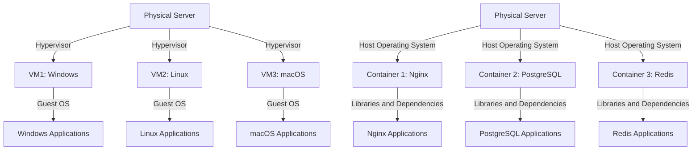
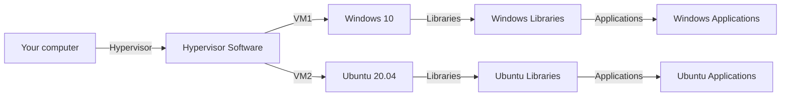
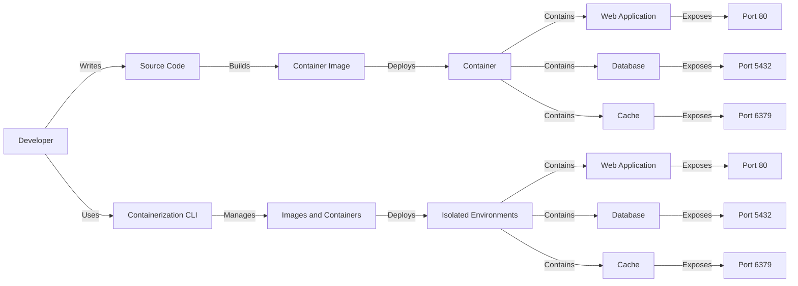

<a name="CI/CD" id="CI/CD"></a>

# Understanding CI/CD

> But first! We need to understand what CI/CD is and why it matters, and then we will look at microservices.

CI/CD is a process that lets you build, test, and deploy applications in an automated way.

A metaphor to understand it:

- **CI**: Imagine you are a chef. You have a recipe to bake a cake. CI (Continuous Integration) means checking every ingredient and every step of the recipe as you add them, to make sure everything is correct and the cake will turn out well.

<br>

- **CD**: Once all ingredients are checked and the recipe is ready, CD (Continuous Deployment) means putting the cake in the oven and baking it automatically without further intervention, ensuring the cake is ready to serve as soon as it is done.

---
routeAlias: 'utiliser-des-pipelines-cicd'
---

<a name="PIPELINES" id="PIPELINES"></a>

# Using CI/CD Pipelines

A CI/CD pipeline is a process that lets you build, test, and deploy applications in an automated way.

What does pipeline mean?

> A pipeline is a process that lets you build, test, and deploy applications in an automated way.

<br>

> In plain terms: it is the entire deployment chain / the deployment process.

---

# Why talk about CI/CD with Docker?

> Docker is a containerization tool.

<small>

So it is important to understand the CI/CD concept with this tool.

Imagine we are developing a web application and we want to deploy it.

We could use a CI/CD pipeline to deploy our application.

On every push to the git repository, the pipeline triggers and deploys our application.

But it deploys our application inside a container.

In an **ISOLATED AND PORTABLE** environment — that is what we want!

If we change our working environment, we will not need to repeat the same steps, thanks to Docker.

</small>

---
routeAlias: 'comprendre-les-microservices'
---

<a name="MICROSERVICES" id="MICROSERVICES"></a>

# Understanding Microservices

A microservice is an independent application that can be built from a specific operating system or software environment.

A metaphor to understand it:

- **Microservice**: Imagine you are in a supermarket. Each aisle is a microservice that manages a specific type of product. For example, the produce aisle handles only fruits and vegetables, while the dairy aisle handles only dairy products. Each aisle operates independently but contributes to the supermarket as a whole.

---
routeAlias: 'pourquoi-utiliser-les-microservices'
---

<a name="MICROSERVICES" id="MICROSERVICES"></a>

# Why use microservices?

Microservices let you split an application into several independent services that can be developed, deployed, and managed separately. This makes the application more modular, easier to maintain, and more scalable.

---

# Concrete example and ... what is it for?

Imagine we are developing an e-commerce application.

We could have the following microservices:

- **Product management microservice**: Handles products, stock, prices, and so on.
- **Order management microservice**: Handles orders, billing, delivery, and so on.
- **Payment management microservice**: Handles payments, transactions, and so on.
- **User management microservice**: Handles users, accounts, permissions, and so on.

I hope you have understood the microservice concept.

Because in truth, when you use Docker/docker you are not going to create microservices as such.

But you will use containers that themselves can be microservices.

And anyway, this architecture is used in everyday life.

---

<small>

## Quiz on microservices and CI/CD

<br>

### 1. What is the main advantage of microservices?

<br>

- [ ] They make it possible to create monolithic applications.
- [ ] They make it possible to split an application into several independent services.
- [ ] They require fewer resources than traditional applications.
- [ ] They are harder to maintain.

<br>

### 2. In the e-commerce application example, which microservice handles payment transactions?

<br>

- [ ] Product management microservice
- [ ] Order management microservice
- [ ] Payment management microservice
- [ ] User management microservice

</small>

---

<small>

### 3. Why use microservices?

<br>

- [ ] To make the application more modular, easier to maintain, and more scalable.
- [ ] To increase application complexity.
- [ ] To reduce the number of developers needed.
- [ ] To avoid using containers.

<br>

</small>

---

<small>

### 4. What is the main goal of CI/CD?

<br>

- [ ] Increase software development complexity.
- [ ] Automate the development, testing, and deployment process.
- [ ] Reduce code quality.
- [ ] Replace developers with machines.

<br>

### 5. Which tool is commonly used for CI/CD?

<br>

- [ ] Docker Hub
- [ ] Jenkins
- [ ] GitHub Packages
- [ ] Quay.io

</small>

---

# Answer(s)

<small>

1. They make it possible to create modular and independent applications.
2. Payment management microservice
3. To make the application more modular, easier to maintain, and more scalable.
4. Automate the development, testing, and deployment process.
5. GitHub Packages / Jenkins

</small>

---
layout: new-section
routeAlias: 'des-definitions-avant-tout'
---

# Definitions first


---

# Definition of virtualization

Virtualization is a process that creates an image of an operating system or software environment in what is called a virtual machine.

# Definition of container

A container is an isolated environment used to deploy applications from an operating system or software environment.

# Definition of containerization

Containerization is a process that creates a container from an operating system or software environment.

---

<!-- not in the right place -->

# Definition of virtual machine

A virtual machine is a software environment that runs operating systems or applications in isolation by simulating computer hardware.

---
routeAlias: 'virtualisation-vs-conteneurisation'
---

<a name="VIRTUALISATION" id="VIRTUALISATION"></a>

# Virtualization vs containerization

Virtualization and containerization are two concepts related to managing computing resources.

- **Virtualization**: Virtualization is a process that creates an image of an operating system or software environment in a virtual machine.
- **Containerization**: Containerization is a process that creates a container from an operating system or software environment.

---
routeAlias: 'schema-de-virtualisation-et-de-conteneurisation'
---

# Virtualization and Containerization Diagram

<small>
Here is a diagram that illustrates the differences between virtualization and containerization.

</small>
<div class="mermaid">



</div>

---

# How does virtualization work?

Virtualization is a process that creates an image of an operating system or software environment in a virtual machine.



---

# How does containerization work?

Containerization is a process that creates a container from an operating system or software environment.



---

# Kernel Definition

<small>

> The kernel is the core of the operating system that manages hardware resources and interactions between hardware and software. Containers are isolated environments that share the same kernel but operate independently of one another.

<br>

## A simple way to understand the kernel:

The kernel is the brain of the operating system.

It manages hardware resources and interactions between hardware and software.

</small>

---

# Quiz on definitions

<small>

## What is virtualization?

<br>

- [ ] Virtualization is a process that creates an image of an operating system or software environment in a container.
- [ ] Virtualization is a process that creates a virtual machine from an operating system or software environment.
- [ ] Virtualization is a process that creates a container from an operating system or software environment.
- [ ] Virtualization is a process that creates a container from an operating system or software environment.

</small>

---

## What is containerization?

<br>

<small>

- [ ] Containerization is a process that creates a container from an operating system or software environment.
- [ ] Containerization is a process that creates a virtual machine from an operating system or software environment.
- [ ] Containerization is a process that creates an image of an operating system or software environment in a container.
- [ ] Containerization is a process that creates a container from an operating system or software environment.

</small>

---

<small>

## What is the difference between virtualization and containerization?

<br>

- [ ] Virtualization is a process that creates an image of an operating system or software environment in a container, whereas containerization is a process that creates a container from an operating system or software environment.

- [ ] Virtualization is a process that creates a virtual machine from an operating system or software environment, whereas containerization is a process that creates a container from an operating system or software environment.

- [ ] Containerization is a process that creates a container from an operating system or software environment, whereas virtualization is a process that creates an image of an operating system or software environment in a container.

- [ ] Containerization is a process that creates an image of an operating system or software environment in a container.

</small>

---
layout: text-image
reverse: true
routeAlias: 'intro-Docker'
title: 'intro-Docker'
anchor: 'intro-Docker'
media: 'https://wiki.ghr36cloud.com/docker.png'
---

<a name="DISCLAIMER" id="intro-Docker"></a>

# Introduction to Docker

Docker is a container management tool that lets you create, manage, and run containers.

Docker offers features such as service management and improved security through its architecture.

---
routeAlias: 'le-cli-docker'
---

<a name="le-cli-docker" id="le-cli-docker"></a>

# The Docker CLI

We will look at Docker's main commands.

### Main Docker commands

| Command               | Description                                    |
| ---------------------- | ---------------------------------------------- |
| <kbd>docker run</kbd>  | Runs a command in a new container |
| <kbd>docker ps</kbd>   | Lists running containers      |
| <kbd>docker stop</kbd> | Stops a running container       |
| <kbd>docker rm</kbd>   | Removes a stopped container                   |

---

<small>

| Command                 | Description                                                 |
| ------------------------ | ----------------------------------------------------------- |
| <kbd>docker pull</kbd>   | Downloads an image from a registry                     |
| <kbd>docker images</kbd> | Lists locally available images                     |
| <kbd>docker rmi</kbd>    | Removes one or more images                            |
| <kbd>docker exec</kbd>   | Runs a command in a running container |
| <kbd>docker build</kbd>  | Builds an image from a Dockerfile                  |
| <kbd>docker push</kbd>   | Pushes an image to a registry                             |
| <kbd>docker tag</kbd>    | Adds a tag to an image                                   |
| <kbd>docker login</kbd>  | Logs in to a registry                                      |
| <kbd>docker logout</kbd> | Logs out of a registry                                    |

</small>

---
routeAlias: "commandes-docker-avancees"
---

<a name="commandes-docker-avancees" id="commandes-docker-avancees"></a>

# Advanced commands

Here are some advanced commands.

### Advanced commands

| Command                         | Description                                       |
| -------------------------------- | ------------------------------------------------- |
| <kbd>docker network create</kbd> | Creates a new Docker network                     |
| <kbd>docker volume create</kbd>  | Creates a new Docker volume                     |
| <kbd>docker inspect</kbd>        | Shows details of a container or image |
| <kbd>docker logs</kbd>           | Shows container logs                   |

---

# More advanced commands

Here are some other advanced Docker commands.

### Additional advanced commands

| Command                       | Description                                                                                       |
| ------------------------------ | ------------------------------------------------------------------------------------------------- |
| <kbd>docker-compose up</kbd>   | Starts and attaches containers defined in a docker-compose file                          |
| <kbd>docker-compose down</kbd> | Stops and removes containers, networks, and volumes defined in a docker-compose file        |
| <kbd>docker-compose logs</kbd> | Shows logs for services defined in a docker-compose file                              |
| <kbd>docker-compose exec</kbd> | Runs a command in a running container defined in a docker-compose file |

---

> Quick tip:

Since Docker version 2.0, you no longer have to write docker-compose with a hyphen — you can use:

```bash
docker compose up
```

<br>

> Do not worry, we will see later how to use these commands.

<br>

## Right away!

---
layout: new-section
routeAlias: 'images-Docker'
---

<a name="images-Docker" id="images-Docker"></a>

# Images Docker


---

> Let's start by reviewing what an image is.

An image is a file that contains an operating system or software environment.

**<u>Example:</u>**

```bash
docker pull ubuntu:latest
```

<small>

This gives us an image of the Ubuntu Linux distribution.

I will therefore **FROM THIS IMAGE** create a **CONTAINER**.

> I can pull images from registries such as:

- Docker Hub
- Quay.io
- GitHub Packages
- etc

But of course I can also create my own images.

<div class="-mt-6">

(either from scratch, or from another image by building layers on top of it)

</div>

</small>

---

## Extra tip: you can search for images directly with the command:

<br>

```bash
docker search <image>
```

Note: images are large, so use them sparingly.

In general, use lightweight base images such as `alpine`, `ubuntu:slim`, `debian:slim`, and so on.

**I think you get the idea — try to use lightweight base images.**

---
layout: new-section
routeAlias: "creer-son-premier-conteneur"
---

<a name="creer-son-premier-conteneur" id="creer-son-premier-conteneur"></a>

<!-- ps Docker -->

# Create your first container


---

# Create your first container

```bash
Docker run -d --name my-container -p 8080:80 nginx
```

## Explanations

- `Docker run`: Command to create and run a container.
- `-d`: Runs the container in the background.
- `--name my-container`: Container name.
- `-p 8080:80`: Container port. (8080 on the host, 80 in the container)
- `nginx`: Image to use.

---

# A small exercise:

Create a container running an nginx image (or one of your choice) that is accessible on your host.

You already have everything you need in the previous slide.

You can then use the `Docker ps` and `Docker logs <id>` commands to verify that everything works and that the container is running.

You can try creating several containers from the same image and making them accessible from your host.

You can also try accessing the application from your host.

And you can stop everything with the `Docker stop <id>` command and remove it with `Docker rm <id>`.

---

### Exercise: Container Management

#### Goal:
Create, manage, and remove a container using CLI commands.

#### Steps:

1. **List available images**  
   Display the list of images available locally on your machine.

   - **Command to use:**  
     ```bash
     docker images
     ```

2. **Download a new image**
   Download the `nginx` image from Docker Hub.

   - **Command to use:**
     ```bash
     docker pull nginx
     ```

---

3. **Create and run a container**
   Create and run an `nginx` container with a port exposed on your host machine (port 8080 on the host redirected to port 80 in the container).

   - **Command to use:**
     ```bash
     docker run -d --name my-nginx -p 8080:80 nginx
     ```

4. **Verify the running container**
   Display the list of running containers.

   - **Command to use:**
     ```bash
     docker ps
     ```

---
layout: new-section
---

# DockerFile


---

# First, definition of a Dockerfile/DockerFile.

A Dockerfile is a file that contains instructions for building a container image.

A DockerFile is the same thing, but for Docker.

For example, if I need an image with a specific Node version and a few dependencies specific to my application, I can create an image with the Node version, all the dependencies, and my application that I need.

---

# Main commands

Specifies the base image from which the Docker image will be built

```dockerfile
FROM <image>:<tag>
```

Defines the Dockerfile author or metadata about the image

```dockerfile
LABEL maintainer="<name or email>"
```

---

Copies a file or directory from the local machine to the Docker image

```dockerfile
COPY <source_path> <destination_path>
```

---

Downloads a file from a URL into the Docker image

```dockerfile
ADD <source> <destination>
```

<br>

> Note: `ADD` can also extract compressed files, unlike `COPY`.

<br>

Sets the working directory (current working directory) in the image

```dockerfile
WORKDIR <path>
```

---

Runs a command when the Docker image is being built

<br>

```dockerfile
RUN <command>
```

<br>

Often used to install dependencies or configure the system

<br>

```dockerfile
ENV <variable> <value>
```

<br>

```dockerfile
EXPOSE <port>
```

---

Specifies an entry point for running a default command in the container

```dockerfile
ENTRYPOINT ["command", "argument"]
```

ENTRYPOINT is often used to define a main command that will always run

Defines a default command that can be overridden when the container starts

```dockerfile
CMD ["command", "argument"]
```

<br>

> CMD is more flexible than ENTRYPOINT and can be overridden by command-line arguments

---

Sets an environment variable in the image

```dockerfile
ENV <variable> <value>
```

Sets the ports the container will expose

```dockerfile
EXPOSE <port>
```
Does not map ports automatically — it exposes the port in the container but not on your host

---

Copies files while preserving file metadata (such as permissions)
```dockerfile
COPY --chown=<user>:<group> <source_path> <destination_path>
```

Useful when file permissions matter inside the container

Sets the volumes the image will use

```dockerfile
VOLUME ["/path/to/volume"]
```
Lets you specify one or more directories that will be mounted as volumes

Sets the user to use inside the container

```dockerfile
USER <user>
```

<br>

> By default, containers run as the `root` user, which is not the case on Docker. (rootless)

---

Sets build arguments that can be passed when building the image

```dockerfile
ARG <variable_name>
```

Sets a signal that should be used to stop the container

```dockerfile
STOPSIGNAL <signal>
```

Defines container health via a command that runs periodically

```dockerfile
HEALTHCHECK --interval=<duration> --timeout=<duration> --retries=<number> CMD <command>
```

Lets you check whether the container is in good working order

---

Lets you reference a Dockerfile instruction from a previous stage to obtain files or layers

```dockerfile
FROM <image>:<tag> AS <alias>
```

Often used in multi-stage builds

Sets a temporary or specific directory for temporary files

```dockerfile
WORKDIR /path/to/directory
```

---

# To use it, run:

```bash
Docker build -t my-image .
```

Explanations:

- `Docker build`: Command to create an image from a Dockerfile.
- `-t my-image`: Image name.
- `.`: Directory where the Dockerfile is located — here at the project root.

However, if you use a Docker file or dockerfile with a name other than `Dockerfile`
<br>
you need to run:

```bash
Docker build -t my-image -f Dockerfile.dev .
```

Dockerfile.dev is the name of the Dockerfile I used as an example.

---

# Small exercise: Performance optimization

#### Goal:

Create, optimize, and analyze Docker containers, with a focus on improving performance and managing resources.
----

### Step 1: Create a simple Dockerfile and start the container

<br>

1. **Goal**: Create a Dockerfile for a simple application and start a container.
2. **Tasks**:
- Create a Dockerfile for a minimal application that uses a lightweight base image.
- Start the container so it is accessible on port 8080.
- Install a web server and make it start when the container launches.
3. **Hints**:
- You can choose a base image such as `alpine` or another one that seems suitable for your needs.
- Find how to expose the container port to the outside.

---

# A bad dockerfile

```dockerfile
# Using a heavy base image that is unnecessary for the application
FROM ubuntu:latest

# Not specifying a maintainer - unclear who created this image
MAINTAINER "someone@example.com"

# Running a single apt-get command without update, which can lead to outdated or vulnerable packages
RUN apt-get install -y curl
```

<br>

> ps: continued on the next slide

---

```dockerfile
# Application code is copied before installing dependencies, which breaks Docker layer caching
COPY . /app

# Running multiple RUN commands in a single instruction, making debugging and maintenance harder
RUN cd /app && \
    mkdir temp && \
    touch temp/file.txt && \
    echo "Creating a temporary file"

# Bad use of the root user — applications should not run with these privileges for security reasons
USER root

# Using a port that is not needed for the application
EXPOSE 1234

# Incorrect and useless CMD command — the application does not actually start here
CMD ["echo", "Hello World"]
```

---

### Explanation of the mistakes:

<small>

1. **FROM ubuntu:latest**: The Ubuntu image is heavy for most applications — prefer a lighter image such as Alpine or one specific to the runtime environment (for example, `node:alpine`, `python:slim`). Also, using `:latest` can introduce unstable version issues; it is better to use a specific version.

2. **MAINTAINER**: This instruction is obsolete in recent Docker versions. Use `LABEL maintainer="someone@example.com"` instead.

3. **RUN apt-get install -y curl**: A `apt-get update` command is missing before installing packages, which can lead to outdated packages. Also, installing `curl` may be unnecessary and adds unnecessary weight to the image.

4. **COPY . /app**: Code is copied before installing dependencies, which breaks Docker caching. For better optimization, dependencies should be installed before copying the full source code, especially if they change rarely.

</small>

---

<small>

5. **RUN cd /app && \ mkdir temp && \ touch temp/file.txt**: There are multiple commands in a single `RUN` instruction, which makes debugging difficult. If one part fails, it will be hard to identify which one. Also, creating a temporary file in a build step makes no sense if the application does not use it directly.

6. **USER root**: Running applications as the root user is not recommended for security reasons. It is better to create an unprivileged user and use it to run the application.

7. **EXPOSE 1234**: Exposing a port that is not used by the application is useless and can be confusing.

8. **CMD ["echo", "Hello World"]**: This command does not actually start an application. It only prints a message, which does not reflect the expected behavior for a Docker application.

</small>

---

# A good dockerfile

Let's look at a good Dockerfile here.

```dockerfile
# Using a lightweight base image suited to the application
FROM alpine:3.16

# Declaring the maintainer via LABEL (more modern than MAINTAINER)
LABEL maintainer="someone@example.com"

# Updating packages and installing curl properly
# Combines apk update and install to reduce layers and keep the image up to date
RUN apk update && apk add --no-cache curl

# Installing dependencies before copying source code to optimize Docker cache
# This ensures dependencies are reused if the source code changes
WORKDIR /app
```

<br>

> ps: continued on the next slide

---

```dockerfile
# Copy only the dependency file (if applicable, e.g. package.json for Node.js, requirements.txt for Python)
# COPY package.json /app  <-- Example of good practice for Node.js or Python

# Install dependencies (if applicable)
# RUN npm install or pip install -r requirements.txt

# Copy the application code into the container
COPY . .

# Create a non-root user to avoid security risks from running as root
RUN adduser -D -g '' appuser
USER appuser

# Expose only the port needed by the application
EXPOSE 8080

# Start the application (appropriate final command for the application)
# Make sure to define the command that starts the actual application (for example, Node, Python, etc.)
CMD ["./start-app.sh"]
```

---

# Why is this a good Dockerfile?

<small>

1. **FROM alpine:3.16**: Alpine is a very lightweight base image (only a few MB) compared to Ubuntu, which reduces the overall Docker image size. By specifying a precise version (`3.16`), stability is guaranteed.

2. **LABEL maintainer="someone@example.com"**: The `LABEL` command is the recommended way to specify the image maintainer because it is more modern and flexible than the old `MAINTAINER` instruction.

3. **RUN apk update && apk add --no-cache curl**: Using `apk update` ensures packages are up to date before installation. The `--no-cache` option avoids storing unnecessary temporary files, which optimizes the image by making it smaller.

4. **WORKDIR /app**: `WORKDIR` sets the working directory where all subsequent actions take place, instead of using `cd` commands. It is cleaner and more readable.

</small>

---

<small>

5. **COPY package.json /app** and **RUN npm install / pip install**: Installing dependencies before copying all source code takes advantage of Docker cache. If source code changes frequently but dependencies stay the same, this step will not be re-run on every build.

6. **COPY . .**: Copies all application source code into the working directory. This happens after installing dependencies to preserve the cache.

7. **RUN adduser -D -g '' appuser**: Creating a non-root user avoids running the application with elevated privileges, which is a good security practice.

8. **USER appuser**: The container now runs as an unprivileged user.

9. **EXPOSE 8080**: The application should only expose ports that are actually needed. Port `8080` is often used for web applications.

10. **CMD ["./start-app.sh"]**: Make sure the startup command matches what is expected to launch the application (for example a script or command to start the server).

</small>

---

# Now it's your turn! Exercise:

### Step 2: Rewrite a poorly optimized Dockerfile

1. **Goal**: Take a poorly optimized Dockerfile and rewrite it to reduce image size and improve startup times.

2. **Tasks**:
	- Here is a Dockerfile that could be written better:

---

```dockerfile
FROM ubuntu:20.04
# Update and install tools
RUN apt-get update && apt-get install -y vim
RUN apt-get install -y git
RUN apt-get install -y curl
RUN apt-get install -y wget
# Installing nodejs and npm
RUN apt-get update && apt-get install -y nodejs
RUN apt-get install -y npm
# Installing web server
RUN apt-get install -y apache2
RUN service apache2 start
RUN apt-get install -y nginx
CMD ["service", "nginx", "start"]
# Setup application
RUN mkdir /app
RUN mkdir /app/tmp
RUN mkdir /app/static
COPY index.html /app/static/
COPY styles.css /app/static/
RUN mv /app/static/* /var/www/html/
# Cleanup
RUN rm -rf /var/lib/apt/lists/* /tmp/* /var/tmp/*
CMD ["apache2ctl", "-D", "FOREGROUND"]
```

---

Here is the corrected version:

```dockerfile
FROM ubuntu:20.04
# Update and install all tools in a single layer, remove WGET (not needed)
RUN apt-get update && apt-get install -y vim git curl nodejs npm apache2 nginx && \
    rm -rf /var/lib/apt/lists/*
# Configure the application in fewer steps
WORKDIR /app
COPY index.html /var/www/html/
COPY styles.css /var/www/html/
# Expose the necessary ports (if needed for the web server)
EXPOSE 80
# Use a single web server, remove service commands (let CMD handle startup)
CMD ["nginx", "-g", "daemon off;"]
```

---

# Dockerfile — Node.js example

```dockerfile
# Use an official Node.js base image
FROM node:14

# Set the working directory in the container
WORKDIR /app

# Copy package.json and package-lock.json into the working directory
COPY package*.json ./

# Install project dependencies
RUN npm install

# Copy the rest of the application files into the working directory
COPY . .

# Expose the port on which the application will run
EXPOSE 3000

# Start the application
CMD ["npm", "start"]
```

---

# Dockerfile — React example

```dockerfile
# Use an official Node.js base image
FROM node:14

# Set the working directory in the container
WORKDIR /app

# Copy package.json and package-lock.json into the working directory
COPY package*.json ./

# Install project dependencies
RUN npm install

# Copy the rest of the application files into the working directory
COPY . .

# Expose the port on which the application will run
EXPOSE 3000

# Start the application
CMD ["npm", "start"]
```

---

# Dockerfile — Python example

```dockerfile
# Use an official Python base image
FROM python:3.9

# Set the working directory in the container
WORKDIR /app

# Copy requirements.txt into the working directory
COPY requirements.txt ./

# Install project dependencies
RUN pip install -r requirements.txt

# Copy the rest of the application files into the working directory
COPY . .

# Expose the port on which the application will run
EXPOSE 8000

# Start the application
CMD ["python", "app.py"]
```

---

# Dockerfile — Ruby example

```dockerfile
# Use an official Ruby base image
FROM ruby:2.7

# Set the working directory in the container
WORKDIR /app

# Copy Gemfile and Gemfile.lock into the working directory
COPY Gemfile Gemfile.lock ./

# Install project dependencies
RUN bundle install

# Copy the rest of the application files into the working directory
COPY . .

# Expose the port on which the application will run
EXPOSE 3000

# Start the application
CMD ["ruby", "app.rb"]
```

---

# Dockerfile — Java example

```dockerfile
# Use an official Java base image
FROM openjdk:8

# Set the working directory in the container
WORKDIR /app  

# Copy the jar file into the working directory
COPY target/my-application.jar /app

# Expose the port on which the application will run
EXPOSE 8080

# Start the application
CMD ["java", "-jar", "my-application.jar"]
```

---

# DISCLAIMER

<small>
The Dockerfiles above are examples and are not fully complete — I am noting this based on a Dockerfile I personally use in a Next.js project.

</small>

<small>

```dockerfile
# Dependencies stage
FROM node:22-alpine AS deps
RUN apk add --no-cache \
  libc6-compat \
  python3 \
  make \
  g++ \
  cairo-dev \
  pango-dev \
  jpeg-dev \
  giflib-dev \
  librsvg-dev \
  openssl3

WORKDIR /app
COPY package.json package-lock.json ./
RUN npm install canvas --build-from-source && npm install --frozen-lockfile
```

</small>

---

<small>

```dockerfile
# Build stage
FROM node:22-alpine AS builder
WORKDIR /app
COPY --from=deps /app/node_modules ./node_modules
COPY --from=deps /app/package.json ./package.json
COPY tsconfig.json server.js .env ./
COPY . .

USER root
RUN npx prisma generate && npm run build

# Production stage
FROM node:22-alpine AS runner
WORKDIR /app

ENV NODE_ENV production

RUN addgroup -g 1001 -S nodejs && adduser -S nextjs -u 1001
RUN npm i -g next

COPY --from=builder /app/package.json ./package.json
COPY --from=builder /app/node_modules ./node_modules
COPY --from=builder /app/public ./public
COPY --from=builder /app/.env ./.env
COPY --from=builder /app/server.js ./server.js
COPY --from=builder --chown=nextjs:nodejs /app/.next/ ./.next

USER nextjs

EXPOSE 3000
ENV PORT 3000

CMD ["node", "server.js"]
```

</small>

---

In fact, this is a somewhat more realistic Dockerfile than the previous ones.

> There are 3 stages:

<br>

1. **deps: dependency installation**
2. **builder: application build**
3. **runner: application execution**

<br>

> But as you can see, I used Alpine Linux to reduce image size.

So I do not have access to dnf install, pacman install, or apt-get install.

But I do have access to apk add to add my dependencies.

<br>

> And also, I used a multi-stage build to separate build and runtime stages.

<br>

---

# Dockerfile 

I also created a non-root user to run the application.

<div class="text-red-500">

**For more security.**

</div>

Why? The root user is too powerful.

So here I created a non-root user to run the application with only the necessary permissions.

---
layout: new-section
routeAlias: 'reseaux-docker'
---

<a name="reseaux-docker" id="reseaux-docker"></a>

# Docker Networks


---

# Networks in Docker

## Introduction to Docker networks

Networks in Docker let containers communicate with each other and with the outside world. They play a crucial role in container isolation, security, and performance.

---

## Types of Docker networks (1/2)

1. **Bridge Network**: The default network that lets containers communicate with each other on the same host.
   Example: Containers on a "bridge" network can connect to each other using their internal IP addresses.
   Metaphor: A bridge connecting all boats in a harbor.

2. **Host Network**: Uses the host network directly, which can improve performance but reduces isolation.
   Example: 
   ```bash
   docker run --network host nginx
   ```
   Metaphor: A boat that uses the harbor infrastructure directly.

---

## Types of Docker networks (2/2)

3. **None Network**: Disables all network access for the container.
   Example:
   ```bash
   docker run --network none busybox
   ```
   Metaphor: An isolated boat with no connection.

4. **User-defined Network**: Custom network to isolate groups of containers.
   Example:
   ```bash
   docker network create my-network
   docker run --network my-network nginx
   ```
   Metaphor: A private harbor for a specific group of boats.

---

## Docker network configuration

### Example with Docker Compose:

```yaml
version: '3.8'
services:
  frontend:
    image: nginx
    networks:
      - frontend-network

  backend:
    image: node
    networks:
      - frontend-network
      - backend-network

  db:
    image: postgres
    networks:
      - backend-network

networks:
  frontend-network:
  backend-network:
```

---

## Useful commands for network management

```bash
# List networks
docker network ls

# Create a network
docker network create my-network

# Inspect a network
docker network inspect my-network

# Connect a container to a network
docker network connect my-network my-container

# Disconnect a container from a network
docker network disconnect my-network my-container
```

---

## Best practices for Docker networks

1. Use custom networks to isolate groups of containers
2. Avoid exposing ports unnecessarily
3. Use network aliases to make communication between containers easier
4. Configure appropriate security rules
5. Document your network architecture

---

# Docker Compose


---

# Before we begin

What is Docker Compose?

It is a tool that lets you deploy containers using YAML files.

Docker Compose is a tool that lets you deploy containers using YAML files.

> Note: I am talking about containers, not images — you can use existing images or custom images for your containers.

---

# YAML syntax

> Second point: YAML is a configuration language that is very easy to pick up but requires perfect indentation (like Python, for example). If you do not respect indentation, you will get an error.

---

# Concrete example with Next.js and PostgreSQL

**Example with a Next.js project that wants to use PostgreSQL as a database — why install it locally and struggle to repeat these steps if you want to change servers or if another developer on the project has to do the same steps locally on their machine?**

> Because yes, you understood it — but we do not install PostgreSQL the same way on Windows, Linux, and macOS, so if a developer joins the project, hello hassle.

---

# Deployment with Docker Compose

Or: We use a dockerfile/Dockerfile and a docker-compose.yml to deploy our containers in production environments — docker-compose will in this case build our custom images and then start the containers in "pods" or "services".

---

# DOCKER COMPOSE AND DOCKERFILE SCHEMA

Here we will look at a Docker Compose and Docker File schema.
How we can deploy our containers with YAML files.
But also how to deploy containers with JSON files.

<div class="mermaid">
graph TD
    A[Dockerfile] --> B[Docker Image]
    B --> C[Container]
    D[docker-compose.yml] --> E[Services]
    E --> C
</div>

---

# Docker Compose configuration example

```yaml
version: '3.8'
services:
  web-app:
    # Using a suitable image with a specific version for more stability
    image: httpd:2.4

    # Ports correctly mapped between host and container
    ports:
      - "8080:80"

    # Volume correctly defined with a host path and a container path
    volumes:
      - ./web-app:/usr/local/apache2/htdocs/

    # Explicit network declaration for better communication between services
    networks:
      - webnet

  database:
    # Using a specific MySQL version to ensure compatibility and stability
    image: mysql:5.7

    # Explicit environment variables for MySQL configuration
    environment:
      MYSQL_ROOT_PASSWORD: rootpassword
      MYSQL_DATABASE: mydb
      MYSQL_USER: myuser
      MYSQL_PASSWORD: mypassword

    # Volume correctly defined for MySQL data persistence
    volumes:
      - mysql-data:/var/lib/mysql

    # Dependency correctly defined with a healthcheck to verify web-app is ready before starting
    depends_on:
      web-app:
        condition: service_healthy

    # Health check to ensure the database is ready before other services try to connect
    healthcheck:
      test: ["CMD", "mysqladmin", "ping", "-h", "localhost"]
      interval: 10s
      retries: 5

# Custom network declaration for secure communication
networks:
  webnet:

# Persistent volume declaration
volumes:
  mysql-data:
```

---

### Explanation of the improvements (1/2)

1. **`version: '3.8'`**: Using a more recent and stable Compose specification version.

2. **`image: httpd:2.4` and `mysql:5.7`**: Specifying a version for each image ensures build stability, avoiding surprises during updates.

3. **`ports: "8080:80"`**: Correctly configured to redirect host port 8080 to container port 80.

4. **Volumes correctly defined**: Volumes are mounted with explicit paths between host and container, ensuring data and source files are properly synchronized.

---

### Explanation of the improvements (2/2)

5. **`networks`**: Creating a custom network ensures services can communicate correctly while isolating traffic from the host network.

6. **`healthcheck`**: Health checks ensure services start correctly and are ready before launching other dependent services.

7. **`depends_on`** with health condition: The "web-app" container must be ready before the database starts, with verification via a healthcheck to avoid startup errors.

With these corrections, the `Docker-compose.yml` file is much more robust, secure, and efficient.

---
layout: new-section
routeAlias: 'volumes-persistants'
---

# Persistent Volumes

<a name="volumes-persistants" id="volumes-persistants"></a>


---

# Persistent Volumes

### What is a persistent volume?

A persistent volume is shared storage space between the container and the host (your computer).

### Why use a persistent volume?

A persistent volume is useful for storing data permanently.

---

### How to use a persistent volume?

To use a persistent volume, you must declare it in your configuration file and mount it in your container. Here is a concrete example with an Nginx container:

```yaml
volumes:
  - nginx-data:/var/www/html
```

---

## Explanation

- `nginx-data` is the name of the persistent volume.
- `/var/www/html` is the path in the container where the volume will be mounted.

## In plain terms:

I create a persistent volume that will be mounted in the container at the path `/var/www/html`.

On my computer I could access it at this location in my filesystem:

```bash
~/nginx-data
```

---

## Creating a volume via CLI

You can do it via the CLI with the command:

```bash
docker run -v my-volume:/data
```

We will see later that you can also do it directly in docker-compose

---

# Concrete example!

```bash
docker run -d \
  --name mysql-container \
  -v mysql-data:/var/lib/mysql \
  -v mysql-logs:/var/log/mysql \
  -v mysql-config:/etc/mysql \
  mysql:latest
```

---

# Explanation of the example:

- `mysql-data` is a persistent volume that stores database data.
- `mysql-logs` is a persistent volume that stores database logs.
- `mysql-config` is a persistent volume that stores database configuration.

---

### Exercise: Using a Docker volume

1. **Goal**: Use a Docker volume to persist application files.

2. **Tasks**:
   - Modify the container you created previously so it uses a Docker volume, so that web application files can be shared between the host and the container.
   - Start the container with this volume and verify that file changes on the host are reflected in the container.

3. **Hints**:
   - Find how to use a volume to mount a host folder into the container.

---
layout: new-section
routeAlias: 'pods-et-reseau'
---

<a name="pods-et-reseau" id="pods-et-reseau"></a>

# Pods and Networking


---

# Pods in Docker

## Introduction to pods in Docker

Pods are groups of containers sharing the same network and namespace. They enable better isolation and communication between containers.

> A metaphor: A boat that contains several containers.

**A comparison with Docker**: A pod is similar to a group of containers in Docker (and the group of containers is called a "service" in Docker).

**A comparison with Kubernetes**: A pod is similar to a group of containers in Kubernetes (and the group of containers is called a pod in Kubernetes).

---

## Using pods in Docker

1. **Creating a pod**:

```bash
Docker pod create --name my-pod
```

2. **Adding containers to the pod**:

```bash
Docker run --pod my-pod --name my-container my-image
```

3. **Inspecting the pod**:

```bash
Docker inspect my-pod
```

4. **Removing the pod**:

```bash
Docker pod rm --force my-pod
```

`--force` is optional — it forces pod removal.

---

## Conclusion

Pods in Docker offer better isolation and communication between containers, making it easier to manage containerized applications.

---

### Small pod exercise

1. **Goal**: Create a pod with two containers and verify that both containers can communicate.
2. **Tasks**:
   - Create a pod with an Nginx container and a Redis container.
   - Verify that both containers can communicate.
3. **Hints**:
   - Use the `Docker pod create` command to create a pod.
   - Use the `Docker run` command to add containers to the pod.
   - Use the `Docker inspect` command to verify that the containers are in the same pod.

Use the ping or curl command to verify that both containers can communicate.

---

# Solution:

### How to verify that both containers can communicate?

With ping:

```bash
Docker exec -it my-pod-redis redis-cli ping
```

With curl:

```bash
Docker exec -it my-pod-nginx curl http://my-pod-redis:6379
```
---

### More complex exercise:

We will do the following exercise together live:

I will provide you with a Node.js backend and a React.js frontend.

You will need to put them in a Docker service and make the frontend able to access the backend.

Then you will need to add a MySQL container to this service and make the frontend able to access the backend and the database.

Here is the project structure:

```bash
.
├── frontend/
│   ├── Dockerfile
│   └── src/
├── backend/
│   ├── Dockerfile
│   └── src/
└── docker-compose.yml
```

---

Let's start by creating the `docker-compose.yml`:

```yaml
version: '3.8'
services:
  frontend:
    build: ./frontend
    ports:
      - "3000:3000"
    depends_on:
      - backend
    networks:
      - app-network

  backend:
    build: ./backend
    ports:
      - "5000:5000"
    depends_on:
      - db
    networks:
      - app-network

  db:
    image: mysql:8.0
    environment:
      MYSQL_ROOT_PASSWORD: rootpassword
      MYSQL_DATABASE: mydb
      MYSQL_USER: user
      MYSQL_PASSWORD: password
    ports:
      - "3306:3306"
    volumes:
      - mysql-data:/var/lib/mysql
    networks:
      - app-network

networks:
  app-network:
    driver: bridge

volumes:
  mysql-data:
```

// ... existing code ...

---

# Checkpoint/Restore

- **Docker**: Can save and restore a container's state.
  ```bash
  Docker container checkpoint
  Docker container restore
  ```
- **Docker**: No native functionality for this.

---

# OCI Compatibility (Open Container Initiative)

- Docker follows **OCI** standards for images and container runtimes.

  **Example: Export an OCI-compliant image**

  ```bash
  docker save --output=myimage.tar myapp:latest
  Docker save --format oci-archive --output=myimage.tar myapp:latest
  ```

---

# Signed image support and security

- Docker offers advanced features to sign and verify images using **sigstore** and **GPG**.

  **Example: Sign an image with Docker**

  ```bash
  Docker push --sign-by user@example.com myapp:latest
  Docker image trust set --pubkeyfile mykey.pub --type signed
  ```

  This is for information — I have not tried this feature yet myself, but here is the link to the official documentation so you can try it at home.

  [Official Docker documentation](https://docs.Docker.io/en/latest/markdown/Docker-push.1.html)

---

# Detached mode with specific retention policies

- Docker lets you configure containers in detached mode while enforcing specific restart policies.

  **Example: Docker restart policy**

  ```bash
  docker run --restart=always -d nginx
  ```

  **Example: Docker restart policy**

  ```bash
  Docker run --restart=on-failure -d nginx
  ```

<br>

---

# Docker Compose: Scaling use case

### Practical case: Scale the backend application to multiple instances

```yaml
version: "3.8"
services:
  backend:
    build: ./backend
    environment:
      DATABASE_URL: postgres://myuser:mypassword@db:5432/mydatabase
    ports:
      - "5000:5000"
    deploy:  # Service deployment
      replicas: 3  # Number of replicas
      resources:  # Allocated resources
        limits:  # Resource limits
          cpus: "0.5"  # CPU limit on a 1 CPU basis
          memory: "256M"  # Memory limit on a 512M basis
    networks:
      - backend
```

---

### Explanation:

- The backend service is scaled to three replicas to handle more traffic.
- Resources are limited for each container with a maximum of **0.5 CPU** and **256MB RAM**.

---

### Step 3: Limiting container resources

1. **Goal**: Limit the resources (CPU, memory) allocated to a container and observe the impact on performance.
2. **Tasks**:
 - Start a container with strict memory and CPU limits.
 - Load the server with requests to test its behavior under resource constraints.
 - Compare resource usage before and after applying these limits.
3. **Hints**:
 - Find how to specify CPU and memory limits when starting a container.

---

# Advanced volume management with Docker Compose

- Sometimes you need to use named volumes for specific performance or persistence needs.

```yaml
services:
  db:
    image: postgres:13
    volumes:
      - db-data:/var/lib/postgresql/data

volumes:
  db-data:
    driver: local
    driver_opts:
      type: "tmpfs"
      o: "size=100m"
```

---

### Explanation:

- Here, we use a **tmpfs** volume to store data in memory, which can improve performance but does not allow persistence after a restart.

---

# Conclusion

- With **Docker Compose** and **Docker Compose**, it is possible to orchestrate complex containers efficiently.
- **Dockerfile**/**Dockerfile** files can be optimized for production using advanced techniques such as **multi-stage builds**.
- **Docker** offers a rootless alternative compatible with Kubernetes, making it an excellent choice for environments where security is paramount.

---

# Bonus: Image and registry support

## Image and registry support

- **Docker**: Offers additional commands to sign and manage images.

<br>

```bash
  Docker image sign
  Docker image trust
```

<br>

- **Docker**: No equivalents for these commands.

---

# Bonus: Container extensions with CRIU (Checkpoint/Restore)

- **Docker** natively supports **CRIU** for saving/restoring a container's state.
  This makes it possible to migrate running containers from one host to another.

  **Example: Checkpoint a container**

  ```bash
  Docker container checkpoint --export=mycontainer.tar mycontainer
  ```

---

# Why Use Git with Docker?

<br>

- **Versioning**: Git lets you version and track changes in configuration files or Dockerfiles.
- **Collaboration**: Sharing images and configurations via Git repositories makes collaboration between teams easier.
- **Automation**: Git can be integrated into CI/CD pipelines to automatically trigger Docker actions (builds, deployments).

---

# Steps for Managing Images with Git

1. **Store Dockerfiles in a Git repository**
   - You can keep your Dockerfiles and configuration files in a Git repository for change tracking and revisions.

2. **Clone the repository and build the image**
   - Clone your Git repository locally:
     ```bash
     git clone https://github.com/your-repo.git
     cd your-repo
     ```
   - Use Docker to build the image from the Dockerfile:
     ```bash
     Docker build -t my-image .
     ```

---

3. **Push the image to a registry**
   - Once the image is built, you can push it to a Docker or OCI registry to share it:
     ```bash
     Docker push my-image docker://my-registry/my-image:latest
     ```

---

# Benefits
- **Tracking**: A complete history of changes.
- **Fast deployment**: Automated updates and deployment via Git.
- **Security**: Well-documented and traceable image versions.

---

This introduces the key concepts of using Git with Docker, with a focus on practical benefits and technical steps.

---
routeAlias: "kubernetes"
---

<a name="kubernetes" id="kubernetes"></a>

# Kubernetes Integration

- Docker was historically used as a runtime in Kubernetes, but has now been replaced by **containerd**.
- **Docker** has direct compatibility with Kubernetes by exporting pods in YAML format.

  **Example: Export a pod to Kubernetes with Docker**

  ```bash
  Docker generate kube mypod > mypod.yaml
  kubectl apply -f mypod.yaml
  ```

---

> I am briefly mentioning Kubernetes because it is what most companies use.

# What is Kubernetes?

Kubernetes is an open-source container orchestration system.

It is a container management system that lets you manage clusters of containers.

Even though the official documentation says it is not an orchestrator but a container management system.

---

# Kubernetes Architecture

Kubernetes uses a master and worker system.

The master is generally a server that manages the workers.

The workers are the servers that run the containers.

To use it you therefore need a server cluster and to be on Linux.

[Kubernetes on Windows](https://learn.microsoft.com/fr-fr/virtualization/windowscontainers/kubernetes/getting-started-kubernetes-windows)

---

# Kubernetes manifest example

```yaml
apiVersion: v1
kind: Pod
metadata:
  name: my-pod
```

---

# Kubernetes manifest example (continued)

```yaml
spec:
  containers:
    - name: my-container
      image: my-image:latest
```

Explanation:

- `apiVersion: v1`: Kubernetes API version.
- `kind: Pod`: Type of resource to create.
- `metadata: name: my-pod`: Pod metadata.
- `spec: containers: - name: my-container image: my-image:latest`: Specification of the container to start.

<small class="!-mt-4 text-red-500">

**Note: we will not go into Kubernetes in detail — this is just to give you an example manifest.**

</small>

---

# CNAME and CGroup with Docker

## Introduction

- Overview of CNAME and CGroup concepts
- Their role in container management with Docker

---

## CNAME - What is it?

**CNAME (Canonical Name) definition**

- In DNS, CNAME is a record that maps one domain name to another domain name.
- Used to redirect subdomains or alternate names to a main domain.
- Example: `www.exemple.com` → `exemple.com`

---

### Using CNAME in containers
**CNAME and Docker**

- Docker does not directly use CNAME records in container management.
- However, DNS concepts such as CNAME can be useful for directing network requests between containers.

Indeed, Docker does not directly manage **CNAME** (Canonical Name) DNS records, because this record type is specific to the **Domain Name System (DNS)** on the Internet, not to internal networks or container management.

---

However, there are alternatives for configuring names and managing network communication between containers in a Docker environment.

There are several solutions for name resolution between containers:

### 1. **`/etc/hosts` file**
   - **Docker** automatically creates an `/etc/hosts` file inside each container for local name resolution.
   - You can manually edit this file to add name mappings between containers.
   Example: add an entry in the `/etc/hosts` file to map a domain name to a local IP address.

   ```bash
   echo "172.17.0.2 backend" >> /etc/hosts
```

---

### 2. **Docker internal DNS**
   - Docker configures internal networks so containers can communicate with each other. Each container can be referenced by its **container name**.
   - If containers are on the same Docker network (by default), they can resolve each other by name directly, without external DNS.

   Example: If you have a container named `backend`, another container on the same network can access `backend` by name without additional configuration.

   We have already seen this in previous slides.


---

### 3. **DNS aliases with `--network-alias` (via Docker Compose/Docker Compose)**
   - If you use **Docker Compose** to orchestrate multiple containers, you can use the **`network-alias`** option to assign DNS aliases to containers on the same network.

   Example with Docker Compose:
   ```yaml
   version: '3'
   services:
     frontend:
       image: mon_frontend
       networks:
         app_net:
           aliases:
             - www.monsite.com
     backend:
       image: mon_backend
       networks:
         app_net:
   networks:
     app_net:
       driver: bridge
   ```
---

   Here, `frontend` will have the DNS alias `www.monsite.com`, which other containers can use to contact it.

---

### 4. **Custom DNS server**
   - If you need more advanced DNS management (for example, using CNAME records), you can deploy a **DNS** server in your container network and configure it to manage DNS records.
   - You can configure Docker to use this DNS server with the `--dns` option when starting containers.

   Example:
   ```bash
   Docker run --dns 10.88.0.10 --name mon_conteneur mon_image
   ```

   Here, `10.88.0.10` would be the IP address of your custom DNS server.

---

### Conclusion
Although **CNAME** cannot be used directly with Docker for containers, you can use the following alternatives:

- Name resolution by container name on the same network.
- Adding aliases with Docker Compose.
- Using a custom DNS server to manage more complex names.

These solutions provide effective name management and network communication between containers.

---

## CGroup - What is it?

- CGroups are Linux kernel features that limit and monitor resource usage by process groups (CPU, memory, disk, and so on).
- Docker uses CGroups to manage container resources.

---

## CGroup and Docker
**How Docker uses CGroups**

- When a container is started with Docker, it is encapsulated in a CGroup.
- This makes it possible to control the resources available to each container.
- Example: Limit CPU usage of a container with `--cpus`.

---

## Usage example with Docker
**Example of CGroup management with Docker**

```bash
Docker run --rm -d --name mon_conteneur --cpus=1 --memory=512m mon_image
```

- Here, we limit CPU to 1 and memory to 512 MB for the container.
- The container is isolated thanks to CGroups.

---

## Benefits of CGroups in Docker
**Why use CGroups?**

- Better resource management.
- Prevention of resource overuse by containers.
- Performance monitoring and limit adjustment.

---

## Conclusion

- CNAME: mainly used in DNS, less directly relevant to Docker but usable with workaround solutions.
- CGroup: an essential component for resource management with Docker.

---
class: 'grid text-center align-self-center justify-self-center'
---

# Thank you for your attention.

[Documentation](https://Docker.io/)

---

# Docker Services

## Introduction to Docker services

Services in Docker let you manage groups of containers that work together. They are particularly useful with Docker Compose for orchestrating multiple containers.

> A metaphor: An orchestra where each musician (container) plays their part in the harmony of the group.

**A comparison with Kubernetes**: A Docker service is similar to a Kubernetes service, but with a simpler and more direct scope.

---

## Using services in Docker

1. **Creating a service with Docker Compose**:

```yaml
version: '3.8'
services:
  web:
    image: nginx
    ports:
      - "80:80"
  db:
    image: postgres
    environment:
      POSTGRES_PASSWORD: example

  backend:
    build: ./backend
    environment:
      DATABASE_URL: postgres://myuser:mypassword@db:5432/mydatabase
    ports:
      - "5000:5000"
    deploy:
      replicas: 3
      resources:
        limits:
          cpus: "0.5"
          memory: "256M"
    networks:
      - backend
```

---

2. **Starting services**:

```bash
docker-compose up -d
```

3. **Inspecting services**:

  ```bash
docker-compose ps
```

4. **Stopping services**:

     ```bash
docker-compose down
```

---

## Conclusion

Services in Docker offer a simple and effective way to manage groups of containers, particularly useful for multi-container applications.

---

# Differences between Docker and other solutions

<div class="text-[8px]">

| Feature       | Docker                                                                 | Other solutions                                                                 |
|----------------------|------------------------------------------------------------------------|-----------------------------------------------------------------------|
| **Daemon**            | Requires a daemon to run                                    | Some solutions do not need a daemon                              |
| **Services**         | Manages services via Docker Compose                                   | Uses pods or other similar concepts |
| **Security**         | Runs with a daemon, which can pose security issues  | Some solutions are designed for better security |
| **Compatibility**    | De facto standard for containerization                             | Variable compatibility depending on the solution |

</div>

---

# Differences between Docker and other solutions (continued)

<div class="text-[8px]">

| Feature       | Docker                                                                 | Other solutions                                                                 |
|----------------------|------------------------------------------------------------------------|-----------------------------------------------------------------------|
| **Rootless**         | Requires root privileges for some operations                | Some solutions allow rootless execution by default |
| **Standard tools** | Uses standard Linux tools for container management   | Uses solution-specific tools |
| **Images**           | Requires a background daemon to create images                | Some solutions allow creating images without a daemon |

</div>

---
src: './pages/ansible.md'
---